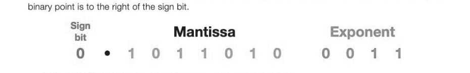
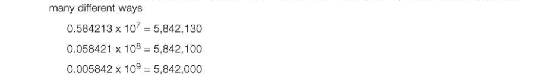
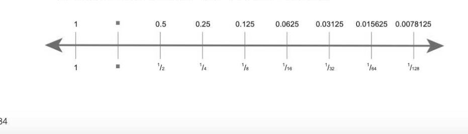
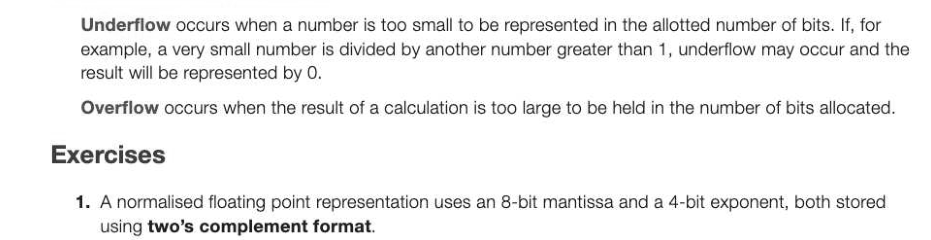
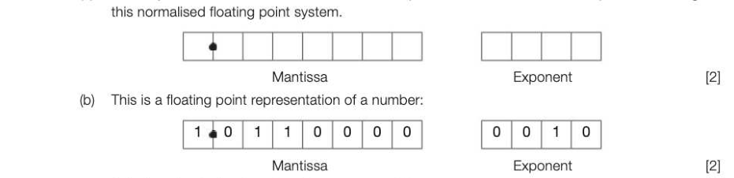

# Appendix A — Floating point form
## Objectives

- Know how numbers with a fractional part can be represented in floating point form
- Explain why fixed and floating point representation of decimal numbers may be inaccurate
- Be able to calculate the absolute and relative errors of numerical data stored and processed in computer systems
- Compare absolute and relative errors for large and small magnitude numbers, and numbers close to one
- Compare the advantages and disadvantages of fixed and floating point form in terms of range, precision and speed of calculation
- Be able to normalise un-normalised floating point numbers with positive or negative mantissas
- Explain underflow and overflow and describe the circumstances in which they occur

## Revision of fixed point binary numbers

Fixed point binary assumes a pre-determined number of bits before and after the point. This makes fixed point numbers simpler to process but there is a compromise in the range and number of values that can be represented and therefore in the accuracy of representation. Moving the point to the right increases the range but reduces the accuracy of the fractional part and vice versa. 168 4 2 1 x X x In the example above, only numbers which are multiples of % can be represented. The value 4.9, for example would be 'rounded' to 4.875 or 00100111 with three fractional bits to the right of the point. 2048 1024 512 256 128 64 32 16 8 4 2 1 = 0.5 0.25 0.125 0.0625

## Floating point binary numbers

Using 32 bits (4 bytes), the largest fixed point number that can be represented with just one bit after the point is only just over two billion. Floating point binary allows very large numbers to be represented. When ordinary decimal numbers become very large, they are written in a more convenient scientific notation m x 10" where m is known as the mantissa or coefficient, and n is the exponent or order of magnitude. 5000 can therefore written as 0.5 x 104, and 42,750.254 can be written as 0.42750254 x 10°, moving the decimal point five places to the left. This technique can easily be applied to binary numbers too, where the mantissa and exponent are represented for example using 12 bits, with 8 bits for the mantissa and 4 bits for the exponent. The leftmost bit of both the mantissa and the exponent are sign bits, with O indicating a positive number, and 1 a negative number. In a computer, of course, many more bits than this will be used to represent a floating point number, with 32-, 64- and 128-bit floating point numbers all being common. In all the examples below, eight bits are used for the mantissa and four bits for the exponent. The implied

0 • 1011010 0011 = 0.101101 x 2°= 0101,101 = 44+1+0.5+0.125 = 5.625 To convert the floating point binary number above to decimal:

- Write down the mantissa, 0.1011010
- Translate the exponent from binary to decimal 0011 = 3. This means that you have to move the point 3 places to the right, as the mantissa has to be multiplied by 2°. The binary number is therefore 101.1010
- Translate this to binary using the table in Figure 1. The number is 5.625.

## Negative exponents

If the exponent is negative, the binary point must be moved left instead of right. 0 © 1000000 1110 = 0.1 x 2? = 0,001 = 0.125 The example above has a positive mantissa of 0.1000000 and a negative exponent of -2. « Find the two's complement of the exponent. (Remember that to convert a positive to negative binary number using two's complement you must flip the bits and add 1.) Exponent = -2 Move the binary point of the mantissa two places to the left, to make it smaller. The mantissa is therefore 0.001 (You can ignore the trailing zeros)

- Translate this to decimal with the help of Figure 1. The answer is 0.125.

## Handling negative mantissas

A negative floating point number will have a 1 as the sign bit or MSB (Most Significant Bit) of the mantissa

The example above has a negative mantissa of 1.0101101 and a positive exponent of 0101. Find the twos complement of the mantissa. It is 0.1010011, so the bits represent -0.1010011 Translate the exponent to decimal, 0101 = 5 Move the binary point 5 places to the right to make it larger. The mantissa is -10100.11 Translate this to binary with the help of Figure 1. The answer is -20.75. If the exponent and the mantissa are both negative, the same technique applies, but the point moves to the left instead of the right. 1 © 0100000 1101 = 1.0100000 x 2% = - 0.1100000 x 2% = - 0,0901100 = - 0.09375

## Normalisation

Normalisation is the process of moving the binary point of a floating point number to provide the maximum level of precision for a given number of bits. This is achieved by ensuring that the first digit after the binary point is a significant digit. To understand this, first consider an example in decimal. In the decimal system, a number such as 5,842, 13010 can be represented with a 7-digit mantissa in

The first representation, with a significant (non-zero) digit after the decimal point has the maximum precision. Anumber such as 0.00000584213 can be represented as 0.584213 x 10°.

## Normalising a positive binary number

In binary arithmetic, the leading bit of both mantissa and exponent represent the sign bit. In normalised floating point form: A positive number has a sign bit of 0 and the next digit is always 1. This means that the mantissa of a positive number in normalised form always lies between ¥2 and 1.

## Example 1

Normalise the binary number 0.0001011 0101, held in an 8-bit mantissa and a 4-bit exponent.

- The binary point needs to move 3 places to the right so that there is a 1 following the binary point.
- Making the mantissa larger means we must compensate by making the exponent smaller, so subtract 3 from the exponent, resulting in an exponent of 0010.
- The normalised number is 0.1011000 0010

## Normalising a negative binary number

An unnormalised number will have a sign bit of 1 and one or more 1s after the binary point.

## Example 2

Normalise the binary number 1.1110111 0001, held in an 8-bit mantissa and a 4-bit exponent.

- Move the binary point right 3 places, so that it is just before the first O digit. The mantissa is now 1.0111000 Moving the binary point to the right makes the number larger, so we must make the exponent smaller to compensate. Subtract 3 from the exponent. The exponent is now 1 - 3 = -2 = 1110
- The normalised number is 1.0111000 1110 A normalised negative number has a sign bit of 1 and the next bit is always 0.
The mantissa of a negative number in normalised form always lies between -¥2 and -1.

## Example 3

What does the following binary number (with a 5-bit mantissa and a 3-bit exponent) represent in decimal? V2 1/4 1/8 1/16 te) 1 1 1 1 () 1 1 This is the largest positive number that can be held using a 5-bit mantissa and a 3-bit exponent, and represents 0.1111 x 23 = 7.5

## Example 4

The most negative number that can be held in a 5-bit mantissa and 3-bit exponent is:

Note that the size of the mantissa will determine the precision of the number, and the size of the exponent will determine the range of numbers that can be held.

Converting from decimal to normalised binary floating point To convert a decimal number to normalised binary floating point, first convert the number to fixed point binary.

## Example 5

Convert the number 14.25 to a normalised floating point binary, using an 8-bit mantissa and a 4-bit exponent.

- In fixed point binary, 14.25 = 01110.010
« Remember that the first digit after the sign bit must be 1 in normalised form, so move the binary point 4 places left and increase the exponent from 0 to 4. The number is equivalent to 0.1110010 x 24

- Using a 4-bit exponent, 14.25 = 0 1110010 0100

## Example 6

If the decimal number is negative, calculate the two's complement of the fixed point binary:

In normalised form, the first digit after the point must be 0, so the point needs to be moved four places left. 10001.110 = 1.0001110 x 24 = 10001110 0100

## Rounding errors

In the decimal system, % can never be represented completely accurately as a decimal number. Similarly, some binary numbers cannot be represented in the finite number of bits used to represent them, and other numbers such as 0.149 can never be represented completely accurately in binary. Their accuracy will depend on the number of bits available in fixed point binary, or the size of the mantissa in floating point binary. Rounding errors are unavoidable and result in a loss of precision. Example: Using the number line below, find the closest binary representation for the number 0.7610 that can be held in fixed point binary using 8 bits 0.76 is approximately equal to 0.5 + 0.25 + 0.0078125 = 0.7578125

The absolute error is calculated as the difference between the number to be represented, and the actual binary number that is the closest possible approximation in the given number of bits. Absolute error = 0.76 - 0.7578125 = 0.0021875 The relative error is the absolute error divided by the number, and may be expressed as a percentage. Relative error = (0.0021875/0.76) = 0.002878 or 0.2878% (approximately) In computer systems reliant on the manipulation of fractional numbers such as foreign currency or stock exchange systems, rounding errors can be expensive. In other systems such as missile guidance and timing, such errors can be fatal. The effect of number magnitude on absolute and relative errors An international sprinting track must be exactly 100 metres. What degree of tolerance would be accepted here? 1m? 1cm? 0.1cm or 0.001cm? In fact the IAAF recognise that a tolerance of 2cm or 0.02% is acceptable. 2cm is the absolute error above or below an actual track length, and 0.02% is the relative error, relative to the official length. Depending on the application and the magnitude of the numbers, the significance or implications of an absolute or relative error can change. A relative margin of error of only 0.0005 on an estimated drilling depth of 32,000ft might seem small, but not when you find you are an absolute 16ft short of drilling pipe on board an oil platform in the middle of the sea. Notice that absolute errors are always a positive difference between the actual or recorded data. An absolute error of say 0.5 in a number of 10,000 is a relative error of 0.005%. The same error in a number close to 1, say 0.99, is approximately 50.5%; clearly very much more significant. In a very small number, for example 0.00001, a seemingly very small absolute error of 0.000005 is a relative error of 50%. Application Published data Recorded data | Absolute error | Relative error Currency exchange rate | 1.35264 Euros to GBP |1.35 Euros to GBP, 0.00264 0.20% Train times 18 minutes 19 minutes 1 minute 5.56% Offshore oil drilling depth 32,000 feet 32,016 feet 16 feet 0.05%

## Fixed point vs floating point

Fixed and floating point each have their own advantages and disadvantages in terms of range, precision and the speed of calculation.

- Floating point allows a far greater range of numbers using the same number of bits. Very large numbers and very small fractional numbers can be represented. The larger the mantissa, the greater the precision, and the larger the exponent, the greater the range.
- In fixed point binary, the range and precision of numbers that can be represented depends on the position of the binary point. The more digits to the left of the point, the greater the range, but the lower the precision. For example, referring to Figure 1, if the binary point in a 16-bit number is placed four places from the least significant bit, numbers are only precise to four binary places. A decimal number such as 12.53125 cannot be accurately represented. In floating point, it can be represented with absolute precision as, say, 011001000100 0100.
- Fixed point binary is a simpler system and is faster to process.

## Underflow and overflow

---

## Exercises

1. Anormalised floating point representation uses an 8-bit mantissa and a 4-bit exponent, both stored using two's complement format. (a) In binary, write in the boxes below, the smallest positive number that can be represented using

Calculate the decimal number. Show your working. (2] (c) Write the normalised representation of the decimal value 12.75 in the boxes below: Mantissa Exponent (2] (d) Floating point numbers are usually stored in normalised form. State two advantages of using a normalised representation. (2] (e) An alternative two's complement format representation is proposed. In the alternative representation 7 bits will be used to store the mantissa and 5 bits will be used to store the exponent. Existing representation (8-bit mantissa, 4-bit exponent): Mantissa Exponent Proposed alternative representation (7-bit mantissa, 5-bit exponent): Mantissa Exponent [2] Explain the effects of using the proposed alternative representation instead of the existing representation. [2] AQA Unit 3 Qu 3 June 2011
