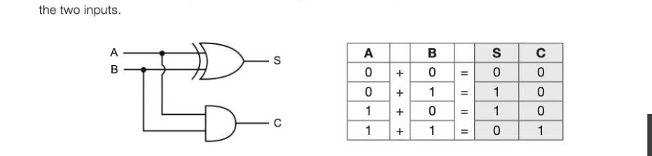
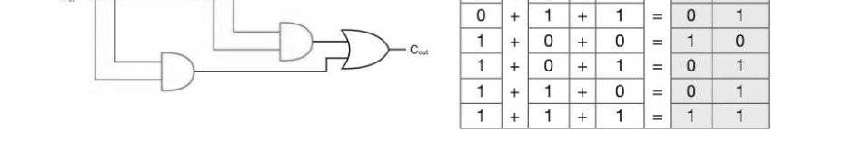

# Appendix B — Adders and D-type flip-flops
## Objectives

Recognise and trace the logic of the circuits of a half-adder and a full-adder

- Construct the circuit for a half-adder
- Be familiar with the use of the edge-triggered D-type flip-flop as a memory unit

## Performing calculations using gates

With the right combination of gates, it is possible to output the result of a binary addition or subtraction including the value of any carry bit as a second output.

## Half-adders

A half-adder can take an input of two bits and give a two-bit output as the correct result of an addition of

This is shown by the diagram above and represented by the truth table where S represents the sum and C represents the carry bit. S can be given as S = A®B, and C as C = A'B. Although a half-adder can output the value of a carry bit, it only has two inputs so it cannot use the carry from a previous addition as a third input to a subsequent addition in order to add n-bit numbers.

## Full adders

A full adder combines two half-adders to add three bits together including the two inputs A and B, and a carry bit C. The logic gate circuit below illustrates how two half-adders have been connected with an

'= s oj+/of+| 1 |=/1] 0 om oO }+{ 1 /]+}] 0 }=|1 te)

Now the Boolean logic becomes S = A®B@Cin, and Coyt = (A-B)+(Cin-(A®B)).

## Concatenating full adders

Multiple full adders can be connected together. Using this construct, n full adders can be connected together in order to input the carry bit into a subsequent adder along with two new inputs to create a concatenated adder capable of adding a binary number of n bits. + = 14 Co

## D-type flip-flops

A flip-flop is an elemental sequential logic circuit that can store one bit and flip between two states, 0 and 1. It has two inputs, a control input labelled D and a clock signal. The clock or oscillator is another type of sequential circuit that changes state at regular time intervals. Clocks are needed to synchronise the change of state of flip-flop circuits. width edge The D-type flip-flop (D stands for Data or Delay) is a positive edge-triggered flip-flop, meaning that it can only change the output value from 1 to 0 or vice versa when the clock is at a rising or positive edge, i.e. at the beginning of a clock period. When the clock is not at a positive edge, the input value is held and does not change. The flip-flop circuit is important because it can be used as a memory cell to store the state of a bit.

Output Q only takes on a new value if the value at D has changed at the point of a clock pulse. This means that the clock pulse will freeze or 'store' the input value at D until the next clock pulse. If D remains the same on the next clock pulse, the flip-flop will hold the same value. The use of a D-type flip-flop as a memory unit A flip-flop comprises several NAND (or AND and OR) gates and is effectively 1-bit memory. To store eight bits, eight flip-flops are required. Register memories are constructed by connecting a series of flip-flops in a row and are typically used for the intermediate storage needed during arithmetic operations. Static RAM is also created using D-type flip-flops. Imagine trying to assemble 16GB of memory in this way! The graph below illustrates how the output Q only changes to match the input D in response to the rising edge on the clock signal. Q therefore delays, or 'stores' the value of D by up to one clock cycle. "9 LAL ELT.

---

## Exercises

1. A half-adder is used to find the sum of the addition of two binary digits. (a) Complete the diagram below to construct a half adder circuit. (1) A Ss (b) Complete the following truth table for a half adder's outputs S and C. A|B/|S/cC [2] (c) How does a full adder differ from a half adder in terms of its inputs? [2]

2. An edge-triggered D-type flip-flop can be used as a memory cell to store the value of a single bit. The following graph shows the clock cycle and the input signals applied to D. (a) Label each rising edge on the diagram below. a] (b) Draw the flip-flop's output Q on the graph. [4]
