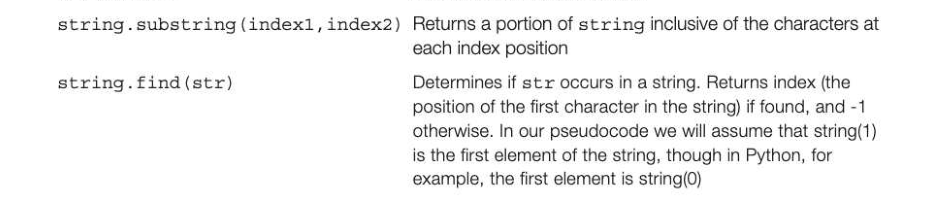
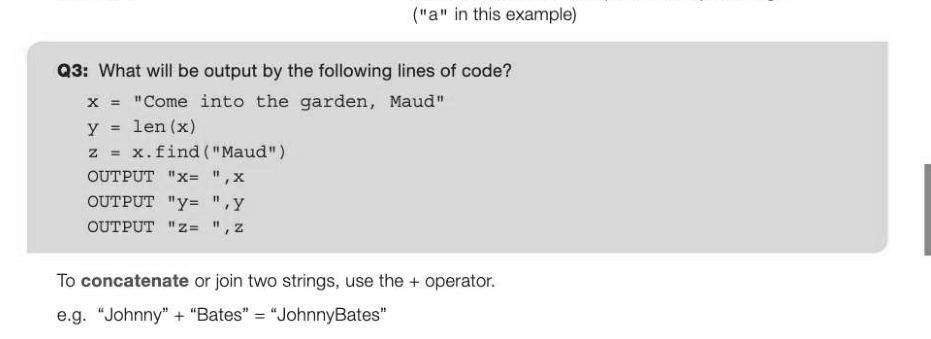
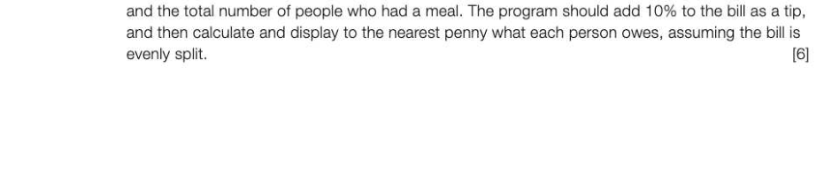

# Chapter 1 — Programming basics
## Objectives

- Define what is meant by an algorithm and pseudocode
« Learn how and when different data types are used

- Learn the basic arithmetic operations available in a typical programming language
- Become familiar with basic string handling operations
- Distinguish between variables and constants

## What is an algorithm?

An algorithm is a set of rules or a sequence of steps specifying how to solve a problem. A recipe for chocolate cake, a knitting pattern for a sweater or a set of directions to get from A to B, are all algorithms of a kind. Each of them has input, processing and output. We will be looking in more detail at properties of algorithms in Section 2 of this book. In the context of programming, the series of steps has to be written in such a way that it can be translated into program code which is then translated into machine code and executed by the computer.

## Using pseudocode

Whatever programming language you are using in your practical work, as your programs get more complicated you will need some way of working out what the steps are before you sit down at the computer to type in the program code. A useful tool for developing algorithms is pseudocode, which is a sort of halfway house between English and program statements. There are no concrete rules or syntax for how pseudocode has to be written, and there are different ways of writing most statements. We will use a standard way of writing pseudocode that translates easily into a programming language such as Python, Pascal or whatever procedural language you are learning. This book does not teach you how to program in any particular programming language — you will learn how to write programs in your practical sessions — but it will help you to understand and develop your own algorithms to solve problems.

## An introduction to pseudocode statements

## Input/output statements

Most programs will have input and output statements to allow the user to enter data and display or print results. Here is the pseudocode for a simple example: OUTPUT "What is your name? " #display text on the screen #wait for user input and assign the value to the variable myname

```
myname ← USERINPUT
OUTPUT "Hello, ",myname
```

This program will ask the user to input their name, and then display "Hello, Jo" or whatever name the user entered. Notice that in this pseudocode, text such as "Hello," will be wrapped in speech marks to distinguish it from variables. We will also use the pseudocode

```
myname ← USERINPUT "What is your name? "
```

which combines the OUTPUT and USERINPUT statement to display the prompt "What is your name? " and then wait for the user to enter text and press the ENTER key.

## Comments

Note also that anything following a # will be treated as a comment and will have no effect on the running of the program. Comments are very important when you come to code your programs, to document the code (specifying the name, author, date written and purpose of the program, for example) and to explain how any tricky bits of the program work. 1-1

## Data types

All programming languages have built-in elementary data types. Different data types are held differently in the computer's memory so you need to use the correct data type for the task. The most common data types include:

- integer a whole number such as -25, 0, 3, 28679
- real/float | anumber with a fractional part such as -13.5, 0.0, 3.142, 100.0001
- Boolean a Boolean variable can only take the value TRUE or FALSE character a letter or number or special character typically represented in ASCII, such as a, A, ? or %. Note that the character "4" is represented differently in the computer from the integer 4 or the real number 4.0
- string anything enclosed in quote marks is a string, for example "Peter", "123", or "This is a string". Either single or double quotes are acceptable in many languages.

## Common arithmetic operations

The symbols and / are used for the common arithmetic operations of addition, subtraction, multiplication and division. e.g. Suppose the bill in a restaurant comes to £20, and you want to divide it equally among 3 or 4 friends.

```
bill ← 20
billBetween4 ← bill/4 will return the value 5
billBetween3 ← bill/3 returns 6.666666667
```

In pseudocode you can assume that bil1Between3 will be automatically defined as a real variable and will store a value such as 6.666666667, though this may not be the case in every programming language.

## The Round function

You can round this number using a function round.

```
billBetween3 ← round (billBetween3, 2) #round to 2 decimal places
```

This will return the value 6.67.

## The Trunc function

Some languages have a truncate or trunc function, which rounds a real number down to the nearest whole number.

## Exponentiation

If you want to find, for example 2°, 5 is called the exponent and you need to use exponentiation.


```
x ← y**n
```

a Integer division and finding a remainder Sometimes you may want to perform integer division and find a remainder. For example: Twenty apples are to be divided between 6 people. How many will each receive, and how many will be left over? In this case you need to use the div operator to find the whole number of apples each person will receive. The mod operator will find the remainder. These two operations are coded differently in different programming languages, but in pseudocode you could write the following statements:

```
apples ← 20
applesPerPerson ← 20 div 3 (written applesPerPerson 20//3 in Python)
```

This will return 6 in applesPerPerson.

```
applesRemaining ← 20 mod 3 (written applesRemaining 20%3 in Python)
```

This will return 2 in applesRemaining.

## String-handling functions

Programming languages have a number of built-in string-handling methods or functions. Some of the common ones in a typical language are: len (string) Returns the length of a string



ord ("a") Returns the integer value of a character (97 in this example) chr (97) Returns the character represented by an integer



## String conversion operations

int ("1") converts the character "1" to the integer 1 str (123) converts the integer 123 into a string "123" float ("123.456") converts the string "123.456" to the real number 123.456 str (123.456) converts the real number 123.456 to the string "123.456" date (year, month, day) returns a number that you can calculate with Converting between strings and dates is usually handled by functions built in to string library modules, e.g. strtodate("01/01/2016"). Example:

```
datel ← strtodate ("18/01/2015")
date2 ← strtodate ("30/12/2014")
days ← datel - date2
OUTPUT datel, date2, days
```

This will output 2015-01-18 2014-12-30 19

## Constants and variables

Some programming languages require you to declare all variables and constants before they are used in


Variables are identifiers (names) given to memory locations whose contents will change during the course of the program; we have seen plenty of examples of these — e.g. in the statement below, the variable myname will change according to what the user enters.

```
myname ← USERINPUT
```

You should always try to use meaningful names for variables, rather than x, y and z, as this helps to make the program easy to follow and update when required. Some programming languages also allow you to define constants, whose value never changes while the program is being run. For example, if your program involved calculating the area of a circle, you could define pi at the start of the program as a constant having the value 3.14159. Or, you might hold the company phone number as a constant, declared at the start of the program as const companyPhone = "01453 123456"

## Advantages of using constants

The advantage of using a constant is that in a long, complex program there is no chance that a programmer will accidentally change its value by using the identifier for a different purpose. It also means that if the value of a constant (e.g. VAT) changes from say 20.0 to 17.5, the programmer does not have to hunt through the program to find all the lines where the value 20.0 has been used. In addition, using constants makes programming code more readable than using values. Some languages such as Python do not require or even allow you to define variables or constants — you just use them as and when required in the program.


---

## Exercises

1. A school keeps data about each of its pupils. State the most suitable data type for each of the


Whether or not the pupil is entitled to free school meals {5) 2. (a) Write pseudocode for a program which asks the user to enter the total bill for a restaurant meal,



## Exercises continued

(b) Complete the following table showing an additional two sets of test data, the reason for each test and the expected result. (6) 100.00 10 Total amount exactly divisible by 41.00 number of people 3. (a) Name two ways in which you can help to make your programs understandable for another programmer. (2) (b) Imagine that you have had a stall at the Summer Fayre. At the end of the day you count up the number of each 1p, 2p, 5p, 10p, 20p and 50p coins you have received. Write a pseudocode algorithm to allow the user to input the number of coins of each value, and to calculate and display the total takings. Make use of two ways of making the program understandable given in your answer to part (a). (6)
