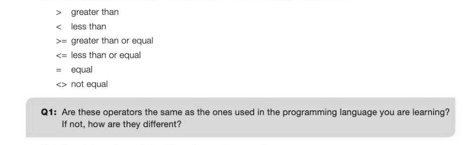
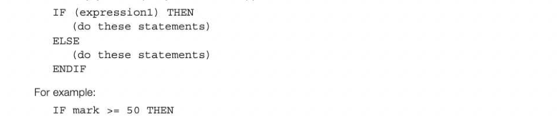
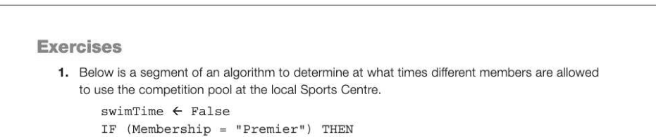

# Chapter 2 — Selection
## Objectives

- be able to use relational operators
- be able to use Boolean operations AND, OR, NOT, XOR
- be able to use nested selection statements

## Program constructs

There are just three basic programming constructs: sequence, selection and iteration. Sequence is just two or more statements following one after the other, such as

```
OUTPUT "Please enter a number: "
n ← USERINPUT
msquared ←n*n
```

The last statement is an assignment statement in which a value is assigned to a variable. In this chapter and the next, we will look at selection and iteration.

## Selection

Selection statements are used to select which statement will be executed next, depending on some 1-2 condition. Conditions are formulated using relational operators.

## Relational operators

The following operators may be used in pseudocode for making comparisons:



Selection statements can take different forms, for example:

```
IF (expression1) THEN
    (do these statements)
ENDIF
```

Expression] is an expression involving a relational operator such as

```
IF (AGE >=17) THEN
   canDrive ← TRUE
ENDIF
```

If expression1 does not evaluate to TRUE, control passes to the next statement after the IF statement. Alternatively, you can specify what should happen if the condition does not evaluate to TRUE:



```
   OUTPUT "Pass"
ELSE
   OUTPUT "Fail"
   OUTPUT "You will have to retake this test."
ENDIF
```

A 'nested' selection statement may have another IF statement inside one or both of the code blocks for the cases of the outer IF: IF (expression1l) THEN

```
IF (expression2) THEN
    (do these statements)
ELSE
    (do these statements)
ENDIF
```


## Example 1

A bank offers different interest rates according to how much is in the account. There are three thresholds of £500, £3,000 and £10,000: If amount less than 500, rate = 1% If amount greater than or equal £500 but less than £3000, rate = 1.5% If amount greater than or equal £3000 but less than £10000, rate = 2%


```
   rate ← 0.01
ELSE IF (amount < 3000) THEN
   rate ← 0.015
ELSE IF (amount < 10000) THEN
   rate ← 0.02
ELSE
   rate ← 0.035
```

## The CASE statement

Some programming languages support the use of a CASE statement, an alternative structure to a nested IF statement. It is useful when a choice has to be made between several alternatives.

## Example 2

Perform different statements according to an option choice entered by the user. CASE choice of

```
   1: OUTPUT "You have selected option 1"
       (more statements here)
   2: OUTPUT "You have selected option 2"
       (more statements here)
   3: OUTPUT "You have selected option 3"
       (more statements here)
ELSE
   OUTPUT "You must enter 1, 2 or 3"
ENDCASE
```

## Example 3

A statement to calculate the number of days in each month between 2001 and 2099 may be written: CASE month of

```
    "Jan","Mar","May","Jul","Aug","Oct","Dec": daysInMonth ← 31
    "Apr", "Jun", "Sep", "Nov": daysInMonth ← 30
    "Feb": IF year MOD 4 = 0 THEN
                 daysInMonth ← 29
              ELSE
                 daysInMonth ← 28
              ENDIF
ENDCASE
```

## Boolean operators AND, OR, NOT

More complex conditions can be formed using the Boolean operators AND and OR.

## Example 4

IF (a > b) AND (a > c) THEN

```
   max ← a
ELSE IF (b > a) AND (b > c) THEN
   max ← b
ELSE
   max ← c
ENDIF
```

## Example 5

Write pseudocode for a program to allow the user to input the day of the week and output "Weekday" or "Weekend".

```
day ← USERINPUT
IF (day = "Saturday") OR (day = "Sunday") THEN
   OUTPUT "Weekend"
ELSE
   OUTPUT "Weekday"
ENDIF
```

## Example 6

A tourist attraction has a daily charge for children of £5.00 on a weekday, or £7.50 on a weekend or bank holiday. Adults are charged £8.00 on weekdays and £12.00 on weekends and bank holidays. Write pseudocode to allow the user to calculate the charge for a visitor. OUTPUT "Enter W for weekend, B for bank holiday or D for weekday"

```
day ← USERINPUT
OUTPUT "Enter A for adult, C for child"
visitor ← USERINPUT
IF ((day = "W") OR (day = "B")) AND (visitor = ") THEN
    charge ← 12.0
ELSE IF ((day = "W") OR (day = "B")) AND (visitor = "C") THEN
    charge ← 7.5
ELSE IF (visitor = "A") THEN
    charge ← 8.0
ELSE
    charge ← 5.0
ENDIF
```

## The NOT operator

You can usually avoid the use of the NOT operator, replacing it with an appropriate condition.


## The XOR operator

XOR stands for exclusive OR, so that a XOR b means "either a or b but not both". This can be implemented with a combination of AND, OR and NOT conditions: (a AND NOT b) OR (NOT a AND b) Note that NOT takes precedence over AND. Add extra brackets if you are in any doubt!


---

## Exercises



```
swimTime ← TRUE
```

ELSE IF ((Membership = "Adult") AND (Day = "Weekday") AND (Time < 1500)) OR

```
       ((Membership = "Adult") AND (Day = "Weekend")) THEN
swimTime ← TRUE
```

ELSE IF (Membership = "Junior") AND (Day = "Weekend") THEN

```
swimTime ← TRUE
```

ENDIF Write down the values of swimTime after the segment of the algorithm has executed with the following data:

## (i) Membership: Premier Day: Weekday Time: 1700

## (ii) Membership: Adult Day: Weekday Time: 1100

## (ii) Membership: Junior Day: Weekday Time: 1000

## (iv) Membership: Adult Day: Weekend Time: 0900

(v) Membership: Adult Day: Weekday Time: 1530 {5} 2. (a) Write a pseudocode algorithm for a program which calculates the cost of carpeting a room. The carpet is supplied in a roll 4m wide. The cost of the carpet is £10 per square metre. The program should ask the user to enter the longest dimension (length) and shortest dimension (width) of the room, then calculate and display the length and width and cost of carpet that will be supplied. You can assume that the width of the room is not more than 4m. If a width of more than 4m is entered, display an error message and quit the program. The length could be more or less than 4m. {5) (b) Calculate the expected results for the following room sizes:


Length=6, width=5 [5]
