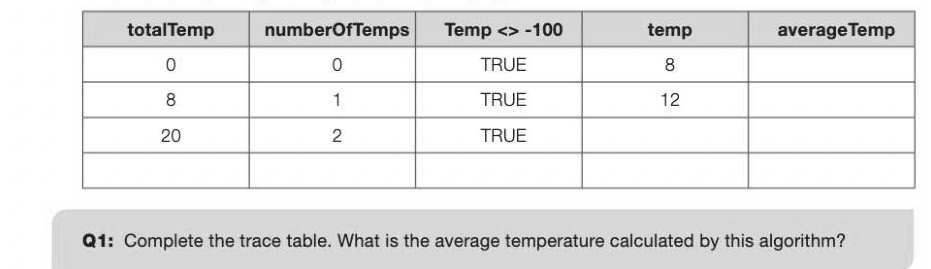

# Chapter 3 — Iteration
## Objectives

- Understand and use three different types of iterative statement WHILE, REPEAT and FOR
- Be familiar with, and be able to use, random number generation

## Performing a loop

In the last two chapters we looked at sequence and selection statements. The third programming construct is iteration. Iteration means repetition, so iterative statements always involve performing a loop in the program to repeat a number of statements. There are three different types of loop to be considered, although some programming languages do not implement all three.

- Indefinite iteration where the iteration continues until some specified condition is met, includes WHILE ... ENDWHILE loops and REPEAT ... UNTIL loops
- Definite iteration, where the number of times the loop is to be executed is decided in advance,


« The expression controlling the repetition of the loop must be of type Boolean — that is, one which evaluates to True or False

- This expression is tested at the start of the loop
This is best explained by means of an example. Suppose you wanted to input the daily maximum temperatures for one month, calculate and output the average of these measurements. The program has to work for any month, so when you have entered all the temperatures you will enter a 'dummy' value -100 to signify that there are no more temperatures to enter. A first attempt at the pseudocode might look like this:

```
temp ← 0 #initialise temp
totalTemp ← 0 #initialise total of temperatures
numberOfTemps ← 0 #initialise number of temperatures
WHILE temp <> -100
   OUTPUT "Enter next temperature"
   temp ← USERINPUT
   totalTemp ← totalTemp + temp
   numberOfTemps ← numberOfTemps + 1
ENDWHILE
averageTemp ← totalTemp/numberOfTemps
OUTPUT averageTemp
```

Test this algorithm with temperatures 8, 12 and -100. We can draw a trace table showing the value of the variables as they change during execution of the program.



You should have ended up with 3 temperatures and an average temperature of -26.66667 instead of 10. The problem is that the expression controlling the loop is tested only once each time round, at the beginning of the loop, and not after each statement within the loop as it is executed. Therefore, we have to make sure that as soon as the number -100 is entered, the next thing that happens is that the Boolean expression is tested.

```
totalTemp ← 0 #initialise total of temperatures
numberOfTemps ← 0 #initialise number of temperatures
OUTPUT "Enter next temperature"
temp ← USERINPUT #input first temperature
WHILE temp <> -100
    totalTemp ← totalTemp + temp
   numberOfTemps ← numberOfTemps + 1
   OUTPUT "Enter next temperature"
    temp ← USERINPUT
ENDWHILE
averageTemp ← totalTemp/numberOfTemps
OUTPUT averageTemp
```

Note that with a WHILE... ENDWHILE loop, if the Boolean expression is TRUE at the start, the loop will not be executed at all and control will pass straight to the next statement after ENDWHILE. The REPEAT... UNTIL loop This type of loop is very similar to the WHILE... ENDWHILE loop, with the difference that the Boolean expression controlling the loop is written and tested at the end of the loop, rather than at the beginning. This means that the loop is always performed at least once.

## Example 1

Write pseudocode for a program which tests someone on the squares of numbers up to 25. #program to test a user on the squares of numbers #random(a,b) generates a random integer between a and b REPEAT

```
   num ← random(1,25)
   numsquare ← num * num
   OUTPUT "What is the square of ", num
   answer ← USERINPUT()
    IF answer = numsquare THEN
       OUTPUT "Correct, well done"
   ELSE
       OUTPUT "No, it is ", numsquare
   ENDIF
   OUTPUT "Another go? Answer Y or N"
   anotherGo ← USERINPUT
UNTIL (anotherGo = "N") OR (anotherGo = "n")
```

The FOR... ENDFOR loop This type of loop is useful when you know how many iterations need to be performed. For example, suppose you want to display the two times table:

```
FOR count ← 1 TO 12
   product ← 2 * count
   OUTPUT "2 x ", count, " = ", product
ENDFOR
```

The value of count starts at 1 and is incremented each time round the loop. When it reaches 12, the loop terminates and the next statement is executed.

## Nested loops

Loops can be "nested" one inside another. Suppose we want to display all the multiplication tables between 1 and 12. We can do this with two FOR loops, one inside the other.

## Example 2

```
FOR table ← 1 TO 12
   FOR count ← 1 TO 12
       product ← table * count
       OUTPUT table, "x ", count, " = ", product
   ENDFOR
ENDFOR
```

## Example 3

Use a random number generator to simulate throwing a die to find out how many throws it takes to get a


```
numberOfThrows ← 0
throw ← 0
WHILE throw <> 6
   throw ← random(1,6)
   numberOfThrows ← numberOfThrows + 1
   OUTPUT "You threw a ", throw
ENDWHILE
OUTPUT "That took ",numberOfThrows," throws"
OUTPUT "Another go? (Y¥ or y)"
answer ← USERINPUT
```

ENDWHILE

## Example 4

You can count backwards as well as forwards in a FOR... ENDFOR loop. Here is a pseudocode program which uses the 'sleep' method to count down in seconds to blast-off. It uses a function called sleep which suspends execution for a given number of seconds: ReadyForCountdown ← USERINPUT "Press enter when you're ready to start" FOR secs ← 10 TO 0 STEP -1 OUTPUT secs sleep (1) #suspends execution for 1 second ENDFOR OUTPUT "BLAST-OFF!"


---

## Exercises

1. Write a pseudocode algorithm to allow the user to input two integers highestNumber and multiplier. The program should output the results of multiplying integers 2, 3... highestNumber by multiplier. For example if the user enters 100 for highestNumber and 7 for multiplier the program should output the numbers 14, 21... 700. [5] Write pseudocode for a program that asks the user which times table they would like to be tested on, and then gives them 5 random questions on this table. The computer should tell them each time whether they got the answer right or wrong. [5]
