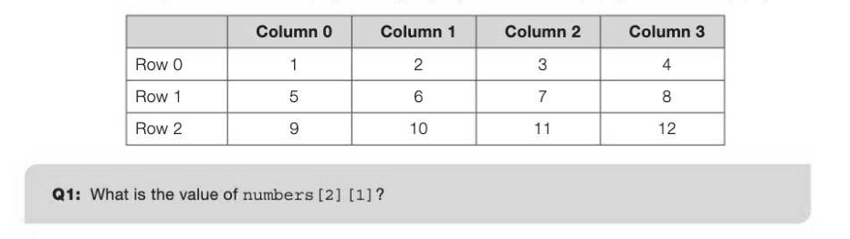

# Chapter 4 — Arrays
## Objectives

- Be familiar with the concept of a data structure
e Use 1- and 2-dimensional arrays in the design of solutions to simple problems

## Data structures

A data structure is a collection of elementary data types such as integer, real, Boolean, char, and built-in methods to facilitate processing in some way. Computer languages such as Python, Pascal and VB have some built-in structured data types such as string, array or list and record. Other data structures such as stacks and trees can be created by the programmer to suit a specific purpose.

## 1-dimensional arrays

An array is defined as a finite, ordered set of elements of the same type, such as integer, real or char. Finite means that there is a specific number of elements in the array. Ordered implies that there is a first, second, third etc. element of the array. For example, (assuming the first element of the array is myArray [0] and not myArray [1]):

```
myArray ← [51, 72, 35, 37, 0, 3]
x ← myArray [2] #assigns 35 to x
```

## Example

An array of strings could be used to hold the names of the birds, and an array of integers to hold the results as they come in. As a simple example we will hold the names of 8 birds in an array:

```
birdName ← ["robin", "blackbird", "pigeon", "magpie", "bluetit",
"thrush", "wren", "starling"]
```

We can reference each element of the array using an index. For example:

```
birdName[2] ← "pigeon" #the index here is 2
```

Most languages have a function which will return the length of an array, so that

```
numSpecies ← len(birdName)
```

will assign 8 to numSpecies.

To find at which position of the array a particular bird is, we could use the following algorithm:

```
bird ← USERINPUT
birdFound ← FALSE
numSpecies ← len(birdName)
FOR count ← 0 TO numSpecies - 1
   IF bird = birdName[count] THEN
       birdIndex ← count
       birdFound ← TRUE
   ENDIF
ENDFOR
IF birdFound = FALSE THEN
   OUTPUT "Bird species not in array"
ELSE
   OUTPUT "Bird found at", birdIndex
ENDIF
```

We need a second array of integers to accumulate the totals of each bird species observed. We can initialise each element to zero.

```
birdcount ← [0,0,0,0,0,0,0,0]
```

To add 5 to the blackbird count (the second element in the list) we can write a statement

```
birdCount [1] ← birdCount[1] + 5
```

The following algorithm enables a member of the Birdwatch team to enter results as they come in from members of the public. birdName • ["robin", "blackbird", "pigeon", "magpie", "bluetit", "thrush", "wren", "starling"]

```
birdcount ← [0,0,0,0,0,0,0,0]
OUTPUT "Please input name of bird (x to end): "
bird ← USERINPUT
WHILE bird <> "x"
       birdFound ← FALSE
       FOR count ← 0 TO 7
              IF bird = birdName[count] THEN
                 birdFound ← TRUE
                 OUTPUT "number observed: "
                 birdsObserved ← USERINPUT
                 birdCount [count] ← birdCount [count] + birdsObserved
              ENDIF
       ENDFOR
       IF birdFound = FALSE THEN
          OUTPUT "Bird species not in array"
       ENDIF
       OUTPUT "Please input name of bird (x to end): "
       bird ← USERINPUT
ENDWHILE
#now print out the totals for each bird
FOR count ← 0 TO 7
       OUTPUT birdName[count], birdCount [count]
ENDFOR
```

## 2-dimensional arrays

An array can have two or more dimensions. A two-dimensional array can be visualised as a table, rather like a spreadsheet. Imagine a 2-dimensional array called numbers, with 3 rows and 4 columns. Elements in the array can be referred to by their row and column number, so that numbers 8 in the example below. An alternative syntax used in some programming languages is numbers [1,3] or numbers (1,3).



## Example

Write a pseudocode algorithm for a module which prints out the quarterly sales figures (given in integers) for each of 3 sales staff named Anna, Bob and Carol, together with the total annual sales for all staff. Assume that the sales figures are already in the 2-dimensional array quarterSales. The staff names are held in a 1-dimensional array staff. staff • ["Anna","Bob","Carol"]

```
quarterSales ← [[100,110,120,110],
                    [350,355,360,360],
                    [200,210,220,220]]
annualSales ← 0
FOR s ← 0 to 2
   #output staff name
    (insert statement here)
   FOR g ← 0 to 3
       OUTPUT "Quarter ",g, quarterSales[s] [q]
       annualsales ← annualSales + quarterSales[s] [q]
   ENDFOR
ENDFOR
OUTPUT "Annual sales for all staff: ",annualSales
```

## Arrays of n dimensions

Arrays may have more than two dimensions. An n-dimensional array is a set of elements of the same type, indexed by a tuple of n integers, where a tuple is an ordered list of elements. In a 3-dimensional array x, a particular element may be referred to as x for example. The first element would be referred to as x (assuming the array indices start at 0 and not 1).


---

## Exercises

1. Referring to the BirdWatch program given earlier in this chapter: (a) Explain why the FOR... ENDFOR loop repeated below is not the most efficient type of loop in this situation. 1)

```
FOR count ← 0 to 7
   IF bird = birdName[count] THEN
       birdFound ← TRUE
       OUTPUT "number observed: "
       birdsObserved ← USERINPUT
       birdCount [count] ← birdCount [count] + birdsObserved
   ENDIF
ENDFOR
```

(b) Rewrite the algorithm using a different type of loop. [3] 2. The birth weights in grams of 100 babies, which vary between 1500 to 4000 grams, are held in an array weight. Write pseudocode for an algorithm which calculates the average birth weight, and then prints out the number of babies who are more than 500 grams below the average weight, together with the average weight of these. [5] 3. The marks for 3 assignments, each marked out of 10, for a class of 5 students are to be input into a two-dimensional array mark so that mark [3] [1], for example, holds the second mark achieved by the 4th student. Any missing assignments are given a mark of zero. Draw a table representing this array, and fill it with test data. [2] Write a pseudocode algorithm which allows the user to enter the marks for the class. Calculate the average mark for each student, and the class average. [4] 4. Inacertain game, treasure is hidden in a 10x10 grid. The grid coordinates are given by grid[row] [col] where grid[0] [0] represents the top left hand corner and grid[9] [9] the bottom right corner. The grid coordinates of the treasure are signified by a 1 at grid[row] [col]. All other grid elements are filled with zeros. What is the purpose of the following pseudocode algorithm? [2]

```
FOR row ← 0 TO 9
   FOR col ← 0 TO 9
       IF grid[row] [col] = 1 THEN
          OUTPUT "row", row, "column", col
       ENDIF
   ENDFOR
ENDFOR
```

Write pseudocode statements to initialise the grid and "hide the treasure" at a random location inside the grid. [5]
