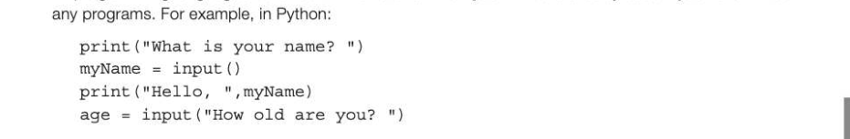
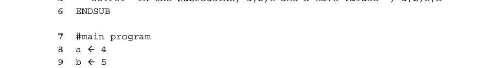
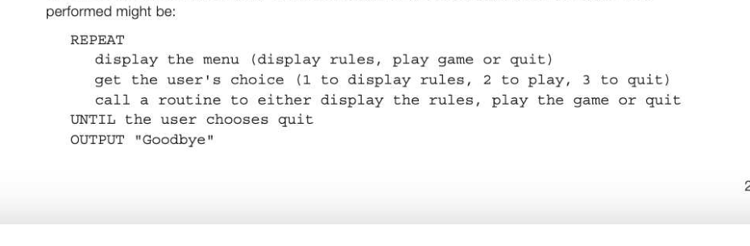
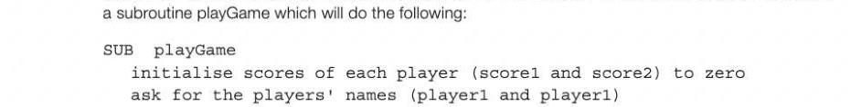
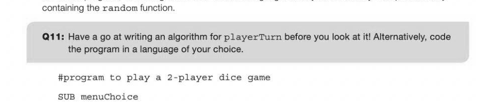
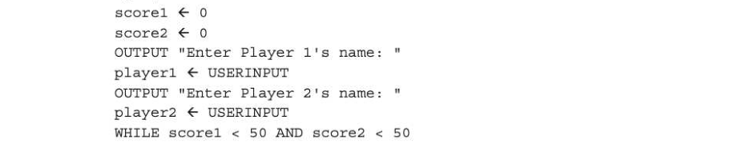
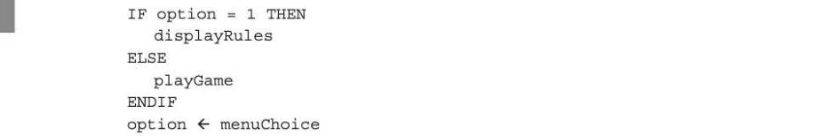

# Chapter 5 — Subroutines
## Objectives

- Be familiar with subroutines, their uses and advantages
- Be able to use subroutines that return values to the calling routine
- Be able to describe the use of parameters to pass data within programs
- Be able to contrast the use of local and global variables

## Types of subroutine

A subroutine is a named block of code which performs a specific task within a program. Most high-level languages support two types of subroutine, functions and procedures, which are called in a slightly different way. Some languages such as Python have only one type of subroutine, namely functions. All programming languages have 'built-in' functions which you will have already used if you have written



A subroutine is called by writing its name in a program statement. Some functions return a result, like the input function above, and some do not return any result, like the print function. Notice that the last statement above combines the print and input functions; when the statement is executed, the computer will display the question "How old are you?" and wait for the user to input an answer, which will be assigned to the variable age. In languages which distinguish between functions and procedures, a function is called like the input function above, always assigning a return value to a variable. A procedure is called by writing its name but not assigning the result to a variable, like the print statement above. However, as we shall see later, a procedure can still pass values back to the calling program if necessary. In Chapter 1, we listed some string-handling functions, and we can write, for example, pseudocode such as

```
x ← int ("567")
```

to call the int function, which will convert the string "567" into an integer.

## User-written subroutines

You can write your own subroutines (functions and/or procedures) and call them from within the program as many times as needed. The subroutine (or subprogram) first needs to be defined, typically above the code in the main program.

## Example 1

Using pseudocode, write a subroutine which displays a menu of 4 options in a game. SUB displayMenu #declare the subroutine

```
   OUTPUT "Option 1: Display rules"
   OUTPUT "Option 2: Start new game"
   OUTPUT "Option 3: Quit"
   OUTPUT "Enter 1, 2 or 3: "
ENDSUB
```

To call the subroutine from the main program, you simply write its name: displayMenu This subroutine always produces the same result whenever it is called; it simply displays this menu.

## Example 2

Sometimes, you may want a subroutine to return a value to the main program: SUB getChoice

```
   OUTPUT "Option 1: Display rules"
   OUTPUT "Option 2: Start new game"
   OUTPUT "Option 3: Quit"
   OUTPUT "Enter 1, 2 or 3: "
   choice ← USERINPUT
   RETURN choice
ENDSUB
#main program starts here
option ← getChoice
OUTPUT "You have chosen ", option
```

In this example, when the program is run, the first line to be executed is the first statement in the main program, option ← getChoice. The subroutine is called, it displays the menu, gets the user's choice in choice and returns this to the main program using the statement RETURN choice. Execution continues where it left off, at the statement OUTPUT "You have chosen ", option. The subroutine is called in a slightly different way from the subroutine displayMenu — compare this to the two different ways in which built-in OUTPUT and USERINPUT subroutines are called. OUTPUT "What is your name?"

```
myName ← USERINPUT
OUTPUT "Hello, ", myName
```

The OUTPUT subroutine does not return a value, the USERINPUT subroutine does.

## Subroutines with interfaces

Frequently, you need to pass values or variables to a subroutine. The exact form of the subroutine interface varies with the programming language, but will be similar to the examples below: SUB subroutineName(parameterl, parameter 2,...) There are two mechanisms for passing parameters: by value and by reference. When parameters are passed by value, changing a parameter inside the subroutine will not affect its value outside the subroutine. All parameters are passed this way in Python. In other languages such as Visual Basic, the programmer can specify whether the parameter is to be passed by value or by reference. When a parameter is passed by reference, the address of the parameter, and not its value, is passed, so any change made to it in a subroutine will be reflected in the calling program.

## Example 3

Consider a simple subroutine which calculates the volume of a cylinder. In the main program, the user is asked to enter values for the radius and length of the cylinder. These variables are then passed as parameters to the subroutine for use in the calculation. The values (or addresses) of the parameters radius and length in line 11 are passed to the subroutine where they are referred to using the identifiers x and len respectively. The order in which the parameters are written when calling the subroutine is important: radius is passed to r, length is passed to len. The return value vol is passed back to the main program, where it is assigned to volume in line 11. 1 SUB cylinderVolume (r, len)

```
2 pi ← 3.142
3 vol ← pitrtrtlen
```


7 OUTPUT "Enter the radius of the cylinder:"

```
8 radius ← USERINPUT
9 OUTPUT "Enter the length of the cylinder:"
10 length ← USERINPUT
11 volume ← cylinderVolume (radius, length)
12 OUTPUT "The volume of the cylinder is ", volume
```

## Local and global variables

Variables used in the main program are by default global variables, and these can be used anywhere in the program, including within any subroutines. Within a subroutine, local variables can be used and these exist only during the execution of the subroutine. They cannot be accessed outside the subroutine and changing them has no effect on any variable outside the subroutine, even if the variable happens to have the same name as the local variable. The ability to declare local variables is very useful because it ensures that each subroutine is completely self-contained and independent of any global variables that have been declared in the main program. The principles of data hiding and encapsulation of all the variables needed in a subroutine are very important in programming. A subroutine written according to these principles can be tested independently, and used many times in many different programs without the programmer needing to know what variables it uses. Any variable in the calling program which coincidentally has the same name as a local variable declared in the subroutine will not cause an unexpected side-effect.

## Example 4


```
4 c←3
5 OUTPUT "In the subroutine, a,b,c and x have values ", a,b,c,x
```



```
loc←6
11 x ← 10
12 OUTPUT "In the main program, a,b,c and x have values ", a,b,c,x
13 printNumbers (x)
14 OUTPUT "In the main program, a,b,c and x now have values ", a,b,c,x
```

## Modular programming

When a program is short and simple, there is no need to break it up into subroutines. With a long, complex program, however, a 'top-down' approach, in which the problem is broken down into a number of subtasks, is generally very helpful in designing the algorithm for reaching a satisfactory solution.

## Programming with subroutines

Using subroutines in a large program has many advantages: A subroutine is small enough to be understandable as a unit of code. It is therefore relatively easy to understand, debug and maintain especially if its purpose is clearly defined and documented Subroutines can be tested independently, thereby shortening the time taken to get a large program working Once a subroutine has been thoroughly tested, it can be reused with confidence in different programs or parts of the same program In a very large project, several programmers may be working on a single program. Using a modular approach, each programmer can be given a specific set of subroutines to work on. This enables the whole program to be finished sooner. A large project becomes easier to monitor and control

## Example 5

A program is to be written which simulates a dice game in which 2 players take turns. The rules of the game are as follows: Players take turns to throw two dice. If the throw is a 'double', i.e. two 2s, two 3s, etc., the player's score reverts to zero and their turn ends. If the throw is not a 'double', the total shown on the two dice is added to the player's score. A player may have as many throws as they like in any turn until they either throw a double or pass the dice. The first player to reach a score of 50 wins the game. We will design the solution in a top-down manner. A first attempt at listing the major tasks to be



The major tasks can be split into subroutines, which can each be tested independently. We need the following subroutines: SUB menuChoice #display menu and get user's choice SUB displayRules SUB playGame Playing the game needs to be broken down further. At this stage we can start writing pseudocode for



```
   WHILE scorel < 50 AND score2 < 50
       scorel ← playerTurn(playerl1,score1) # player 1's turn
       IF scorel >= 50 THEN
          OUTPUT "You win!"
       ELSE
          score2 ← playerTurn (player2,score2) # player 2's turn
          IF score2 >= 50 THEN
              OUTPUT "You win!"
          ENDIF
       ENDIF
   ENDWHILE
ENDSUB
```

Finally, we have to design the subroutine playerTurn. This is incorporated into the pseudocode for the whole program, which is given below. In some languages it may be necessary to import a library



```
   OUTPUT "Option 1: Display rules"
   OUTPUT "Option 2: Start new game"
   OUTPUT "Option 3: Quit"
   OUTPUT "What would you like to do?"
   choice ← USERINPUT
   WHILE choice < 1 OR choice > 3
          OUTPUT "That is not a valid choice."
          OUTPUT "Please enter a number between 1 and 3: "
          choice ← USERINPUT
   ENDWHILE
   RETURN choice
ENDSUB
```

#subroutine to display rules

## SUB displayRules

OUTPUT "The rules of the game are as follows: Players take turns to throw two dice. If the throw is a 'double', i.e. two 2s, two 3s, etc., the player's score reverts to zero and their turn ends. (etc.)"

## ENDSUB

#subroutine for each player to take a turn

## SUB playerTurn (player, score)


```
diel ← random(1,6) #call a built-in function
die2 ← random(1,6)
OUTPUT "You rolled ", diel," and", die2
IF diel = die2
   scoreThisTurn ← 0
   cumulativeScore ← 0
   OUTPUT "Bad luck! Press any key to continue"
   anyKey ← USERINPUT #accept any keypress from user
   anotherGo ← "N"
ELSE
   scoreThisTurn ← scoreThisTurn + diel + die2
   cumulativeScore ← score + scoreThisTurn
   OUTPUT "Your score this turn is ",scoreThisTurn
   OUTPUT player,"Your cumulative score is ", cumulativeScore
    IF cumulativeScore >= 50 THEN
       anotherGo ← "N"
   ELSE
       OUTPUT "Another go? (Answer Y or N)"
       anotherGo ← USERINPUT
   ENDIF
ENDIF
```

ENDWHILE RETURN cumulativeScore

## ENDSUB

#subroutine to play game

## SUB playGame



```
scorel ← playerTurn(playerl, scorel)
IF scorel >= 50 THEN
   OUTPUT "You win!"
ELSE
   score2 ← playerTurn(player2, score2)
   IF score2 >= 50 THEN
       OUTPUT "You win!"
   ENDIF
ENDIF
```

ENDWHILE

## ENDSUB

#main program starts here option ← menuChoice

## WHILE option <> 3



## ENDWHILE

## OUTPUT "Goodbye!"


---

## Exercises

1. Referring to the program code above, answer the following questions. (a) Give one example of a global variable and one example of a local variable used in this program. Why is it good practice to use local variables whenever possible? 4] (b) Give one example of a parameter in this program. What is the advantage of using subroutines with parameters? 3] (c) The first statement in the main program is option ← menuChoice Explain what this statement does. [2]
