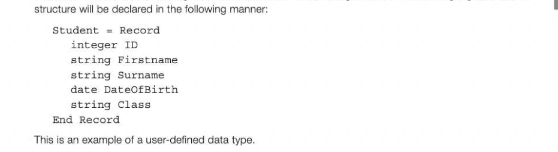
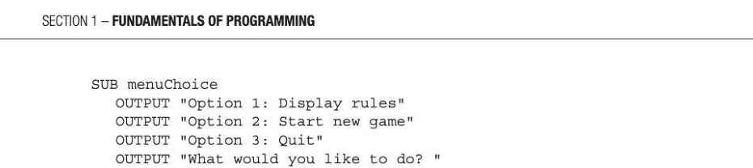
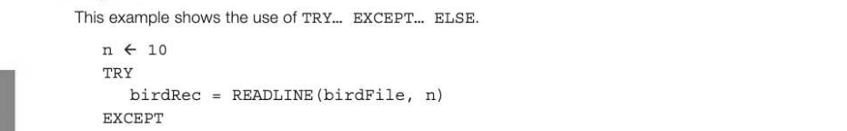

# Chapter 6 — Files and exception handling
## Objectives

- define the terms field, record, file
- be able to read from and write to a text file
- understand when and how to use exception handling in a program

## Fields, records and files

If you want to store data permanently so that you can read or update it at a future date, the data needs to be stored in a file on disk. The most common way of storing large amounts of data conveniently is to use a database, but sometimes you need to create and interrogate your own files. Generally, a file consists of a number of records. A record contains a number of fields, each holding one item of data. For example, in a file holding data about students, you might have the following record structure: 1453 Gemma Baines 01/05/2004 2G 1768 Paul Gerrard 17/11/2003 2G 2016 Brian Davidson 03/08/2002 3H The table shows a file containing three records, each record having 5 fields. In some languages, a record



Another way of storing a file is to use a text file, described below. Writing to a text file Suppose that you want to write to a text file containing the names of birds seen and the numbers of each bird reported by an individual participating in the RSPB's Big Garden Birdwatch described in Chapter 4, page 17. You may be starting a new file or appending data to an existing file — there are different 'modes' in which a file can be opened including read, write and append. We will assume that if you open the file in 'append' mode it will create a file if one does not already exist in the folder. Programming languages have different syntax for writing to and reading from a file, but pseudocode for a program to write data to a new file would be something like the following:

OPEN birdFile to append data OUTPUT "How many records do you wish to write?"

```
numRecs ← USERINPUT
FOR n ← 1 TO numRecs
   OUTPUT "Enter bird name: "
   birdName ← USERINPUT
   OUTPUT "Enter number of birds reported: "
   birdsReported ← USERINPUT
```


## Reading from a text file

Some programming languages such as Python will allow you to read an entire text file using just a single statement. You can also read a text file line by line (or record by record). Each record will have a number of fields commonly separated by commas, as in a CSV (comma-separated values) file. Suppose you want to search birdFile for a specific bird name and print out the number of birds. Assume that this file has 8 records. OPEN birdFile for reading OUTPUT "What bird are you searching for? "

```
birdNameSearch ← USERINPUT
FOR n ← 1 TO 8
   READLINE (birdFile, n) #read the nth record
   Split record into individual comma-separated fields
   birdName ← field[0]
   birdsSeen ← field[1]
    IF birdName = birdNameSearch THEN
       OUTPUT birdName, birdsSeen
   ENDIF
ENDFOR
CLOSE birdFile
```

## Overwriting text in an existing file

Sometimes you may want to overwrite existing data; for example, to correct a record in the file. In that case, you can open the record for both reading and writing, search through the file for the record you want, and write a new record in its place.

## Binary (non-text) files

It is possible to read and write binary files as well as text files. A binary file can contain records with different types of field such as string, integer, real, Boolean. Each of these fields may occupy a different number of bytes; for example a real number stored as text may occupy 12 bytes for a 12-figure number, but considerably fewer as a pure binary number. Reading a binary file is language-specific but always involves knowing exactly what each field type in the record is and how many bytes it occupies. The file needs to be opened in a mode which specifies that it is a binary file.

## Exception handling

It is a good idea to include in your programs some exception-handling routines to specify what should happen if an error occurs that would normally cause the program to crash. Common errors of this sort include:

- trying to read a non-existent file
- trying to convert a non-numeric string entered by the user, to an integer or a real number
- trying to perform calculations with a non-numeric variable
- division by zero
Most languages provide an easy way of handling exceptions with a try...except clause. Here are three examples:

## Example 1


```
   OUTPUT ("Sorry, can't find this file")
ENDEXCEPT
```

## Example 2

Below is an example of a validation routine that could be used in the program shown in the last chapter to simulate a simple dice game.



```
choice ← USERINPUT
WHILE choice < "1" OR choice > "
   TRY
       choiceAsInteger ← int(choice) #try to convert string to integer
   EXCEPT
       OUTPUT "That is not an integer!"
   ENDEXCEPT
   # The user entry may be an integer but not between 1 and 3...
   OUTPUT "Please try again.. enter a number between 1 and 3: "
   choice ← USERINPUT
ENDWHILE
RETURN choiceAsInteger
```

ENDSUB

## Example 3



OUTPUT "Attempt to read beyond end of file" ELSE Split record into individual comma-separated fields TRY

```
   birdsSeen ← int(field[1]) #convert string to integer
EXCEPT
   birdsSeen 0
   OUTPUT "This is not an integer"
ELSE
   totalBirdsSeen ← totalBirdsSeen + birdsSeen
ENDEXCEPT
```

ENDEXCEPT


---

## Exercises

1. Write pseudocode for a program which reads a text file containing the current highest score for a game. Compare the current highest with a variable called myscore and if myscore is greater than the one on the file, replace the record with the new high score. [5] 2. (a) Explain with the aid of an example, the purpose of exception-handling in programs involving file handling. [2] (b) Explain why exception-handling routines are useful for validating data input by the user. 3]

## Section 2

Problem solving and theory of computation In this section: Chapter 7 — Solving logic problems 34 Chapter 8 = Structured programming 39 Chapter 9 Writing and interpreting algorithms 42 Chapter 10 Testing and evaluation 48 Chapter 11 Abstraction and automation 52 Chapter 12 Finite state machines 60
