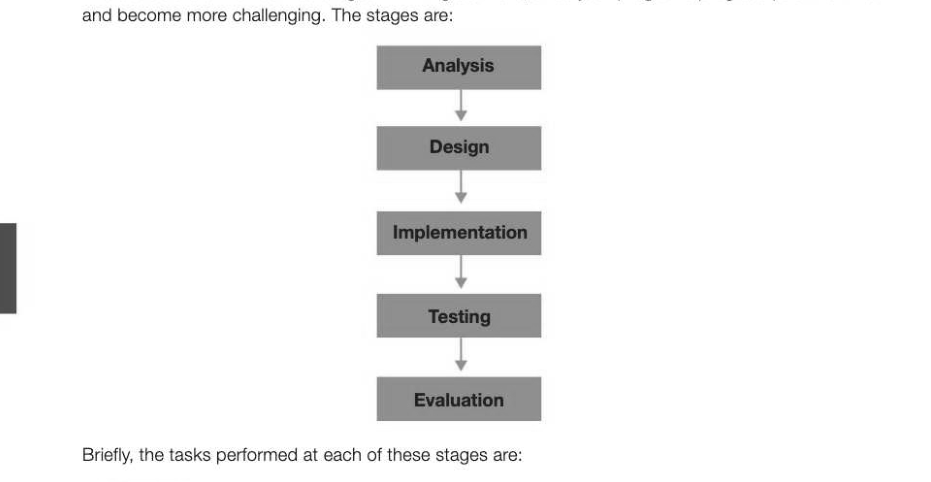
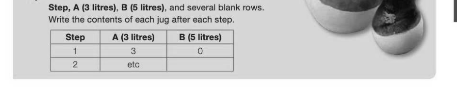
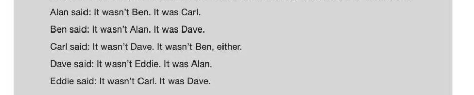
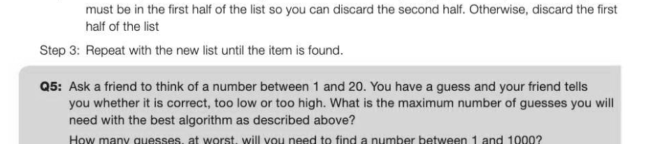

# Chapter 7 — Solving logic problems
## Objectives

- Define the stages of systems development
- Be able to develop solutions to simple logic problems
- Be able to check solutions to simple logic problems

## Stages in software development

Software is the name given to any program written for the computer. There are several well-defined stages in writing software, once your programs progress past the trivial

« Analysis: the requirements and goals of the project must be established, and a data model created. The needs of the end user are considered, and alternative solutions to the problem may be suggested « Design: data structures will be specified, algorithms, user interfaces, screen designs and reports will all be designed

- Implementation: the program code is written
- Testing: the whole system must be tested for the presence of errors, using selected test data covering normal, boundary and erroneous data
« Evaluation: the system is evaluated according to given criteria It is not necessary or even desirable that one phase is finished before another starts. In an evolutionary prototyping approach, some parts of the design, such as the user interface, may be implemented and shown to the customer, who then gives feedback. If it is not what they wanted, further work is done on the design. Testing may begin on parts of the implementation before other parts are completed. At each stage, it may be necessary to revisit previous stages. Customer feedback at every stage is crucial for successful project development.

We will go through the first four of these stages in this Section, starting with some problem-solving exercises which will get you thinking creatively about how to solve problems — a useful skill for analysing a problem and designing a solution. The types of problems we will be looking at are "computational" rather than "data-processing" problems.

## Problem-solving

Solving logic problems is good training for "computational thinking" — basically, the ability to think logically about a problem and apply techniques for solving it. This is closely related to the skill of designing algorithms which can be turned into computer programs. This chapter is designed to get you thinking about developing and checking solutions to simple logic problems. (Solutions to the example problems are given at the end of the chapter.) One type of problem asks you to find a method of solving a problem which has a goal and a set of resources, as in Ques' tion 1. Q1: There are two jugs, A and B. Jug A has a capacity of three litres. Jug B has a capacity of five litres. There are no markings on the jugs, so it is not possible to tell exactly how much is in a jug just by looking at it, unless it is full or empty. There is a sink with a water tap and a drain. How can exactly one litre of water be obtained from the tap using the two jugs? Tip: Create a table like the one below with 3 columns headed 2-7

Some problems require you to work out a method of solution and use the clues to find the answer, as in the following problem. An example of this type of problem is shown below. Q2: The police are interrogating five suspects after a bank robbery. Each of them makes two statements, but it turns out only five of these statements are true. Can you work out who committed the crime? What strategy will you use to work it out?

Tip: What is the key fact given in the statement of the problem?

Example 3 is a classic logic problem, which has many different variations on the same theme.

## Strategies for problem solving

There are some general strategies for designing algorithms which are useful for solving many problems in computer science. First of all it is useful to note that there are two types of algorithmic puzzle. Every puzzle has an input, which defines an instance of the puzzle. The instance can be either specific (e.g. fill a magic square with 3 rows and 3 columns), or general (n rows and n columns). Even when given a general instance of a problem, it is often helpful to solve a specific instance of it, which may give an insight into solving a more general case.

## Exhaustive search

For example, suppose you are asked to fill a 'magic square' with 3 rows and 3 columns with distinct integers 1-9 so that the sum of the numbers in each row, column and corner-to-corner diagonal is the same. This is a specific instance of a more general problem in which there are n rows and n columns. Some problems can be solved by exhaustive search — in this example, by trying every possible combination of numbers. We can put any one of 9 integers in the first square, and any of the remaining 8 in the second square, giving 9x8 = 72 possibilities for just the first two squares. There are 9x8x7x6x5x4x3x2 = 362,880 ways Of filling the square. If you are a mathematician you will know that this is denoted by 9!, spoken as "nine factorial". You might think a computer could do this in a fraction of a second. However, looking at the more general problem, where you have n x n squares, you will find that even for a 5 x 5 square, there are so many different combinations (25! or 25 factorial) that it would take a computer performing 10 trillion operations a second, about 49,000 years to find the answer! So, to solve this problem we need to come up with a better algorithm. It turns out to be not very difficult to work out that for a 3 x 3 square, each row, column and diagonal must add up to 15 and the middle number must be 5, which considerably reduces the size of the problem. (The details of the algorithm are not discussed here.)

## Divide-and-conquer

To find a particular item in a sorted list, one strategy is to look at every item starting from the beginning until you find what you are looking for (the exhaustive search strategy). A far more efficient strategy is to perform a binary search: Step 1: Look at the middle item of the list first. If this is the item being sought, stop searching Step 2: Otherwise, if the middle item is greater than the one being sought, the item you are looking for

Sometimes a problem requires a flash of insight to solve. If you have seen the film "The Imitation Game" about Alan Turing and how he cracked the Enigma Code during World War II, you will recall his insight in realising that most messages ended with the words "Heil Hitler". This proved crucial in reducing the exhaustive search algorithm, which could never provide the solution in the 24 hours before the code was changed, to one which the code-breakers used to decode the messages every day.

## Solutions to examples

## Solutions to examples continued

---

## Exercises

1. Three days ago, yesterday was the day before Sunday. What day will it be tomorrow? There are two married couples who need to cross a river. They have a boat that can hold no more than two people at a time. The husbands insist that at no time can their wives be left alone in the company of the other man. How can they cross the river? You have an 8-pint jug full of water, and two empty jugs of 5- and 3-pint capacity. How can you get exactly 4 pints of water into one of the jugs by completely filling up and/or emptying jugs into others? 4. The following problem has become very popular since it is reputed to have been set to candidates during job interviews at Microsoft. A group of four people, who have one torch between them, need to cross a rickety bridge at night. A maximum of two people can cross the bridge at one time, and any party that crosses (either one or two people) must have the torch with them. The torch must be walked back and forth — it cannot be thrown. Person A takes one minute to cross the bridge, person B takes 2 minutes, person C takes 5 minutes and person D takes 10 minutes. A pair must walk together at the rate of the slower person's pace. Find the fastest way they can accomplish this task.
