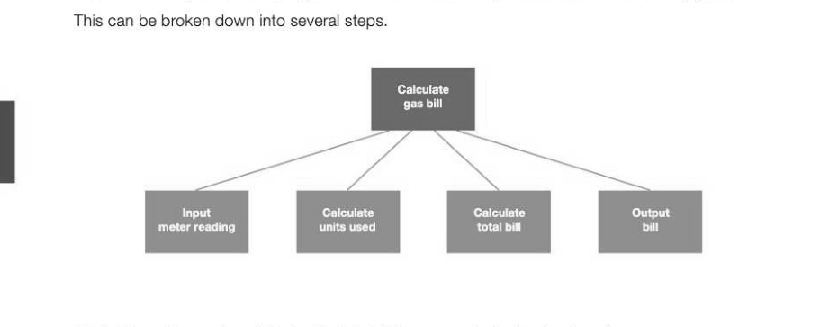
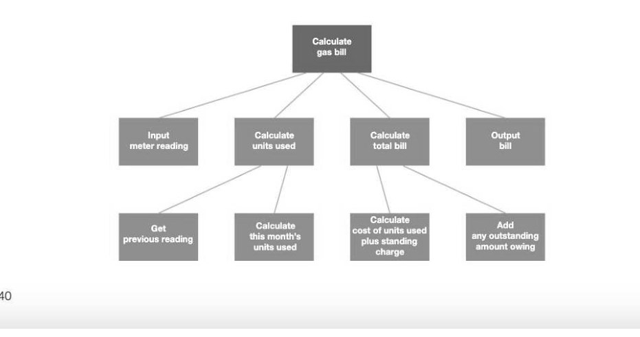
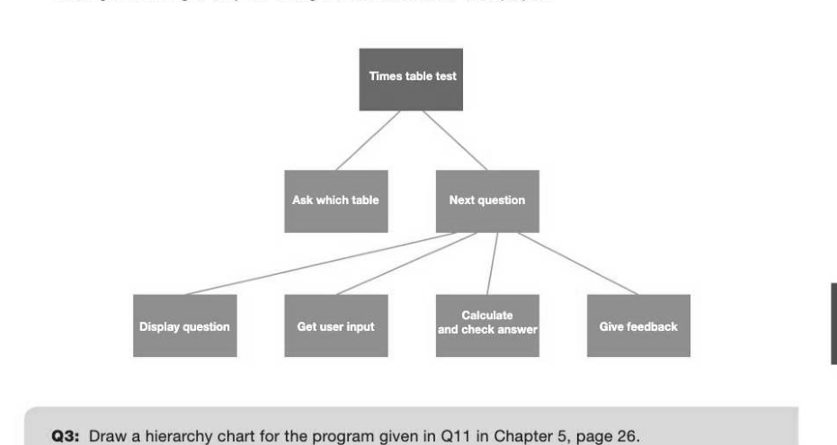

# Chapter 8 — Structured programming
## Objectives

- understand the structured approach to program design and construction
- be able to construct and use hierarchy charts when designing programs
- be able to explain the advantages of the structured approach

## The structured approach

The structured programming approach aims to improve the clarity and maintainability of programs. (See Chapter 5, page 25, "Programming with subroutines".) Using structured programming techniques, only three basic programming structure are used:

- sequence — one statement following another
- selection — IF ... THEN ... ELSE... ENDIF and CASE ... ENDCASE statements
- iteration - WHILE ... ENDWHILE, REPEAT... UNTIL and FOR ... ENDFOR loops
Languages such as Python, Pascal and C# are block-structured languages which allow the use of just three types of control structure. They may allow you to break out of a loop, but this is not recommended in structured programming. Each block should have a single entry and exit point.

## Block-structured languages

A block is a section of code consisting of one or more statements. For example, a block may be a single F... ENDIF statement, with the beginning of the block denoted by, for example, the keyword IF or an opening curly bracket, and the end denoted by either the end of indented code, (as in Python), a curly bracket or a keyword such as END or ENDIF. A block may also be a subroutine such as a function or procedure. Another important aspect of structured programming is to keep subroutines independent of the program which calls them, which means that they should not make use of global variables. Any variable declared in the main program should be passed as a parameter to a subroutine if it is needed.

## Designing structured programs

Top-down design is the technique of breaking down a problem into the major tasks to be performed; each of these tasks is then further broken down into separate subtasks, and so on until each subtask is sufficiently simple to be written as a self-contained module or subroutine. Remember that some programs contain tens of thousands, or even millions, of lines of code, and a strategy for design is absolutely essential. Even for small programs, top-down design is a very useful method of breaking down the problem into small, manageable tasks.

Advantages of structured (modular) programming The advantages of thes structured approach may be stated as: Individual modules can be separately tested Modules can be kept in a module library and reused in other programs Large programs can be split into modules that are easier to read, debug and maintain Several programmers in a team can work on separate modules, thus shortening development time for a large project

## Hierarchy charts

A hierarchy chart is a tool for representing the structure of a program, showing how the modules relate to each other to form the complete solution. The chart is depicted as an upside-down tree structure, with modules being broken down further into smaller modules until each module is only a few lines of code (never more than a page).

## Example 1

Draw a hierarchy chart for a program which calculates and prints a customer's monthly gas bill.

'Calculate units used' and 'Calculate total bill' may now be further broken down.

## Limitations of a hierarchy chart

Note that a hierarchy chart does not show the detailed program structures required in each module - for example, it does not show selection and iteration. A greater level of detail may be shown in a structure chart but these are not covered here.

## Example 2

Draw a hierarchy chart for a program which asks the user which times table they would like to be tested 'on, and then displays five questions, getting the user's answer each time and telling them whether they were right or wrong. If they are wrong, the correct answer is displayed.

---

## Exercises

1. Using local rather than global variables in subroutines is one way of helping to make a program easy to maintain. (i) Explain why this is the case. [3] (i) Describe briefly three other ways in which a program can be made easy to understand and maintain. (6) 2. Draw a hierarchy chart for a quiz program which does the following: asks the user 10 random multiple-choice questions from a bank of 100 questions held in a file. if the user gives the correct answer, gives feedback and adds 1 to the user's score

- if they give the wrong answer, gives feedback and displays the correct answer
- at the end of the questions, gives the score out of 10
- asks if they want another 10 questions (6)
