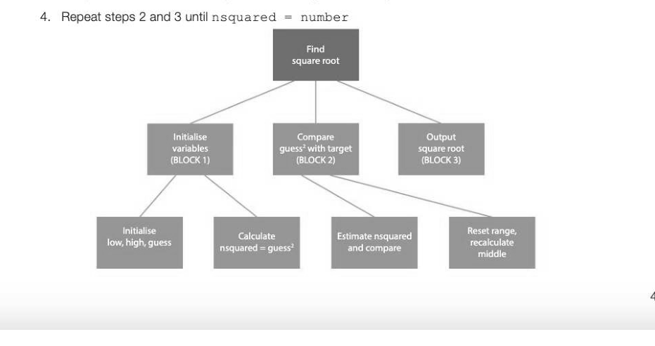
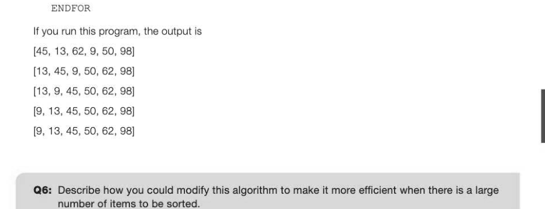

# Chapter 9 — Writing and interpreting algorithms
algorithms

## Objectives

- To understand the term 'algorithm'
- To learn how to write and interpret algorithms using pseudocode

## Properties of an algorithm

A recipe for chocolate cake, a knitting pattern for a sweater or a set of directions to get from A to B, are all algorithms of a kind.

## Computational algorithms

The definition of an algorithm is:

- thas clear and precisely stated steps that produce the correct output for any set of valid inputs
- It must always terminate at some point
A good algorithm also has the following properties:

- It should allow for invalid inputs
e It should execute efficiently, in as few steps as possible

- It should be designed in such a way that other people will be able to understand it and modify it if necessary
What kinds of problem are solved by algorithms? There are thousands of different practical applications of algorithms. Some of the best-known applications include: « Internet-related algorithms. Algorithms are used to manage and manipulate the huge amount of data stored on the Internet. How does a search engine find all the pages on which particular information resides in a fraction of a second?

- Route-finding algorithms. Given two locations, how does a route-finder determine the shortest or best route between the two points? There may be thousands of possible routes. This type of algorithm is used not only for driving a vehicle from A to B, but also for many other applications, for example, finding the best route to transmit packets of data from A to B over a network.
« Compression algorithms. These are used to compress data files so that they can be transmitted faster or held in a smaller amount of storage space. For example, MP3 files are compressed so that you can hold thousands of tracks on a mobile phone. « Encryption algorithms. When someone purchases something over the Internet and sends their credit card number and other personal details to the store, the data needs to be encrypted so that even if it is intercepted, it cannot be read.

## A simple computational algorithm

Suppose you are given the square of an integer and you need to find the integer itself (i.e. the square root of the given number). Your calculator can add, subtract, multiply and divide but it does not have a square root function. Here is one way of finding the square root of the integer number:

```
1n←0 ;initialise n
2 nsquared ← n*n
3 Is nsquared = number?
4 If yes, output n. If no, add 1 to n and repeat from step 2
```

When you start to program, it is tempting to get straight to the computer and type in some code to solve a given problem. However, it will generally save time to figure out the steps needed using paper and pencil before you start coding using pseudocode. Pseudocode is a way of expressing the solution in a way that can easily be translated into a programming language. The algorithm described will do the job, but a better solution is based on the well-known binary search algorithm, which we looked at briefly in Chapter 7, Question 5.

## A "Divide and Conquer" algorithm

This algorithm uses the "Divide and Conquer" strategy to halve the search area every time a guess is made. It goes like this: 1. Setlow ← 1,high ← number, guess ← (low + high)/2andnsquared ← guess* 2. Ifnsquared > number, sethigh ← guess to eliminate the top half of the range, otherwise set

```
low ← guess to eliminate the bottom half of the range
Set guess ← (low + high)/2andnsquared ← guess*
```



The chart represents the blocks of program code that we will use to solve the problem. The solution is short, so it's not necessary to put each block in a separate subroutine.

```
number ← 19321
low ← 1
high ← number
guess ← int((low + high) / 2)
nsquared ← guess ** 2 BLOCK 1 SEQUENCE
WHILE nsquared <> number
    IF nsquared > number THEN
       high ← guess
   ELSE
       low ← guess
   ENDIF
   guess ← int((low + high) / 2)
   nsquared ← guess ** 2 BLOCK 2 - ITERATION
ENDWHILE
OUTPUT "Square root is ",guess BLOCK 3 - SEQUENCE
```

## Sorting algorithms

Sorting is a very common task in data processing, and frequently the number of items may be huge, so using a good algorithm can considerably reduce the time spent on the task. There are many efficient sorting algorithms such as quicksort and merge sort but you will not be required to use these in this course, so we will look at a simple but rather inefficient sort algorithm as an example.

## Bubble sort

The Bubble sort is one of the most basic sorting algorithms and the simplest to understand. The basic idea is to bubble up the largest (or smallest) item, then the second largest, then the third largest and so on until no more swaps are needed. Suppose you have an array of n items:

- Go through the array, comparing each item with the one next to it. If it is greater, swap them.
- The last item in the array will be in the correct place after the first pass
- Repeat n - 1 times, reducing by one on each pass, the number of items to be examined

## Example 1

Write pseudocode for a bubble sort to sort the numbers 45, 62, 13, 98, 9, 50 into ascending sequence. Print the numbers after each of the 6 passes through the list.

```
numbers ← [45,62,13,98,9,50]
numItems ← len(numbers) #get number of items in the array
FOR i ← 0 TO numItems - 2
   FOR j ← 0 TO numItems - i - 2
       IF numbers[j] > numbers[j + 1] THEN
          # Swap the numbers in the array
              temp ← numbers[j]
              numbers[j] ← numbers[j + 1]
              numbers[j + 1] ← temp
       ENDIF
   ENDFOR
   OUTPUT numbers
```



## Interpreting programs

A.useful skill is to be able to look at someone else's program and decide what it does and how it works. Of course, if the programmer has put in lots of useful comments, used meaningful variable names and split a complicated program into separate modules, that should not be too difficult!

## Strategy for interpreting programs

Here are some tips, which may seem fairly obvious. 1. Read the comments in the program 2. Look at the variable names to see if they give any clues

```
3. Follow the steps in the program — the one below starts with the statement shift ← 3
   Try a "dry run" with some test data
```

## Evaluating a program

When two programs written to solve the same problem are not the same, is one program better than the other? It may be that one program is well documented with comments, uses meaningful variable names and properly indented code, does not contain statements that are not needed, and uses a more efficient algorithm. Once a program has been written and tested, you need to be able to: articulate how it works produce test data and results to show that it works correctly get user feedback to show that nothing has been omitted, that it performs all the required tasks and does so efficiently Q7: What will be the output from the algorithm below if the user inputs "Hi, Jo!" Explain briefly the purpose of the algorithm. SUB code(message, shift)

```
   message ← lowercase (message)
    codedMessage ← ""
    FOR x IN message
       IF x IN "abcdefghijklmnopgqrstuvwxyz" THEN
          num ← ord(x) # convert to ASCII value
          num ← num + shift
          IF num > ord("z") THEN # wrap if necessary
              num ← num - 26
          ENDIF
          char ← chr(num) # convert back to character
          codedMessage ← codedMessage + char
       ELSE
          codedMessage ← codedMessage + x
       ENDIF
   ENDFOR
   RETURN codedMessage
ENDSUB
# main program
shift ← 3
OUTPUT ("Enter your message: ")
msg ← USERINPUT
codedMessage ← code (msg, shift)
OUTPUT ("The encoded message is: ", codedMessage)
```


---

## Exercises

1. (a) Three types of programming constructs are sequence, selection and iteration. Describe what is meant by each of these. (6] (b) A computer program contains the following instructions:

```
x ← 10
Y ← 20
x←Y
OUTPUT X, Y¥
```

(i) State which of the constructs in part (a) has been used. i} (i), What will be output by this code? a} 2. Ina football league, the results of each match are input to the computer, which updates each team's points. In the case of a draw, each team (Team A and Team B) gets one point. If Team A wins, then Team A gets 3 points and Team B gets no points. The algorithm for updating points in the case of a draw is: IF TeamAGoals = TeamBGoals THEN

```
TeamAPoints ← TeamAPoints + 1
TeamBPoints ← TeamBPoints + 1
```

ENDIF Write an algorithm for updating the points if there is a winner. (3) 3. Expert jugglers learn new juggling patterns according to certain rules represented by numbers. In this example, the rules for patterns of three numbers are: Rule 1: the total value of the numbers in the list must be a multiple of 3 Rule 2: No number must be one less than the previous number, even if the pattern is repeated indefinitely. Here are some valid patterns of three numbers: Here are some examples of invalid patterns with three numbers: 421 (4+2+1=7, which is not a multiple of 3, so does not obey rule 1) 651 (6is one less than the previous number, so this does not obey rule 2) 627 (when this is repeated, 6 2 7 6 2 7 6 2 7... 6 is one less than the previous number, so this does not obey rule 2) (a) State why the following lists of 3 numbers are not valid patterns of numbers. i) 516 a} (i) 442 o] (b) Write pseudocode for a program which:

- Prompts the user to enter 3 numbers, one after the other
- Outputs "INVALID PATTERN" if the sequence of numbers does not obey the two rules. 7]
