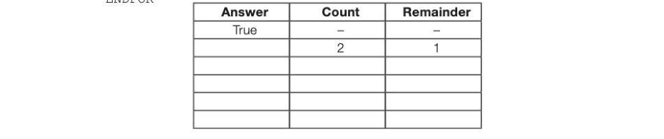

# Chapter 10 — Testing and evaluation
## Objectives

Understand the purpose of testing

- Devise a test plan
- Select test data covering normal (typical), boundary and erroneous data
- Check an algorithm by completing a dry run Know the criteria for evaluating a system

## The purpose of testing

We have looked briefly at problem-solving strategies and the design of solutions using structured programming techniques. You will have implemented several algorithms in your practical sessions. Testing your solutions for correctness can be a complex and time-consuming task, but one that needs to be done thoroughly and systematically. The purpose of testing is not to show that your program usually works correctly, if the user is careful when entering input data. The purpose of testing is to try and uncover undetected errors. Hie Lat Shek Deboy Opens Windows Help jab2002309492, Oot • 2024, 22125108) on wins?

## Devising a test plan

Your program should work correctly whatever data is input. If invalid data is entered, the program should detect and report this, and ask the user to enter valid data. Some data may be valid, but may nevertheless cause the program to crash if you have not allowed for particular values. We need to choose test data that will test the outcome for any user input. To do this, we need to select normal, boundary and erroneous data.

- normal data is data within the range that you would expect, and of the data type (real, integer, string, etc.) that you would expect. For example, if you are expecting an input between 0 and 100, you should test 1 and 99
- boundary data is data at the ends of the expected range or just either side of it - for example -1, 0, 1, 99, 100, 101. Test 0 and 100 to make sure that these give the expected results if the valid range is between 0 and 100
- erroneous data is data that is either outside an expected range, e.g. -1, 101 or is of the wrong data type — for example, non-numeric characters when you are expecting a number to be input
For each test, you should specify the purpose of the test, the expected result and the actual result.

## Example 1

The following program is intended to calculate and print the average mark for each student in a class, for all the tests they have attempted:

```
OUTPUT "How many students? "
students ← USERINPUT
FOR n ← 1 TO students
   OUTPUT "Enter student name"
   name ← USERINPUT
   OUTPUT "Enter total marks for ", name
   totalMarks ← USERINPUT
   OUTPUT "How many tests has this student taken? "
   numTests ← USERINPUT
   averageMark ← ROUND(totalMarks/numTests)
   OUTPUT "Average mark ",averageMark
ENDFOR
```

The test plan will look something like this: Number of students = 4 for Normal data, | tests 1-4 integer result 8 8 Jo: total marks 27, tests 3 a Normal data, 2-10 2 Tom: total marks 31, non-integer result 8 8 tests 4 rounded up 3 Beth: total marks 28, Normal data, 9 9 tests 3 result rounded down 4 Amina: total marks 0, No tests taken 0 Program tests 0 crashes 5 Number of students abc Test invalid data Program terminates You can probably think of some other input data that would make the program crash. For example, what if the user enters 31.5 for the total marks? The program should validate all user input, so some amendments will have to be made.

## Dry-running a program

A useful technique to locate an error in a program is to perform a dry run, with the aid of a trace table. As you follow through the logic of the program in the same sequence as the computer does, you note down in the trace table when each variable changes and what its value is. Examples of this are given in the exercises below.

## Evaluating a computer system

Once a system has been written and thoroughly tested, the final stage is evaluation. This will take place over a period of time, during which the user may run the new system in parallel to an old one. The criteria that may be used for evaluation include:

- Does it meet the performance criteria: © Caan it handle the amount of data or users that it needs to in a live environment? © Is the speed of operation satisfactory?
- Does it always perform as expected?
- Is the system reliable or does it crash at intervals?
- Is the system easy to use?
- Is the interface pleasant to work with, all spellings correct, navigation simple and not 'clunky'?
- Has all the functionality documented in the original specification been implemented, or has one or more of the requirements been overlooked?
- Has it been well documented?
- Will it be easy to maintain? How far has the system been 'future-proofed' - will it be easy to upgrade or add new features in the future?
- How cost effective is the system - will it increase income, decrease costs, or both?


---

## Exercises

1. Complete the trace table below to show how each variable changes when the algorithm is performed on the text data given.

```
x ←0
yeo
z←0
w ← USERINPUT
REPEAT
   x←xtw
   yey
   w ← USERINPUT
UNTIL w < 0
z←ex/y
OUTPUT z
```

Test data: 57224-1 [5]


2. Explain what is meant by an algorithm. [2] One way of checking that an algorithm is correct is to complete a dry run. Dry run the algorithm below by completing the table below. {6) Assume that x has a value of 7. The MOD operator calculates the remainder resulting from an integer division.

```
Answer ← True
FOR Count ← 2 to (x-1) DO
   Remainder ← x MOD Count
    IF Remainder = 0 THEN
       Answer ← False
   ENDIF
ENDFOR
```



What is the purpose of this algorithm? (1) AQA Comp 1 Qu 5 June 2010
