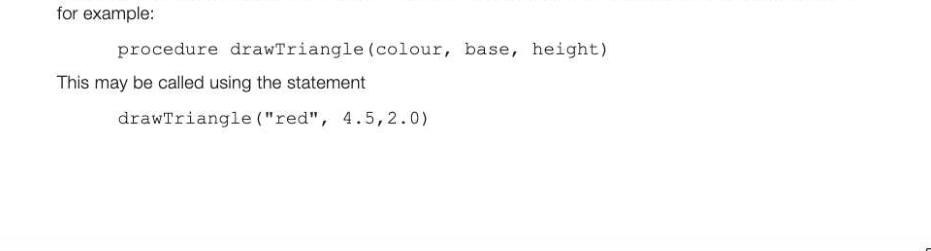
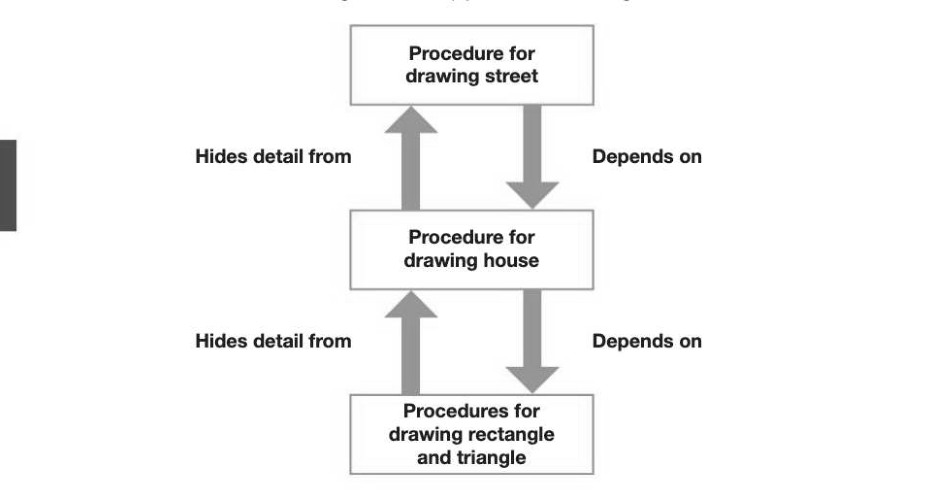
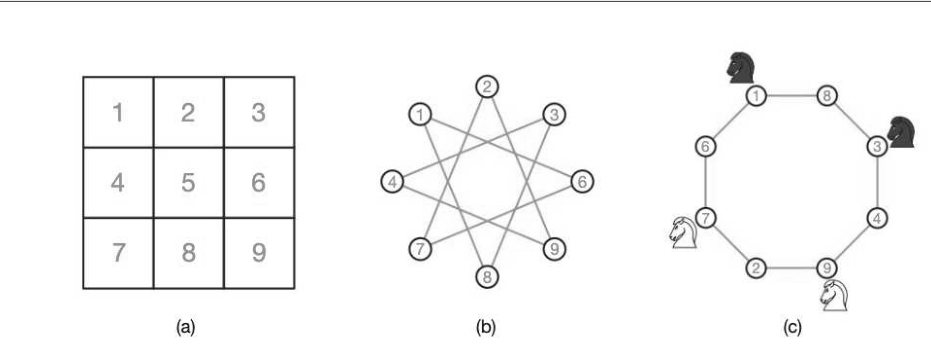
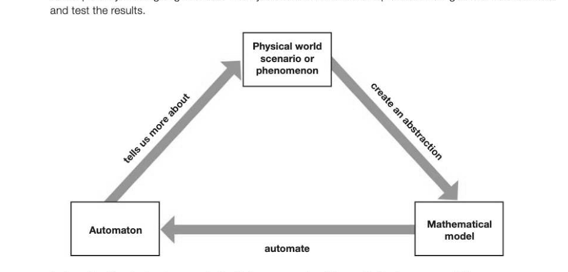
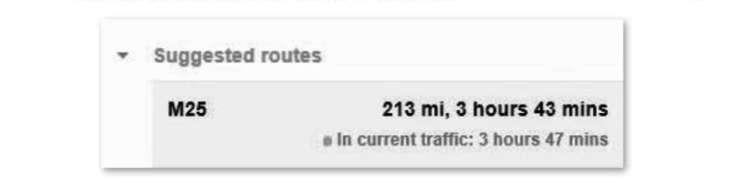

# Chapter 11 — Abstraction and automation
## Objectives

- Describe the skills involved in computational thinking Understand the concept of abstraction
- Give examples of different types of abstraction
- Describe the process of automation for solving problems

## Computational thinking

By this time, you are probably fairly clear about the idea of an algorithm and a problem which involves computation. But what is computational thinking? It is not about following an algorithm in one's head to carry out a mathematical task like adding two numbers. Rather, it is about thinking how a problem can be solved. This involves two basic steps: Formulate the problem as a computational problem — in other words, state it in such a way that it is potentially solvable using an algorithm « Try to construct an algorithm to solve the problem A computational thinker will not be satisfied with any old algorithm, though; it must be a 'good' solution — that is, a correct and efficient solution. A programmer needs to be able to show that a solution is correct and efficient by using logical reasoning, test data and user feedback. Clearly, then, computational thinking is a vital skill for a programmer, and in fact it is not possible to be a programmer without it. It includes the ability to think logically and to apply the tools and techniques of computing to thinking about, understanding, formulating and solving problems. Computing has been called the automation of abstractions, so let's move on to talk about abstraction.

## Abstraction

Representational abstraction can be defined as a representation arrived at by removing unnecessary details. Here are some examples of abstraction. « Any computer model, say of the environment, a new car or a flight simulator, is an abstraction.

- Ifyou are planning to write a program for a game involving a bouncing ball, you will need to decide what properties of the ball to take into account. If it's bouncing vertically rather than, say, on a snooker table, gravity needs to be taken into account. How elastic is the ball? How far and in what direction will it bounce when it hits an edge? What you are required to do is build an abstract model of a real-world situation, which you can simplify; remembering, however, that the more you simplify, the less likely it becomes that the model will mimic reality.
A builder who is planning to build 100 houses on a new estate may use a physical model of the new estate, or in the first instance, a plan on paper or on a computer screen. In either case the model will be greatly simplified. All the houses may appear identical in the model. They may lack windows, doors or chimneys. All the trees in the model may be of identical size, colour and shape.

- The map of the London Underground is a simple model of the actual geography of the Tube stations.
The map tells you what line each station is on and which other lines each station is connected to. It is very useful for a person travelling around London, but of very little use to an engineer who is planning where to dig tunnels for a proposed new line. Abstraction applied to high level programming languages Abstraction is the most important feature of high level programming languages such as Python, C#, Java and hundreds of other languages written for different purposes. To understand why, we need to look at different generations of programming language. « The first generation of language was machine code — programmers entered the binary Os and 1s that the computer understands. Writing a program to solve even a short, simple problem was a tedious, time-consuming task largely unrelated to the algorithm itself.

- The second generation was an improvement; mnemonic codes were used to represent instructions.
But as you will see in later chapters in Sections 4 and 5, it was still an enormously complex task to write an assembly language program and what's more, if you wanted to run the program on a different type of computer, it had to be completely rewritten for the new hardware.

- The third generation of languages, starting with BASIC and FORTRAN in the 1960s, used statements.
like X = A + 5, finally freeing the programmer from all the tedious details of where the variables X and Awere stored in memory, and all the other fiddly implementation details of exactly how the computer was going to carry out the instruction. Finally, programmers could focus on the problem in hand rather than worrying about irrelevant

## Abstraction by generalisation

There is a famous problem dating back more than 200 years to the old Prussian city of Kénigsberg. This beautiful city had seven bridges, and the inhabitants liked to stroll around the city on a Sunday afternoon, making sure to cross every bridge at least once. Nobody could figure out how to cross each bridge once and once only, or alternatively prove that this was impossible, and eventually the Mayor turned to the local mathematical genius Leonhard Euler. The map of 18th century Kénigsberg Euler's first step was to remove all irrelevant details from the map, and come up with an abstraction: jorth bank What we now have is a graph, with nodes representing land masses and edges (lines connecting the nodes) representing the bridges. Now that Euler had his graph, how could he solve the problem?

He did not want to try every possible solution; he realised that this was just a particular instance of a more general problem and he wanted to find a solution that was applicable to similar problems. He noticed a critical feature of the puzzle: since each bridge could be crossed only once, each node had to have an even number of connections, because you must enter and leave a node by a different edge. The only exceptions are the start and end node, since you don't have to enter a start node or leave the end node. All the nodes in this graph have an odd number of nodes, so it is therefore impossible! Euler had laid the foundation of graph theory, which you will come back to in the second year of this course. By abstracting the problem, Euler made possible the solution of innumerable related problems. Not only does it apply to different cities with different numbers of bridges, it applies to many other problems with similar requirements. Abstraction by generalisation, as illustrated above, is a grouping by common characteristics to arrive at a hierarchical relationship of the "is a kind of" type. Thus Euler's problem is a particular instance of graph theory. This type of abstraction is very common in object-oriented programming. A class of object, say an Animal, will be defined with its own attributes such as gender and whether it is carnivore or vegetarian, and its own behaviours, methods or procedures such as move, sleep, eat, etc. Other objects such as Dog, Cat, Mouse and so on may be defined as sub-classes of Animal - they all share common characteristics which are defined in the Animal class, but have their own attributes and behaviours as well. In other words Dog "is a kind of" Animal, as are Cat and Mouse.

## Procedural abstraction

Computer science is, in broad terms, the study of problem-solving, and as such, is also the study of abstraction. As we have seen, abstraction allows us to separate the physical reality of a problem from the logical view. Thus, for example, you can send an email, play music or download an image without knowing any of the detail of how these things are actually done. On the other hand, the computer engineers, technicians and system administrators who enable these things to happen have a very different view. They need to be able to control the low-level details that users are not even aware of. Procedural abstraction means using a procedure to carry out a sequence of steps for achieving some task such as calculating a student's grade from her marks in three exam papers, buying groceries online or drawing a house on a computer screen. Consider, for example, how you could code a program to create the plan for an estate of 100 new houses. You could use a procedure which will draw a triangle of certain dimensions and colour at a particular place on the screen. The colour and dimension are passed as arguments to the procedure,

The programmer does not need to know the details of how this procedure works. She simply needs to know how the procedure is called and what arguments are required, what data type each one is and what order they must be written in. This is called the procedure interface. Similarly, there may be a procedure to build a rectangle that is defined by parameters colour, height and width, which are passed as arguments: drawRectangle ("beige", 4.0, 5.0) To draw a house at a given position on the screen, the programmer may write a procedure buildHouse () which uses the drawTriangle() and drawRectangle() procedures, aligns them and positions the house at a particular position on the screen. All these variables will be passed as arguments to the procedure. Several houses could be combined to make a street. Several streets could be drawn to represent the estate. Then, if the builder of the new estate decides to make all the houses larger, the procedure for drawing the house does not need to be changed - it is simply called with new arguments.

## Functional abstraction

A function is called to return the result of a particular problem. For example, x = sqrt (17) The computation method is of no concern to the user and is hidden. Functional abstraction, then, is a mapping from one set of values to another. The result of this mapping is unique to a given set of inputs, and a value must always be returned.

## Data abstraction

A similar idea is that of data abstraction. The details of how data are actually represented are hidden. For example, when you use integers or real numbers in a program, you are not interested in how these numbers are actually represented in the computer. In a higher level language, it is possible to create abstract data types such as queues, stacks and trees. The abstract data type, for example a queue, is a logical description of how the data is viewed and the operations that can be performed on it. For example, elements can be added to the rear of the queue and removed from the front. The queue may have a maximum size that cannot be exceeded. The programmer using this data structure, however, is concerned only with the operations such as AddToQueue or RemoveFromQueue and does not need to know how the data structure is implemented using, for example, an array and pointers to the front and rear of the queue.

## Information hiding

Information hiding is where data is not directly accessible and can only be accessed through defined procedures/functions. This is most commonly seen in object-oriented programming, for example in a class where the data or attributes of the class are private and can only be accessed through public functions.

## Decomposition and Composition

Decomposition is breaking down a complex problem into a number of sub-problems, each of which performs an identifiable task. Composition is the opposite - combining procedures to form compound procedures (e.g. BuildHouse, BuildStreet). It can also mean combining objects to form compound data, for example records or a data structure such as a queue, tree or list.

## Problem abstraction

Problem abstraction involves removing details until the problem is represented in a way that it is possible to solve because it reduces to one that has already been solved. For example, the problem of how to find your way through a maze can be reduced to a problem of traversing a graph, for which there is an algorithm - something you will be studying in the second year of this course! (See Chapter 47 of the A Level textbook.) Consider the following problem: There are four knights on a 3x3 chessboard: the two white knights are at the bottom two corners, and the two black knights are at the two upper corners. The goal is to switch the knights in the minimum number of moves so that the white knights are in the upper corners and the black knights are in the bottom corners. (A knight can only move in the following manner: one or two squares horizontally or vertically, followed by two squares or one square at right angles, moving 3 squares in total.)

We can abstract this problem by first numbering the squares of the chessboard. 1 to 9. Now we can draw lines from 1 to 6 and 1 to 8 representing the two possible moves from square 1. Do the same for each square in turn, and you end up with the graph shown in (b). (Square 5 can't be reached with a knight's move so it is omitted from this graph.)

Figure (b) is not much help in solving the problem. Now imagine that all the vertices are joined by a single string, and now rearrange the string so that the vertices form a circle — this gives us a much more revealing picture. There are only two ways to solve the puzzle in the minimum number of moves; move the knights along the edges in either a clockwise or a counter-clockwise direction until each of the knights reaches the diagonally opposite corner for the first time. This can be seen as a 'graph unfolding' problem, equivalent to a general problem that has already been solved in the same way, so is a reduction of the more general problem.

## 2-11 Automation

Automation in computer science deals with building and putting into action models to solve problems. For example, you could model the financial implications of running an ice-cream stand at a given venue for a week or a longer period. You have to decide on what has to be included in the model and what assumptions you are going to make. Then you have to create and implement the algorithms and execute

Automating the abstraction may in fact tell us more about the reality that we are modelling.

---

## Exercises

1. "Representational abstraction is a representation arrived at by removing unnecessary details." Describe what this means in relation to a computer program which allows the user to enter a starting address A and a destination address B and returns a map of the route, the number of miles and the estimated journey time it will take to travel by car from A to B. (5)

2. Explain how information hiding and procedural abstraction could be used in a game program in which the player has to collect treasure in a cave and avoid being eaten by a monster. [5] 3. Describe briefly three ways in which computer scientists make use of the concept of abstraction in solving problems. (6) 4. The goal in this problem is to place as many coins as possible at points of the 8-pointed star depicted below, according to the following rules: Each coin must first be placed on an unoccupied point and then moved along a line to an unoccupied point

- Once a coin has been positioned, it cannot be moved again. 8 1 5 4
For example, you could make the following sequence of moves: 1 > 4,29 5,396,732,893 which places 5 coins. What is the maximum number of coins that can be placed? (1) Tip: Use the "graph unfolding" method of solution explained on the previous page.
