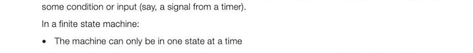
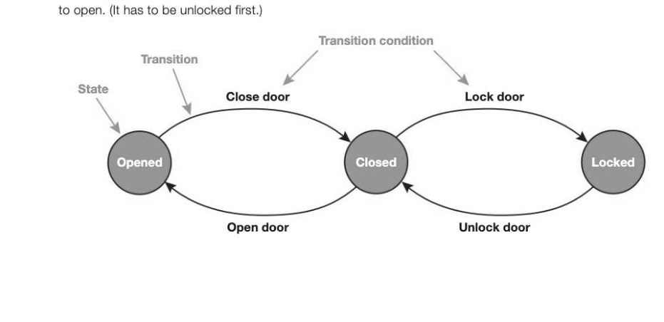
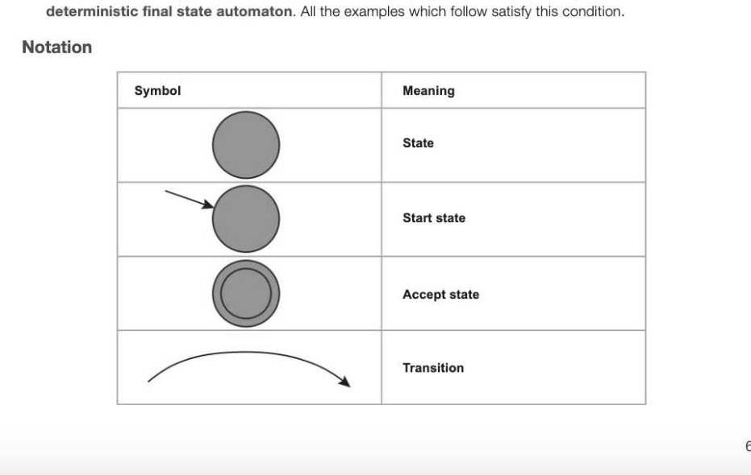
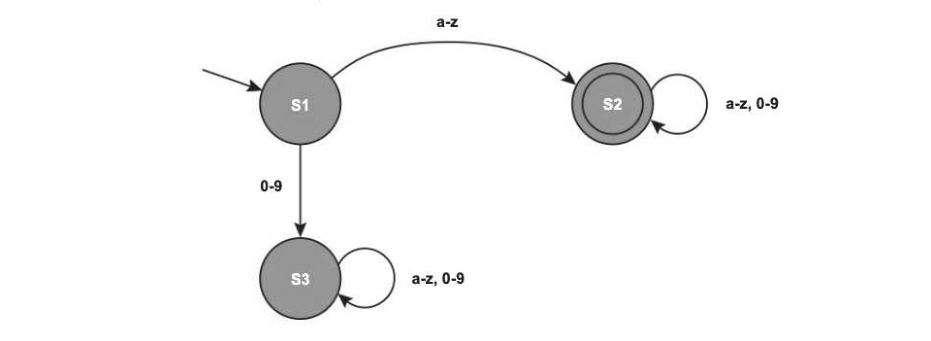
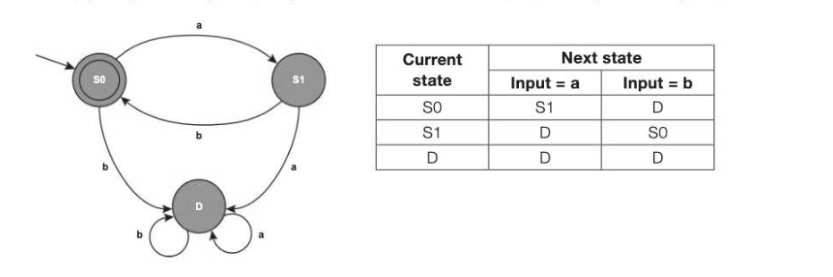
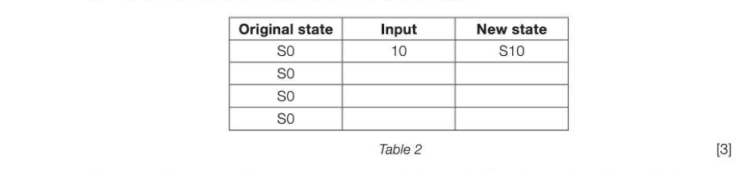
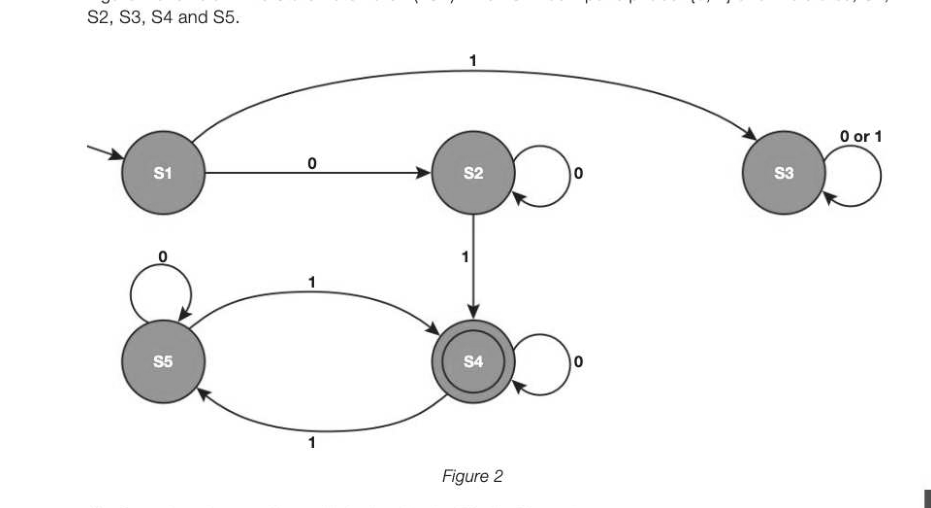
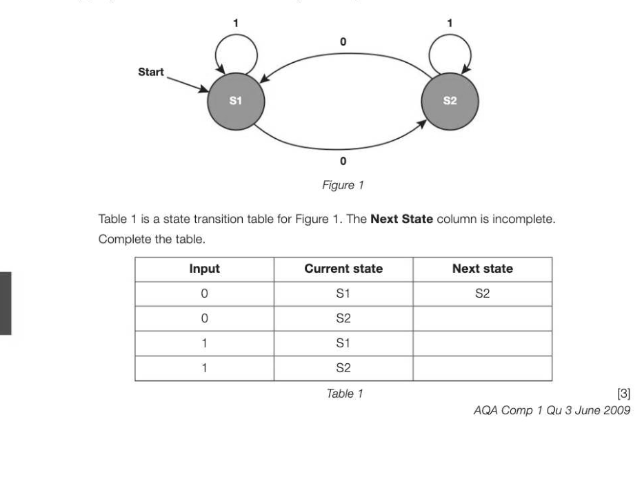

# Chapter 12 — Finite state machines
## Objectives

« Understand what is meant by a finite state machine

- List some of the uses of a finite state machine
- Draw and interpret simple state transition diagrams for finite state machines with no output
- Draw a state transition table for a finite state machine with no output and vice versa

## What is a finite state machine?

A finite state machine is a model of computation used to design computer programs and sequential logic circuits. It is not a "machine" in the physical sense of a washing machine, an engine or a power tool, for example, but rather an abstract model of how a machine reacts to an external event. The machine can be in one of a finite number of states and changes from one state to the next state when triggered by

- Itcan change from one state to another in response to an event or condition; this is called a transition. Often this is a switch or a binary sensor.
- The Finite State Machine (FSM) is defined by a list of its states and the condition for each transition
There can be outputs linked to the FSM's state, but in this chapter we will be considering only FSMs with no output.

## Example 1

Draw an FSM to model the states and transitions of a door. The door can be open, closed or locked. It can change from the state of being open to closed, from closed to locked, but not, say, from locked

## Example 2

Draw an FSM to represent a light switch. When the button is pressed, the light goes on. When the button is pressed again, the light goes off. There is just one input B to this system: Button pressed (B=1) or Button not pressed (B=0). B=1 B=1 Notice that in each state, both the transitions B=0 and B=1 are drawn. If the light is off, the transition B=0 has no effect so the transition results in the same state. Likewise, if the light is on, as long as the button is not pressed, the light will stay on.

## Usage of finite state machines

FSMs are widely used in modelling the design of hardware digital systems, compilers and network protocols. They are also used in the definition of languages, and to decide whether a particular word is allowed in the language. A finite state machine which has no output is also known as a finite state automaton. It has a start state and a set of accept states which define whether it accepts or rejects finite strings or symbols. The finite state automaton accepts a string C;, C2...C, if there is a path for the given input from the start state to an accept state. The language recognised by the finite state automaton consists of all the strings accepted by it. If, when you are in a particular state, the next state is uniquely determined by the input, it is a

## Example 3

Use an FSM to represent a valid identifier in a programming language. The rules for a valid identifier for this particular language are:

- The identifier must start with a lowercase letter
« Any combination of letters and lowercase numbers may follow

- There is no limit on the length of the identifier

In this diagram, the start state S1 is represented by a circle with an arrow leading into it. The accept state S2 is denoted by a double circle. S3 is a "dead state" because having arrived here, the string can never reach the accept state. Each character of the input string is input sequentially to the FSM and if the last character reaches the final state S2 (the accept state), the string is valid and is accepted. If it ends up anywhere else the string is invalid. Note that there can only be one starting state but there may be more than one accept state (or no accept states).

## Example 4

This FSM takes a string, e.g. aaabb, baa, aba. If after reading the whole string, you reach the accept state, the string is valid. The first of these strings is accepted. What about the other two? An alternative representation of an FSM is a state transition table. This shows the current state and the next state for each input. The table below corresponds to the finite state diagram in Example 4 above.

## Example 5

Draw the state transition diagram and the equivalent state transition table for a language in which an empty string or a string of any length in the form ababab is accepted, and any other string is rejected.

---

## Exercises

1. Figure 2 shows the state transition diagram of a finite state machine (FSM) used to control a vending machine. The vending machine dispenses a drink when a customer has inserted exactly 50 pence. A transaction is cancelled and coins returned to the customer if more than 50 pence is inserted or the reject button (R) is pressed. The vending machine accepts 10, 20 and 50 pence coins. Only one type of drink is available. The only acceptable inputs for the FSM are 10, 20, 50 and R.

*Figure 2*

An FSM can be represented as a state transition diagram or as a state transition table. Table 2 is an incomplete state transition table for part of Figure 2. (a) Complete the missing sections of the four rows of Table 2.

*Table 2 (3)*

There are different ways that a customer can provide exactly three inputs that will result in the vending machine dispensing a drink. Three possible permutations are "20, 10, 20", "10, R, 50" and "10, 50, 50". (b) List four other possible permutations of exactly three inputs that will be accepted by the FSM shown in Figure 2. [4] AQA Comp! Qu 4 June 2012

## Exercises continued

2. Figure 2 shows a Finite State Automaton (FSA). The FSA has input alphabet {0, 1} and five states, S1,

*Figure 2*

(a) Complete the transition table below for the FSA in Figure 2. 2-12 Current state Ss, Ss, Ss, Ss, S; S; S, S, Ss Ss; Input symbol 0 1 0 1 0 1 Next state S (1) (b) The state S4 is a special state. This is indicated by the double circle in the diagram. What does the double circle signify? (1) (c) Write Yes or No in each row of the table below to indicate whether or not each of the four input strings would be accepted by the FSA in Figure 2. (2)

(d) Describe the language (set of strings) that the FSA will accept. [2] AQA Comp 3 Qu 4 June 2011

## Exercises continued

3. (a) A state transition diagram models the operation of a hotel lift. A program is written to simulate the behaviour of the lift in a hotel. Describe three states that should be present in this diagram. [3] (b) Figure 1 shows a state transition diagram for a problem which has two states S1 and S2.

*Figure 1*

## Section 3

## Data representation

In this section: Chapter 13 Number systems 68 Chapter 14 Bits, bytes and binary 72 Chapter 15 Binary arithmetic and the representation of fractions 77 Chapter 16 Bitmapped graphics 83 Chapter 17 Digital representation of sound 88 Chapter 18 Data compression and encryption algorithms 93
