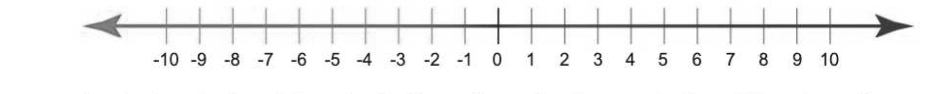
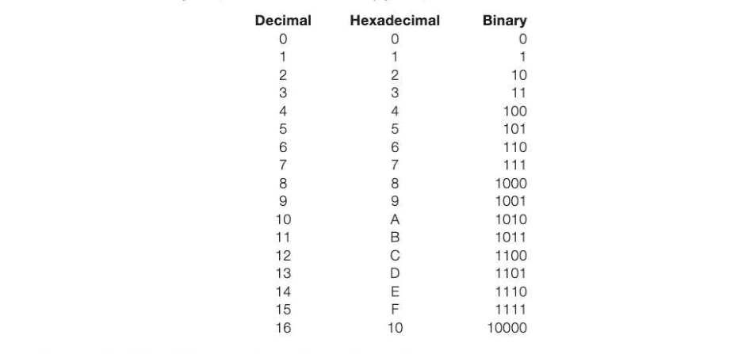
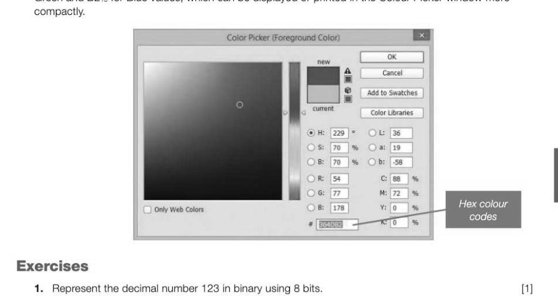

# Chapter 13 — Number systems
## Objectives

- Define a natural number, an integer and a real number
e Explain the difference between a rational and irrational number by example « Understand and use ordinal numbers in context

- Convert between binary, decimal and hexadecimal number systems.

## Number types

On the number line, any whole number, for example, -10, -4, 0, 7, 1076 or 130793879 is an integer.

A natural number is a whole number that is used in counting. For example, five gold rings, four calling birds, three French hens. The (infinite) set of natural numbers, including zero, is referred to as N in mathematics. Thus N = {0, 1, 2, 3,...} A rational number is any value that can be expressed as a ratio, or fraction. This includes all integer values since each can simply be expressed as 7/1 or 1076/1, to use the examples above. An irrational number such as pi is one that cannot be expressed as a fraction and which has an endless series of non-repeating digits. Pi (mt) can be expressed as 3.141592.... but not as a fraction. 22/7 gets close, but it's not correct. An irrational number cannot be correctly represented using a finite number of digits, and therefore a rounding error will occur. Number Ratio or fraction Rational or irrational? 1.75 7/4 Rational 0.3333333 recurring 1/3 Rational v2 Cannot be expressed as a fraction | Irrational In mathematics, the set of integers is referred to as Z and the set of rational numbers is expressed as Q. All integers are rational numbers, so Z = {..., -3, -2, -1, 0, 1, 2, 3,...} A real number is any natural, rational or irrational number. The set R of real numbers is defined as 'the set of all possible real world quantities'. This includes, for example, -10, -6.456, 0.4, 6.0, /2 and Tr. It does not include 'imaginary' numbers such as y-1, or infinity (00). In programming languages, the data type 'real' has a slightly different meaning and is defined simply as a number with a decimal point. The set of real numbers is represented by the symbol R. While natural numbers are used for counting, real numbers are commonly used for measurement.

## Ordinal numbers

Ordinal numbers describe the numerical position of objects: first in a race, second turn on the left. They are used as pointers to a particular element in a sequence, or to define the position of something in a list; for example, an array pointer. Characters and integers are examples of ordinal data types.

## Number bases

Our familiar decimal (or denary) number system uses the digits 0 through 9 and therefore has a base of 10. Binary uses only the digits 0 and 1 and has a base of 2. Hexadecimal uses a base of 16 with digits 0-9 and letters A to F. A number's base can be written as a subscript to denote its value in the correct number system. For example 110 denotes the number eleven in decimal. 112 would denote a binary value, (with a decimal equivalent of three) and 11,5 would denote a hexadecimal value. (17 in decimal.)

## The binary number system

In order to better understand the simplicity of the binary number system, it is best to examine how our familiar decimal number system works. Columns, right-to-left, represent units, tens and hundreds etc. We mentally multiply the values with their column value and add the totals together.

The principle is exactly the same in the binary number system. As we move from right to left, each digit is worth twice as much as the previous one, instead of ten times as much.

The minimum and maximum values that can be represented using unsigned binary for n bits are O and 2" - 1 respectively.

## Converting from decimal to binary

To convert a decimal number to binary, first write headings from right to left of 1, 2, 4, 8... 128. (If the number given is greater than 255, continue writing headings). To convert a number, for example 73, to binary, write a 1 under the largest heading less than 73 (i.e. 64). You now have 73 - 64 = 9 remaining, to be converted to binary. 9 = 8 + 1 so put 1 under 8 and under 1. Fill the spaces with zeros. The binary number representing 73 is 01001001. 128 64 32 16 8 4 2 1 ) 1 0 oO 1 oO i) 1

## The hexadecimal number system

The hexadecimal system, often referred to as simply 'hex', uses a base of 16 as follows:

## Converting from binary to hexadecimal and vice versa

To convert a binary number to hexadecimal, split the binary number into groups of 4 binary digits. Binary 0011 10100-1111 1001 Hex 3 A F 9 = SAFO To convert from hex to binary, perform this operation in reverse by grouping the bits in groups of 4 and translating each group into binary. For example, to convert the number 23:6 to binary Hex 2 3 Binary 0010 = 0011 = 00100011

## Converting from hexadecimal to decimal and vice versa

To convert from hexadecimal to decimal, remember that the left column now represents 16s and not

To convert a decimal number to hex, the easiest way is to first convert the decimal number to binary and then from binary to hex. For example, to convert 75:0 to hex:

Therefore 75:0 = 4Bis (75/16 = 4 remainder 11, or 4B, since 11 is B in hexadecimal).

## Why the hexadecimal number system is used

The hexadecimal system is used as a shorthand for binary since it is simple to represent a byte in just two digits, and fewer mistakes are likely to be made in writing a hex number than a string of binary digits. It is easier for technicians and computer users to write or remember a hex number than a binary number. Colour codes in images often use hexadecimal to represent the RGB values, as they are much easier to remember than a 24-bit binary string. In the example below #364DB2 represents 36;• for Red, 4D,• for Green and B2:6 for Blue values, which can be displayed or printed in the Colour Picker window more

---

## Exercises

1. Represent the decimal number 123 in binary using 8 bits. (1) How many different decimal numbers can be represented using 8-bit binary? (1) What is the hexadecimal equivalent of the decimal number 123? (1) Why are bit patterns often displayed using hexadecimal instead of binary? 2]

*Figure 1*

Figure 1 shows the contents of a memory location. What is the decimal equivalent of the contents of this memory location if it represents an unsigned binary integer? a} What is the hexadecimal equivalent of the binary pattern shown in Figure 1? o] Convert the hexadecimal number DA to decimal. O] Give one example of a natural number and one example of an irrational number. (2) Which of the following, if any, are not part of the set IR of real numbers? -12.75, 0, 22/7, 58, V2
