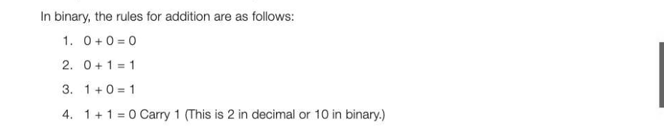
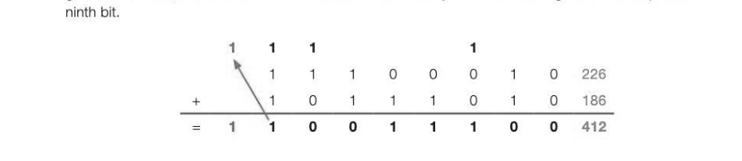
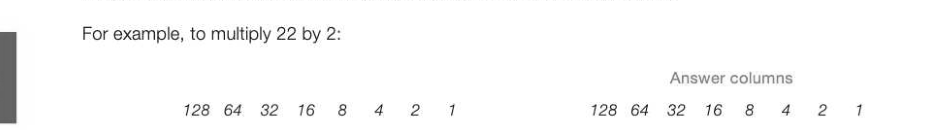
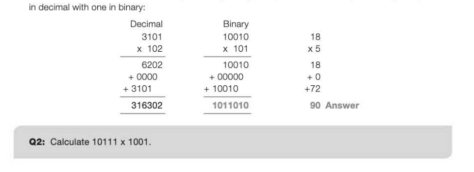
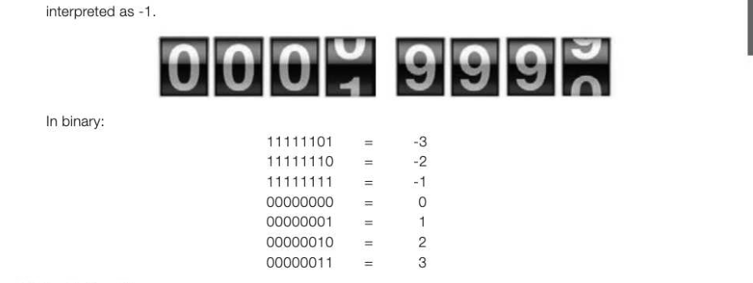
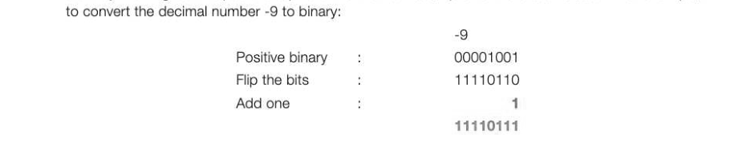
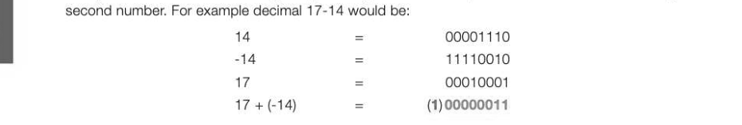
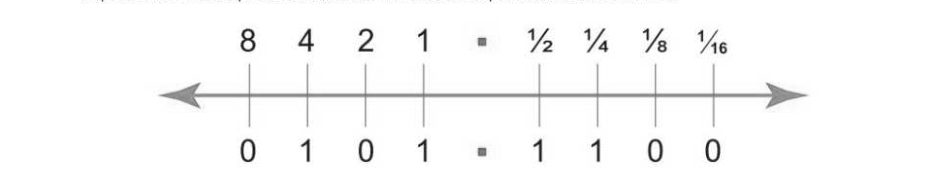
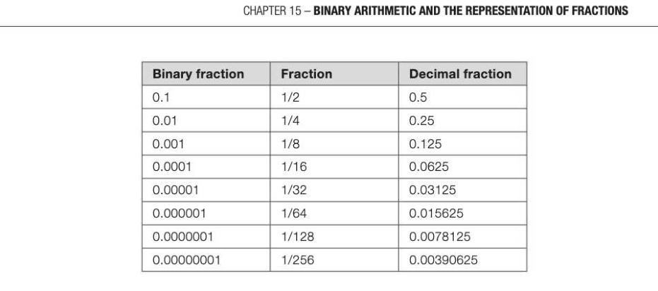
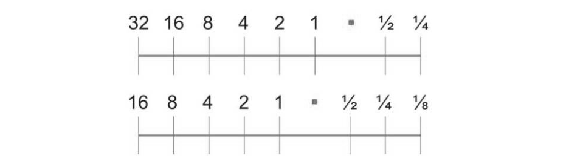

# Chapter 15 — Binary arithmetic and the representation of fractions
representation of fractions

## Objectives

- Be able to add and multiply together two unsigned binary numbers
- Convert between signed binary and decimal and vice versa
« Represent positive and negative numbers in two's complement and specify the range of n bits Perform subtraction using two's complement « Understand how numbers with a fractional part can be represented in binary « Use fixed point binary form to represent a real number in a given number of bits

## Binary addition

Binary addition works in a similar way to decimal addition. If two numbers added together are equal to or greater than the base value, (in the case of decimal, 10) then the 'tens' are carried. In binary, an addition that equals 2 or more results in a carry over to the next column.



5. 1+1+41=1 Carry 1 (This is 3 in decimal or 11 in binary.) Use the following worked example as a guide to where and how each of the rules is implemented.


```
§ © ©←£ Ve
© é
```

## Overflow

In the following example, 8 bits are used to store the result of an addition. The result of the addition is greater than 255, and an overflow error occurs where a carry from the most significant bit requires a



## Binary multi

Multiplication also works in a similar way to our decimal system. In decimal, moving a number one place value to the left multiplies it by 10, and shifting it 2 places to the left multiplies it by 100. In binary, shifting a number one place to the left multiplies it by 2. Shifting it 2 places to the left multiplies it by 4, shifting it 3 places to the left multiplies it by 8, and so on. There are several methods of doing binary multiplication, one of them being to use a combination of shifts and addition, best shown by the example below. However, you may find the second method, using long multiplication and shown on the next page, easier to understand and apply.



Multiplicand O 0 O 1 0 1 1. 0 22 Answer 0 0 1 0 1 1 0 0 44 Multiplier 0 0 080 0 0 0 1 0 2 (Multiplicand shifted left one place) To multiply 22 by 3, you need to add the multiplicand (multiplied by 1) to the multiplicand multiplied by 2. Answer columns 128 64 32 168 4 2 1 128 64 32 16 8 4 2 1 Multiplicand O 0 O 1 O 1 1 0 22 oo oOo 1 0 1 1 0 22 Multiplier O O08 O08 0 O O 1 1 3 + oo 1 0 1 1° 0 0 44 Answer 0 1 0 0 0 0 1 0 66 To multiply 22 by 10, add the multiplicand multiplied by 2 to the multiplicand multiplied by 8 Answer columns 128 64 32 168 4 2 1 128 64 32 16 8 4 2 1 Multiplicand O 0 0 1 O 1 1 0 22 oo 1 0 1 1 0 0 44 Multiplier O O© O O 1 0 1 O 10 + 1 0 1 1 0 0 0 O 176 Answer 1 1°01 1 1 0 O 220

This is effectively exactly the same as performing a long multiplication sum. Compare a long multiplication



## Signed and unsigned binary numbers

An unsigned representation of a binary number can only represent positive numbers. A signed representation can represent both positive and negative numbers. Two's complement, described below, is one representation of a signed binary number.

## Two's complement

Two's complement binary works in a similar way to numbers on an analogue counter. Moving the wheel forwards one, will create a reading of 0001; turn back one, and the reading will become 9999. 9999 is



## Calculating the range

The range that can be represented with two's complement using rn bits is given by the formula: -(2@D)..2@D-1 With eight bits, the maximum decimal range that can be represented is -128 to 127 because the leftmost bit is used as a sign bit to indicate whether a number is negative. If the leftmost number is a 1, itis a negative number. Thus 10000000 represents -128

## Converting a negative decimal number to binary

Start by working out the positive equivalent of the number, flip all of the bits and add 1. For example,



Converting a negative two's complement binary number to decimal The same method works the other way. Flip all of the bits and add 1. Then work out the result in decimal using the normal method. For example, to convert the binary number 11100101 to decimal:


## Binary subtraction using two's complement

Binary subtraction is best done by using the negative two's complement number and then adding the



The carry on the addition is ignored, and the correct answer is given.

## Fixed point binary numbers

Fixed point binary numbers can be a useful way to represent fractions in binary. A binary point is used to separate the whole place values from the fractional part on the number line:



In the binary example above, the left hand section before the point is equal to 5 (4+1) and the right hand section is equal to (9%), or 0.5 + 0.25 = 0.75. So, using four bits after the point, 0101 1100 is 5.75 in decimal. A useful table with some decimal fractions and their equivalents is given below:



## Converting a decimal fraction to fixed point binary

To convert the fractional part of a decimal to binary, you can employ the same technique as you would when converting any decimal number to binary. Take the value and subtract each point value from the amount until you are left with 0. Take the example 3.5625 using 4 bits to the right of the binary point:


It is worth noticing that in this system, some fractions cannot be represented at all. 0.2, 0.3 and 0.4, for example, will require an infinite number of bits to the right of the point. The number of fractional places would therefore be truncated and the number will not be accurately stored, causing rounding errors. In our decimal system, two decimal places can hold all values between.00 and.99. With the fixed point binary system, 2 digits after the point can only represent 0, %, ¥, or % and nothing in between.



The range of a fixed point binary number is also limited by the fractional part. For example, if you have only 8 bits to store a number to 2 binary places, you would need 2 digits after the point, leaving only 6 bits before it. 6 bits only gives a range of 0-63. Moving the point one to the left to improve accuracy within the fractional part also serves to half the range to just 0-31. Even with 32 bits used for each number, including 8 bits for the fractional part after the point, the maximum value is only about 8 million. Another format called floating point binary may be used, but this is not examined at AS Level.


---

## Exercises

1. Represent the decimal value -19 as an 8-bit two's complement binary integer. (2) 2. What is the largest positive decimal value that can be represented using 8-bit two's complement binary? 1] 3. Describe how 8-bit two's complement binary can be used to subtract one number from another number. In your answer show how the calculation 25 —- 49 would be completed using the method that you have described. (2) 4. Acomputer stores the current temperature of a supermarket delivery van. The temperature in °C is stored as a two's complement integer using a single byte. (a) Convert the freezer temperature value of -19 into binary. (2) (b) State the range of temperature values that can be stored using 8 bits. 1) 5. Amemory location contains the value 10101011. What is its decimal equivalent if it represents a two's complement binary integer? (2) 6. Using 1 byte to hold each number, with an imaginary binary point fixed after the fourth digit, convert the following decimal numbers to binary: (a) (i) 4.25 (ii) 7.1875 (ii) 6.875 (3) (b) Convert the following binary numbers to decimal, assuming four bits after the point: (i) 0000000001 101000 (i) 00000000001 10010 (2) (c) What are the largest and smallest positive numbers that can be stored in two bytes assuming four bits after the binary point? (2)
