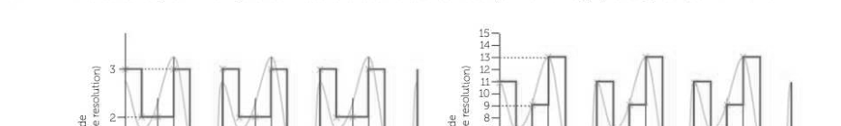
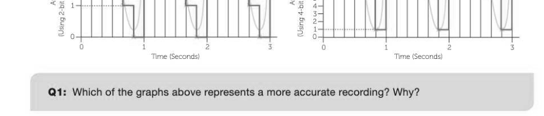
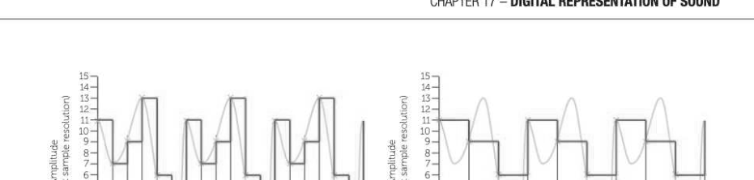
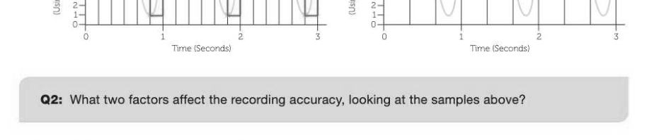
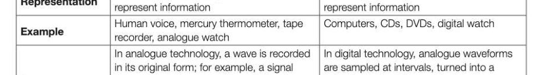
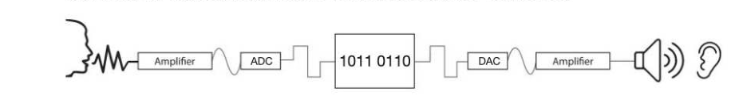
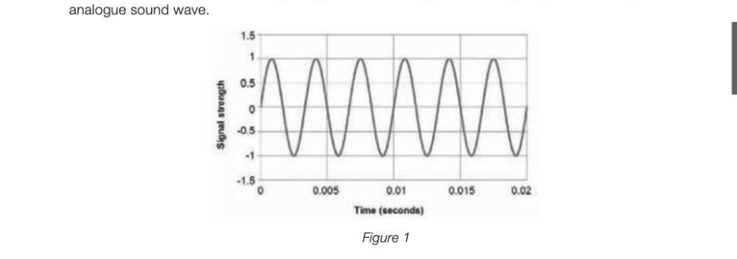
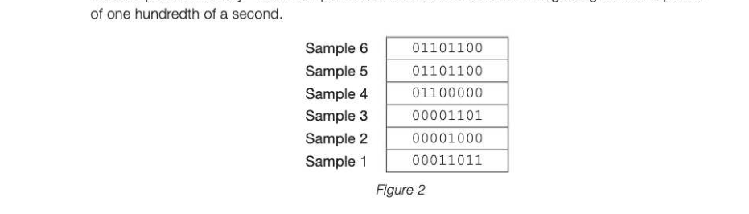

# Chapter 17 — Digital representation of sound
## Objectives

- Describe the digital representation of sound in terms of sampling rate and resolution
- Describe the principles of operation of an analogue to digital converter and a digital to analogue converter Understand and apply the Nyquist theorem
- Calculate sound sample sizes in bytes
- Describe the purpose of MIDI and the use of event messages
- Describe the advantages of using MIDI files for representing music

## Sound sampling and resolution

Sound waves are naturally in a continuous, analogue form. To represent sound in a computer, the (continuous) analogue sound waves have to be converted to a (discrete) digital format. This can be done by measuring and recording the amplitude of the sound wave at given time intervals (several thousand times per second). The more frequently the samples are taken, the more accurately the sound will be represented. The frequency at which samples are taken is measured in hertz (Hz), a unit of frequency equal to one cycle per second. In addition, in the same way that an image's quality is improved with a more precise representation of 3-17 colour enabled by a greater colour depth, the accuracy of a sound recording increases with a greater audio bit depth. Increasing the number of points of amplitude (represented on the y axis below) increases the accuracy at which you can record a sound's amplitude (or wave height) at a given point in time.

a3 z q 6 Ea 5 "B14 4

## Sample rate

The sampling rate is the frequency with which you record the amplitude of the sound. The more often you take a sample, the smoother the playback will sound. The disadvantage of this, is that every time you take a sample, at a resolution of say 16 bits, you need to store another 2 bytes of data. A typical CD recording is made at 44,100Hz, or 44,100 times per second. This means that for every second of sound, 2 bytes x 44,100 = 88,200 / 1000 = 88.2KB is required and for every minute, approximately 5.3MB is required. For stereo sound, this is doubled to provide samples for left and right channels.

4-bit = 44 (Using |

## Calculating sound sample sizes

To calculate the byte size of a sample, you must multiply: the number of samples per second x the number of bits per sample x the length of the sample in seconds A sample of one minute taken at a resolution of 16 bits at 2OKHz would be calculated as follows: 20,000 x 16 x 60 = 19,200,000 bits or 2,400,000 bytes or 2.4MB If the sample is recorded in stereo, a sample for each channel is taken and therefore the sample size 3-17 will double.

## Analogue and digital signals and data

The differences are shown in the table below. E Analogue 4 Digital. Acontinuous signal which represents Discrete time signals generated by digital Signal physical measurements modulation Representation Uses a continuous range of values to Uses discrete or discontinuous values to

Data from a microphone can be copied onto a limited set of numbers and stored on a tape, then read, amplified and sent to a digital device speaker to produce the sound — Continuously varying quantities are Quantities are counted rather than Quantifying measured measured.

## Analogue to digital conversion

During the process of converting an analogue sound into a digital recording, a microphone converts the sound energy into electrical energy. The analogue to digital converter (ADC) samples the analogue data at a given frequency, measuring the amplitude of the wave at each point and converting it into a binary value according to the resolution or audio bit depth being used for each sample.

To output a sound, the binary values for each sample point are translated back into analogue signals or voltage levels and sent to an amplifier connected to a speaker. ADCs are used with analogue sensors such as a microphone and the most common use for a DAC is to convert a digital audio signal to an analogue signal. Interpreting frequency The frequency of a sound is determined by the speed of oscillation or vibration of a wave. This controls the pitch and is measured in Hertz, (Hz). By looking at a simple graph, you can interpret the frequency or pitch of the sound. Pann Ananda Pe ACH PO PEGE GEC VYyV VV Vv Vv Vv Mh Ley In the first example above, the wave is oscillating (from peak to trough) twice every 0.001 seconds. That equates to 2,000 oscillations per second, and would therefore have a frequency of 2,000 Hz or 2KHz. The second example would be a lower pitched sound with a frequency of 1KHz.

## Nyquist's theorem

Harry Nyquist discovered in 1928 that in order to produce an accurate recording, the sampling rate must be at least double that of the highest frequency in the original signal. His theory was later proven in 1949 by Claude Shannon. This means that a sound with a frequency of 10,000Hz must be sampled at a minimum of 20,000Hz in order to accurately reproduce the original. The human ear can hear frequencies between approximately 20Hz and 20,000Hz and some individuals are able to hear frequencies a little beyond that. For that reason, CDs are sampled at 44,100Hz in order for recorded sound to be reproduced accurately enough for there to be no audible distinction from the original — at least to most of us. What your dog might make of hearing a CD versus the original is another matter!

## Musical Instrument Digital Interface (MIDI)

MIDI is a technical standard that describes a protocol, digital interface and connectors which can be used to allow a wide variety of electronic musical instruments, computers and other related devices to connect and communicate with one another.

## A midi controller carries event messages that specify pitch

and duration of a note, timbre, vibrato and volume changes, and synchronize tempo between multiple devices. The ability to specify an instrument for a note makes it possible 4 for a computer and only a few skilled musicians with a synthesiser to recreate the music of a much larger ensemble. A MIDI file is not a recording of a live source. It is a list of instructions that tell it to synthesise a sound based on pre-recorded digital samples and synthesised samples of sounds created by different sources of instruments. A MIDI file can use 1,000 times less disk space than a conventional recording at an equivalent quality. The music created is also easily manipulated and the 'instructions' to play a specific song can also be passed on to other digital instruments or played in a different key

---

## Exercises

1. To record sound a computer needs to convert the analogue sound signal into a digital form. During this process samples of the analogue signal are taken. Figure 1 shows part (0.02 seconds) of an

*Figure 1*

The frequency of an analogue sound wave is determined by how many waves of oscillation occur per second and is measured in Hertz (Hz) — the number of waves of oscillation per second. (a) If the part of the analogue sound shown in Figure 1 is the highest frequency in the entire sound to be sampled, what is the minimum sampling rate (in Hz) that should be used? [2] (b) Describe clearly the steps taken by an ADC (analogue-to-digital converter) in the conversion of an analogue sound wave to an equivalent digital signal. [3] MIDI is an alternative method for storing sound digitally that does not use sound waves; instead, information about each musical note is stored. (c) State one advantage of using the MIDI representation for storing sound digitally. (1) (d) State an item of data, other than the note itself, that might be stored about a musical note in a MIDI file. (1) AQA Comp 1 Qu 3 June 2012

## Exercises continued

2. A performance by a music band is to be recorded and distributed on CD. The figure below shows three samples stored in a computer's memory that have been taken from an analogue signal as part of the recording process. A sampling rate of 44,000Hz (Hertz) has been used.

(a) What sampling resolution has been used? (1) (b) If the original analogue signal lasts 100 seconds, how many bytes of storage will be required to store all the samples taken in the recording process? [3] The average human can hear frequencies up to 20,000Hz (Hertz). (c) Explain why a sampling rate of 44,000Hz has been chosen for the recording. [2] The CD recording is processed to create a version of the performance that can be downloaded from the band's website. The sound quality of the version of the recording stored on the web server is not as good as the sound quality of the CD version. (d) State one possible cause of this reduction in sound quality. (1) AQA Comp 1 Qu 3 June 2013 3. To record sound a computer needs to convert the analogue sound into a digital form. During this process samples of the sound have to be taken. Figure 2 shows 6 samples that have been stored in a computer's memory. These samples have been taken from the analogue signal over a period

*Figure 2*

Look at the digital representation, shown in Figure 2, of the analogue sound. One Hertz (Hz) is one sample per second. (a) What sampling rate, in Hertz, has been used? [2] (b) What sampling resolution has been used? (1) (c) State Nyquist's theorem. [2] AQA Comp 1 Qu 3 June 2010
