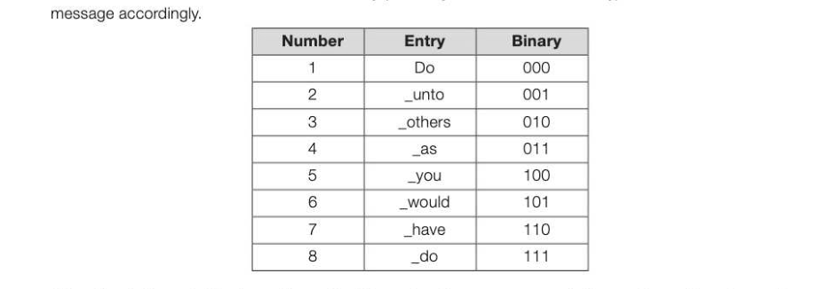
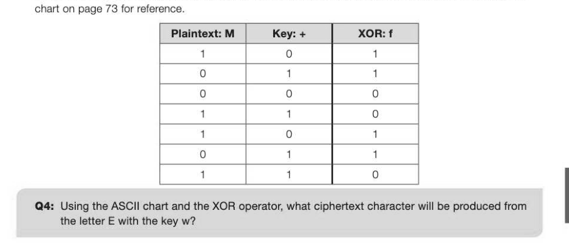
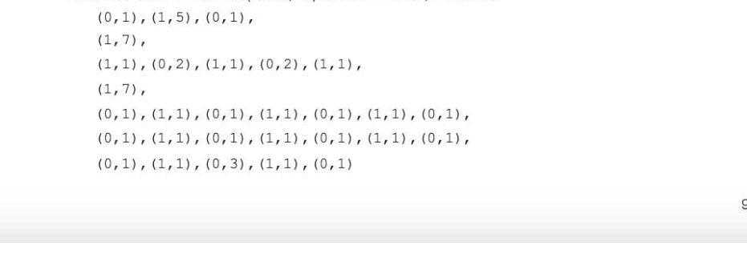

# Chapter 18 — Data compression and encryption algorithms
encryption algorithms

## Objectives

Know why sound and images are often compressed Understand how other files can be compressed « Understand the difference between lossless and lossy compression « Explain the advantages and disadvantages of different compression techniques

- Explain run length encoding and dictionary based compression
- Define encryption by use of examples
- Be able to encrypt and decrypt a message using the Caesar cipher
- Understand the flaws of the Caesar cipher with reference to substitution and brute force methods
- Explain the function of the Vernam cipher by example Explain why the Vernam cipher is considered to have perfect security Compare the Vernam cipher with others that depend on computational security

## Why use compression?

File compression techniques were developed to reduce the storage space of files on disk. With disk 3-18 storage becoming larger and cheaper, this is less important these days, but the reduction of file size has become even more important in the sharing and transmission of data. Internet Service Providers (ISPs) and mobile phone networks impose limits and charges on bandwidth. Images on websites need to be in a compressed format to enable a web page to load quickly — even on a fast connection, music and video streaming must take advantage of compression in order to reduce buffering. (In streaming audio or video from the Internet, buffering refers to downloading a certain amount of data to a temporary storage area or buffer, before starting to play a section of the music or movie.) Compression can be either lossy, where unnecessary information is removed from the original file, or lossless. Lossless compression retains all information required to replicate the original file exactly.

## Lossy compression

Lossy compression works by removing non-essential information. The two JPG images overleaf are clearly identifiable as the same thing, but one has been heavily compressed, displaying untidy and blocky compression artefacts as a consequence. Nevertheless, we can make out the subject of the image well, but the degree to which they are compressed comes at the cost of quality.

Original image 310KB Heavily compressed image 5.7KB The compression of sound and video works in a similar way. MP3 files use lossy compression to remove frequencies too high for most of us to hear and to remove quieter sounds that are played at the same time as louder sounds. The resulting file is about 10% of original size, meaning that 1 minute of MP3 audio equates to roughly 1MB in size. Voice is transmitted over the Internet or mobile telephone networks using lossy compression and although we have no problem in understanding what the other person is saying, we can recognise the difference in quality of a voice over a phone rather than in person. The apparent difference is lost data.

## Lossless compression

Lossless compression works by recording patterns in data rather than the actual data. Using these patterns and a set of instructions on how to use them, the computer can reverse the procedure and reassemble an image, sound or text file with exact accuracy and no data is lost. This is most important with the compression of program files for example, where a single lost character would result in an error in the programming code. A pixel with a slightly different colour would not be of huge consequence in most cases. Lossless compression usually results in a much larger file than a lossy file, but one that is still significantly smaller than the original.

## Run Length Encoding (RLE)

If you were ordering food from a takeaway restaurant for a group of five friends, it is likely that you might ask for "5 pizzas" rather than "one pizza, and another pizza, and another pizza etc." Run Length Encoding exploits the same principle. Rather than recording every pixel in an image, for example, it records its value and the number of times it repeats.

For this section of the balloon image, the encoding for the first row might crudely translate to: 6 green, 8 yellow and 17 orange, using one binary value for the colour value and another for the number of contiguous matching pixels in the run. This would reduce the data necessary to store this row to 6 bytes (00000110 00000001 00001000 00000010 00010001 0000001 1) rather than 31 bytes assuming a bit depth of 8 and values for each colour of 00000001, 00000010 and 00000011. 6m 8m 17m

## Dictionary-based compression techniques

Suppose that instead of sending a complete message, a copy of the Oxford English Dictionary was sent alongside a coded message using the page number and the position of the word on that page. The word 'pelican' falls on page 249 as the 7th word on that page. This could be send as 249,7 — using only 2 bytes; considerably fewer than the 7 bytes it would take to send the complete word. (Ignore, for now, the additional space that it would take to send the dictionary with it!) Dictionary based compression works in a similar way. The compression algorithm searches through the text to find suitable entries in its own dictionary (or it may use a known dictionary) and translates the



Using the dictionary table above, the saying "Do unto others as you would have others do unto you" would be compressed as 12 345 6 7 3 8 25 or in binary using only 33 bits. This compares to 51 characters or 51 bytes — a reduction of 92%. This still ignores the fact that the dictionary must also be stored with the text, but with a longer body of text to be compressed, a dictionary becomes quite insignificant in size compared with the original, and the original message can still be reassembled perfectly.

## What is encryption?

Encryption is the transformation of data from one form to another to prevent an unauthorised third party from being able to understand it. The original data or message is known as plaintext. The encrypted data is known as ciphertext. The encryption method or algorithm is known as the cipher, and the secret information to lock or unlock the message is known as a key. The Caesar cipher and the Vernam cipher offer polar opposite examples of security. Where the Vernam offers perfect security, the Caesar cipher is very easy to break with little or no computational power. There are many others methods of encryption —- some of which may take many computers, many years to break, but these are still breakable and the principles behind them are similar.

## The Caesar cipher

Julius Caesar is said to have used this method to keep messages secure. The Caesar cipher (also known as a shift cipher) is a type of substitution cipher and works by shifting the letters of the alphabet along by a given number of characters; this parameter being the key. Below is an example of a shift cipher using a key of 5. (An algorithm for this cipher is given as an example on page 46.) A\B/C/D/E|F/G)/H/1/J|/K/LIM|N/O/P/Q|R|S|T/U/ Vi W|Xx < N VIVIVIVIVIVIVIV VI Y VI Vivi villi vlvivivi lly

```
←
```

F/G|/H|/ 1) J/K}/LIM|N/O/P/Q/R/|S|T/U)ViW/X|Y|Z|/A|B/C/D/E You will no doubt be able to see the ease with which you might be able to decrypt a message using this system. DGYDQFH WR ERUGHU DQG DWWDFN DW GDZQ Even if you had to attempt a brute force attack on the message above, there are only 25 different possibilities (since a shift of zero means the plaintext and the ciphertext are identical). Otherwise you might begin by guessing the likelihood of certain characters first and go from there. Using cryptanalysis on longer messages, you would quickly find the most common ciphertext letter and could start by assuming this was an E, for example, or perhaps an A. (Hint.)

## Cryptanalysis and perfect security

Other ciphers that use non-random keys are open to a cryptanalytic attack and can be solved given enough time and resources. Even ciphers that use a computer-generated random key can be broken since mathematically generated random numbers are not actually random; they just appear to be so. A truly random sequence must be collected from a physical and unpredictable phenomenon such as white noise, the timing of a hard disk read/write head or radioactive decay. A truly random key must be used with a Vernam cipher to ensure it is mathematically impossible to break.

## The Vernam cipher

The Vernam cipher, invented in 1917 by the scientist Gilbert Vernam, is one implementation of a class of ciphers known as one-time pad ciphers, all of which offer perfect security if used properly. All others are based on computational security and are theoretically discoverable given enough time, ciphertext and computational power. Frequency analysis is a common technique used to break a cipher.

## One-time pad

To provide perfect security, the encryption key or one-time pad must be equal to or longer in characters than the plaintext, be truly random and be used only once. The sender and recipient must meet in person to securely share the key and destroy it after encryption or decryption. Since the key is random, so will be the distribution of the characters meaning that no amount of cryptanalysis will produce meaningful results.

## The bitwise exclusive or XOR

A Boolean XOR operation is carried out between the binary representation of each character of the plaintext and the corresponding character of the one-time pad. The XOR operation is covered in Chapter 23 and you may want to refer to this to verify the output for any combination of 0 and 1. Use the ASCII



Using this method, the message "Meet on the bridge at 0300 hours" encrypted using a one-time pad of +tkiGeMxGvnhoQO0xQDIllVdT4slUm9af will produce the ciphertext: Fdigtx3cH#Y6!i(=vTg' Ci") Lb The encryption process will often produce strange symbols or unprintable ASCII characters as in the above example, but in practice it is not necessary to translate the encrypted code back into character form, as it is transmitted in binary. To decrypt the message, the XOR operation is carried out on the ciphertext using the same one-time pad, which restores it to plaintext.


---

## Exercises

1. Explain the difference between lossy and lossless data compression. (2] 2. Run-length encoding (RLE) is a pattern substitution compression algorithm. Data is stored in the format (colour,run) where 0 = White, 1 = Black.



## Exercises continued

(a) Reassemble the encoded sequence above to form a 7x7 web icon image in the grid below. 3] (b) RLE encoding is a lossless compression method. Give one disadvantage of lossless compression over lossy methods for the compression of images. (1) (c) Explain why compression is considered necessary for images on the web. [2] 3. a) Explain why lossy compression techniques would not be suitable for use with files containing large bodies of text. (1) (b) Suggest a suitable lossless method for compressing text. 1) 3-18 4. The Vernam cipher uses a one-time pad. (a) Explain what is meant by a one-time pad. (1) (b) Using the section of ASCII code below, apply the one-time pad £JFL to the word exam to encrypt it using the Vernam method. [4] |ASCII| DEC | Binary |ASCII| DEC | Binary |ASCII| DEC | Binary _ space| 032 | 0100000 E 069 | 1000101. 096 | 1100000 ! 033 | 0100001 F 070 | 1000110 a 097 | 1100001 " 034 | 0100010 G 071 | 1000111 b 098 | 1100010 £ 035 | 0100011 K 075 | 100 1011 c 099 | 1100011 $ 036 | 0100100 L 076 | 100 1100 d 100 | 1100100 % 037 | 0100101 M 077 | 1001101 e 101 110 0101 & 038 | 0100110 [ 091 | 101 1011 m 109 | 1101101


2 063 | 0111111 _ 095 1011111 Zz 122 111.1010 (c) Astudent claims that "All ciphers are breakable given enough time and ciphertext". Explain why the Vernam cipher disproves this statement. [2]

## Section 4

## Hardware and software

In this section: Chapter 19 Hardware and software 100 Chapter 20 Role of an operating system Chapter 21 Programming language classification Chapter 22 Programming language translators 110 Chapter 23 Logic gates Chapter 24 Boolean algebra 118
