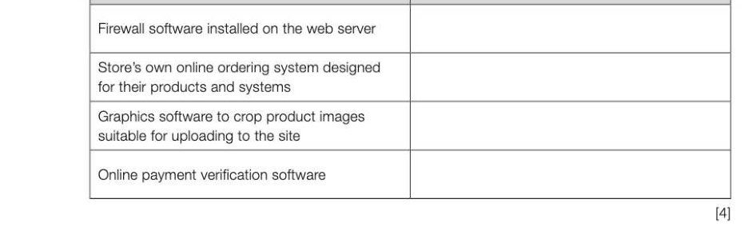

# Chapter 19 — Hardware and software
## Objectives

- Define the terms hardware and software and understand the relationship between them
«Explain what is meant by system software and application software Understand the need for, and attributes of, different types of software « Understand the functions of operating systems, utility programs, libraries and translators

## Hardware and software

There is a very simple distinction between computer hardware and software. Hardware is the term used to describe the electrical or electro-mechanical parts of a computer and its input, output and storage devices. Software comprises all the programs that are written to make computers function. In the early days of computing, pioneers like von Neumann (1903-1957) and other (mostly male) engineers, who were figuring out the extremely complex task of how to how to build a computer, thought that the actual coding of programs using binary numbers to represent instructions, and setting the appropriate switches on the machines was a relatively simple task which could be left to young women with suitable secretarial skills and some aptitude for mathematics. They were soon disabused of this notion. Maurice Wilkes (1913-2010), a computer scientist in the 1940s, 4-19 recalls: "As soon as we started programming, we found out to our surprise that it was not as easy to get programs right as we had thought. | can remember the exact instant when | realised that a large part of my life from then on was going to be spent in finding mistakes in my own programs."

## Clas: ation of software

Software can be broadly classified into system software and application software.

## System software

System software is the software needed to run the computer's hardware and application programs. This includes the operating system, utility programs, libraries and programming language translators.

## Operating system

An operating system is a set of programs that lies between applications software and the computer hardware. It has many different functions, including:

- resource management — managing all the computer hardware including the CPU, memory, disk drives, keyboard, monitor, printer and other peripheral devices
- provision of a user interface (e.g. Windows) to enable users to perform tasks such as running application software, changing settings on the computer, downloading and installing new software.
Operating systems are covered in the next chapter.

## Utility programs

Utility software is system software designed to optimise the performance of the computer or perform tasks such as backing up files, restoring corrupted files from backup, compressing or decompressing data, encrypting data before transmission, providing a firewall, etc. For example, a disk defragmenter is a program _grwewssse—aaeeE ST] that will reorganise a hard disk so that files fie Aen Vew Heb +o m@ which have been split up into blocks and stored Sasa Sams Fe es all over the disk will be recombined in a single series of sequential blocks. This makes reading a file quicker. The software utility Optimise sematad dk usage before defragmentation: Drives, previously called Disk Defragmenter, runs automatically on a weekly schedule on the latest versions of Windows. You can also optimise Estrnated disk usage after defragmentation: - drives on your PC manually. Avirus checker utility checks your hard drive (Fase }(_ step and depending on the level of protection offered, Wrragmented fies Wi consg.cus fies Wl Unmovable fles OFree space incoming emails and internet downloads, for i PRELOAD (C) Ochagrereng.. 0% Conpacrg ries mamanane —J viruses and removes them. Windows 8.1 comes with built-in virus protection called Windows Defender. Several utility programs such as the disk defragmenter, software uninstaller, backup and restore programs and screensavers are supplied as part of the operating system. Other utility programs such as WinZip for compressing and sharing files have to be purchased from independent suppliers. wee nee = Create/Share Copyto Tools View Help Upgrade -@ Onttons Encrypt Resize Convert Watermark FromPC ToPCor Email Social instant What' Zip and Get More Photos to POF orCloud = Cloud = Media Messaging Share~ 'Share Add-ons Advanced Convert Files AS They Are Added — AddtoZ... Save Share Express Add-ons BBB; @ Neme * Type Modified Size Ratio Packed Path

## Libraries

Library programs are ready-compiled programs which can be run when needed, and which are grouped together in software libraries. In Windows these often have a.dll extension. Most compiled languages have their own libraries of pre-written functions which can be invoked in a defined manner from within the user's program.

## Translators

Programming language translators fall into three categories: compilers, interpreters and assemblers. All of them translate program code written by a programmer into machine code which can be run by the computer. Translators are covered in Chapter 22.

## Application software

Application software consists of programs that perform specific user-oriented tasks. It can be categorised as general purpose, special-purpose or custom-written (bespoke) software. General-purpose software such as a word-processor, spreadsheet or graphics package, can be used for many different purposes. For example, a graphics package may be used to produce advertisements, manipulate photographs, draw vector or bit-mapped images. Special-purpose software performs a single specific task or set of tasks. Examples include payroll and accounts packages, hotel booking systems, fingerprint scanning systems, browser software and hundreds of other applications. Software may be bought "off-the-shelf", ready to use, or it may be specially written by a team of programmers for a particular organisation. If, say, a hotel wants to buy some visitor booking software, they may be able to find a ready-made package that is quite suitable, or they may want a bespoke software package that will satisfy their particular requirements. It will almost certainly be cheaper to buy a ready-made package, even if it contains a lot of features which they will never use, since the cost is shared among all the other people buying the package. It will also have the advantages that it is ready to be installed immediately, and is likely to be well-documented, well-tested and bug-free.

---

## Exercises

1. (a) Software can be classified as either system or application software. What is meant by

2. Acompany sells widgets via an online web store. The process of updating the website and processing sales involves many different types of software.

Complete the table below by writing one software category beside each use. You should not use a category more than once. Software Category

3. Give two reasons why a company might choose to purchase a special purpose software package rather than a suite of programs written specifically for their needs. [2]
