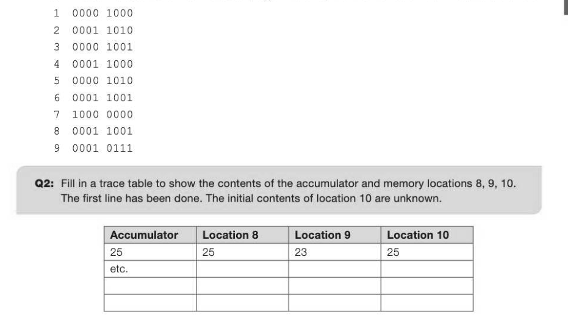

# Chapter 21 — Programming language classification
classification

## Objectives

- Be aware of the development of programming languages and their classification into low- and high-level languages
- Describe low-level languages: machine-code and assembly language
- Explain the term 'imperative high-level language' and its relationship to low-level programming Understand the advantages and disadvantages of machine-code and assembly language programming compared with high-level programming

## Early programmable computers

The first computers were conceived in the 1940s during the Second World War for military purposes — famously, Alan Turing and others at Bletchley Park cracked the Enigma Code used by the Germans with the aid of Colossus, one of the very first programmable computers. By the late 1940s, there was still only a handful of computers in existence but a few large companies were becoming interested in using them for commercial purposes such as payroll; one of the first major computer applications. They discovered that a computer could work out employees' pay about 1000 times faster than a human being. The Colossus computer These early computers had very limited memory (with each memory cell made out of a vacuum tube the size of a lightbulb). As well as a collection of memory cells, typically consisting of 16 bits, they had an accumulator - a special memory location in which all calculations were carried out - and a control unit that decoded instructions. There was only one way of programming a computer; entering the binary digits that the computer could understand. This was called machine code.

## Machine code

In machine code, a typical instruction holds an operation code (opcode) in the first few bits and an operand in the rest of the memory cell. For example, in an 8-bit instruction set, the first 4 bits might hold the opcode and the other 4 bits will hold the operand (the data to be operated on, or the address where the data is held). In reality, at least 32 bits would usually be used to hold an instruction.

For example, some of the machine code instructions in the instruction set for this imaginary computer might take the form given by the following table: 0000 Load the value stored in memory location specified by the operand into the accumulator 0001 Store the value in the accumulator in memory location specified by the operand 0010 Add the value specified in the operand to the value in the accumulator 0011 Compare the contents of the accumulator with the contents of the location specified by the operand 0100 Jump to the address held in the operand if the accumulator held the lesser value in the last comparison 101 Jump to the address held in the operand if the accumulator held the greater value in the last comparison 0110 Jump to the address held in the operand 1000 Stop

## Now we can write a machine code program!

## Example 1

Lines 1-7 below are part of a machine code program to swap the two numbers held in locations 8 and 9.



It's very easy to see how extremely difficult, tedious and error-prone it was to program in machine code. The same operation can be done in Python, for example, with the statement:

This is a good example of abstraction — you really don't want to know all the details of how the computer actually achieves the swap, as it distracts from the task to be performed — and you certainly don't want to have to write out and debug all the machine code instructions. In the Python version, all the details have been abstracted away, leaving you free to concentrate on the algorithm (which could be, for example, a sorting algorithm). Machine code is called a low-level programming language, because the code reflects how the computer actually carries out the instruction — it is dependent on the actual architecture of the computer.

## Assembly language

The next stage in the development of programming languages was assembly language, another low- level language. This had two major improvements: 1. Each opcode was replaced by a mnemonic which gave a good clue to what the operator was actually doing. 2. The operand was replaced by a decimal (or hexadecimal) number. The program to swap two numbers now looks like this: 1 LDA load the contents of location 8 into accumulator 2 sto #store the contents of the accumulator in location 10 3 LDA load the contents of location 9 into accumulator 4 sto 7store the contents of the accumulator in location 8 5 LDA load the contents of location 10 into accumulator 6 sTO store the contents of the accumulator in location 9


This was a major improvement on machine code but still involved coding every step that the computer needed to perform to accomplish each task. The set of mnemonics looked something like this:

## Instruction Meaning

LDA Load the value stored in memory location specified by the operand into the accumulator STO Store the value in the accumulator in memory location specified by the operand ADD Add the value specified in the memory location specified by the operand to the value in the accumulator cmP Compare the contents of the accumulator with the contents of the location specified by the operand BLT Jump to the address held in the operand if the accumulator held the lesser value in the last comparison BGT Jump to the address held in the operand if the accumulator held the greater value in the last comparison

## JMP Jump to the address held in the operand

## STOP Stop

## High-level programming languages

In the 1960s, John Backus and his team at IBM made a hugely significant breakthrough in the development of programming. Backus saw that what was needed was a programming language that enabled programmers to write programs in the same way that they wrote algorithms or mathematical formulae. The first high-level language was born, and they called it FORTRAN, short for FORmula TRANslation. Other languages such as ALGOL, BASIC and COBOL soon followed. In a high-level language, programmers could write statements such as X= (B-C) *D These languages are all examples of imperative high-level languages, so-called because each instruction is basically a command to perform some step in the program, which consists of the step-by- step instructions needed to complete the task. They are high-level because they enable programmers to think and code in terms of algorithms, without worrying about how each tiny step will be executed in machine code and where each item of data will be stored. Each instruction in a high level language is translated into several low-level language instructions. The advantages of high-level languages compared to a low-level language include the following: They are relatively easy to learn «It is much easier and faster to write a program in a high-level language « Programs written in high-level languages are much easier to understand, debug and maintain « Programs written in a high-level language are not dependent on the architecture of a particular machine — they are machine independent «There are many built-in library functions available in most high-level languages

- Different high-level languages are often written specifically for a particular class of problem; for example SQL is tailor-made for querying and manipulating databases
The assembly language program on the previous page to swap two numbers would be written using high-level language as:

```
    ← 25
vow * N wo
 béec
```

Assembly language is still used when the program needs to execute as fast as possible, occupy as little space as possible or manipulate individual bits and bytes. Examples include embedded systems, real- time systems, sensors, mobile phones, device drivers and interrupt handlers.


---

## Exercises

1. (a) Amachine code instruction can be split into an opcode part and an operand part. (i) What does an opcode represent? (1) (i), What does an operand represent? {1} (b) State two advantages of writing a program in assembly language over writing a program in machine code. [2] AQA Comp 2 Qu 2 June 2012
