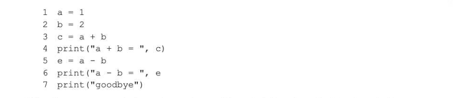
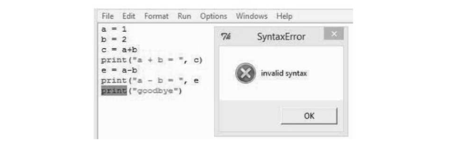

# Chapter 22 — Programming language translators
translators

## Objectives

« Understand the role of an assembler, compiler and interpreter «Explain the difference between compilation and interpretation, and describe situations when both would be appropriate Explain why an intermediate language such as bytecode is produced as the final output by some compilers and how it is subsequently used

- Understand the difference between source and object (executable) code

## Assembler

In the last chapter we looked at machine code and assembly language. Both of these are low-level languages, with each instruction in assembly language almost always being equivalent to one machine code instruction. The machine code instructions that a particular computer can execute (the instruction set) are completely dependent on its hardware, and therefore each different type of processor will have a different instruction set and a different assembly language. Before an assembly language program can be executed, it must be translated into the equivalent machine code. This is done by a program called an assembler. The assembler program takes each assembly language instruction and converts it to the Os and 1s of the corresponding machine code instruction. The input to the assembler is called the source code and the output (machine code) the object code.

## Compiler

A compiler is a program that translates a high-level language such as Visual Basic, C#, Python etc. into machine code. The code written by the programmer, the source code, is input as data to the compiler, which scans through it several times, each time performing different checks and building up tables of information needed to produce the final object code. Different hardware platforms will require different compilers, since the resulting object code will be hardware-specific. For example, Windows and the Intel microprocessors comprise one platform, Apple and ARM processors another, so separate compilers are required for each. The object code can then be saved and run whenever needed without the presence of the compiler. PROCESS OUPUT

## Interpreter

An interpreter is a different type of programming language translator. The interpreter software itself contains subroutines to carry out each high-level instruction. Once the programmer has written and saved a program, and instructs the computer to run it, the interpreter looks at each line of the source program, analyses it and, if it contains no syntax errors, calls the appropriate subroutine within its own program code to execute the command. For example, the following Python program contains an error at line 5.

File "C:/Users/A Level sample programs/progl.py", line 5, in <module> e=a-n NameError: name 'n' is not defined The program produces output at line 4, gets as far as line 5 and then crashes. However, it is not always quite that simple. If we modify the program to introduce a syntax error at line 6, (missing closing bracket) the interpreter does not attempt to run any of the program until this is fixed.

When the program runs, it does not execute any of the code but produces the following output:

From this we can deduce that the translator has scanned through the whole program checking for certain

## Bytecode

Interpreting each line of code just before executing it has become much less common. Most interpreted languages such as Python and Java use an intermediate representation which combines compiling and interpreting. The resulting bytecode is then executed by a bytecode interpreter. The bytecode may be compiled once and for all (as in Java) or each time a change in the source code is detected before execution (as in Python). A big advantage of bytecode is that you can achieve platform independence; any computer that can run Java programs has a Java Virtual Machine (JVM), a piece of software which masks inherent differences between different computer architectures and operating systems. The JVM understands bytecode and converts it into the machine code for that particular computer. A second advantage of using, for example, Java bytecode is that it acts as an extra security layer between your computer and the program. You can download an untrusted program and you then execute the Java bytecode interpreter rather than the program itself, which guards against any malicious programs. It is also possible to compile from Python into Java bytecode (using the Jython compiler) and then use the Java interpreter to interpret and execute it. Advantages and uses of compilers and interpreters Acompiler has many advantages over an interpreter: the object code can be saved on disk and run whenever required without the need to recompile. However, if an error is discovered in the program, the whole program has to be recompiled the object code executes faster than interpreted code

- the object code produced by a compiler can be distributed or executed without having to have the compiler present
- the object code is more secure, as it cannot be read without a great deal of 'reverse engineering'
A compiler would therefore be appropriate when a program is to be run regularly or frequently, with only occasional change. It is also appropriate when the object code produced by the compiler is going to be distributed or sold to users outside the company that produced the software, since the source code is not present and therefore cannot be copied or amended. An interpreter has some advantages over a compiler:

- itis useful for program development as there is no need for lengthy recompilation each time an error is discovered
- itis easier to partially test and debug programs
However, the program may run slower than a compiled program, because each statement has to be translated to machine code each time it is encountered. So if a loop of 10 statements is performed 20 times, all 10 statements are interpreted 20 times. An interpreter may, for example, be used during program development and when the program is complete and correct, it can be compiled for distribution or regular use within the company. An interpreter may also be used in a student environment when students are learning code, as they can test parts of a program before coding it all.

---

## Exercises

1. A programmer is asked to write a program and can choose between using a low-level language or a high-level procedural language. Outline the major difference between these two types of languages, naming an example of each. For each language explain:

- advantages and disadvantages of each one compared to the other
- what translation software would be used, if applicable
- asituation when each one would be the most appropriate choice [10]
2. Explain why an intermediate language such as bytecode is produced as the final output by some compilers and how it is subsequently used. (5)

## 3. (a) The high-level language statement

A:x=B+5 is to be written in assembly language. Complete the following assembly language statements, which are to be the equivalent of the above high level language statement. The Load and Store instructions imply the use of the

(b) (i) What type of translator is required to translate assembly language statements into machine code? (1) (i), What type of translator is required to translate a high-level language statement into machine code? (1) AQA Comp? Qu 3 January 2009
