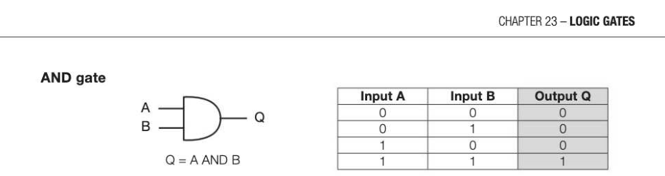
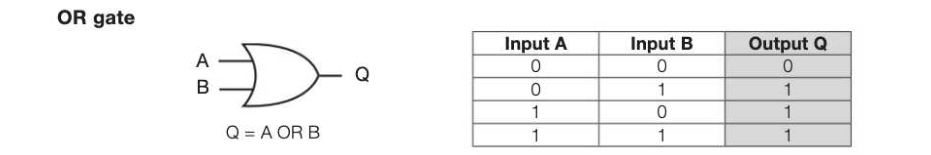
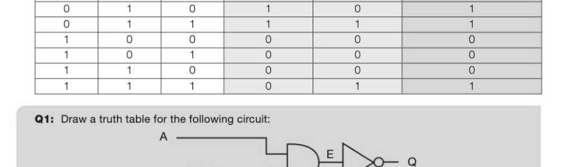
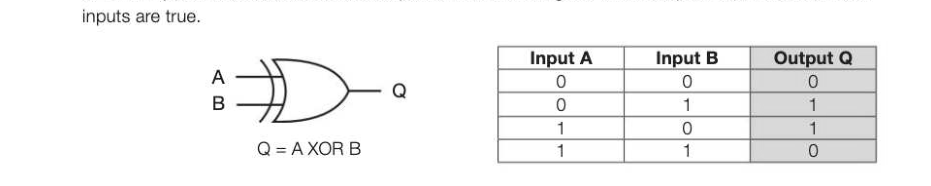
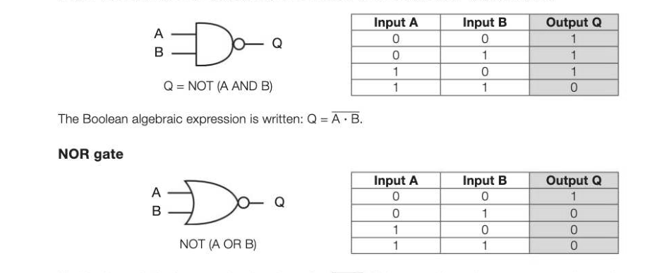
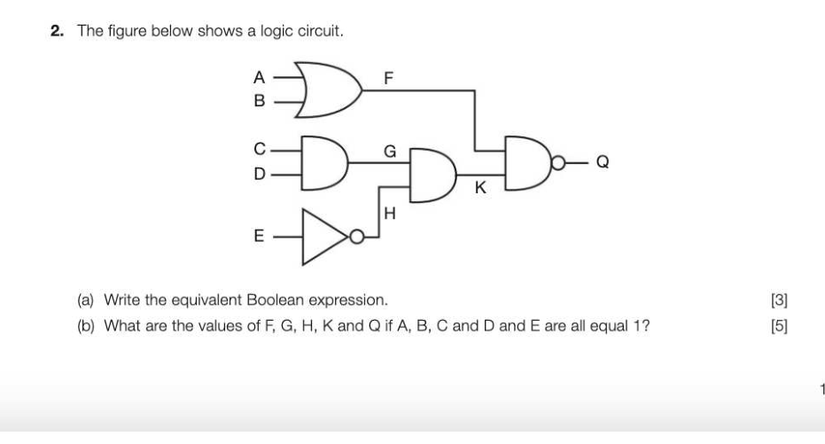

# Chapter 23 — Logic gates
## Objectives

- Construct truth tables for a variety of logic gates
- Be familiar with drawing and interpreting logic gate circuit diagrams involving multiple gates
- Complete a truth table for a given logic gate circuit
- Write a Boolean expression for a given logic gate circuit
- Draw an equivalent logic gate circuit for a given Boolean expression

## Binary logic

At the most elementary level, an electronic device can only recognise the presence or absence of current or voltage. Either electricity is present or it isn't. This is a switch — on or off, true or false, 1 or 0. Witha computer's semiconductor, the voltage at the input and output terminals is measured and is either high or low; 1 or 0. Computers comprise billions of these switches and manipulating these sequences of Ons and Offs can change individual bits. Electronic logic gates can take one or more inputs and produce a single output. This output can become the input to another gate and a complicated cascaded sequence of logic gates can be implemented to form a circuit in, for example, the CPU.

## Simple logic gates and truth tables

There are a number of different logic gates that are each designed to perform a different operation in terms of output. These are: NOT, AND, OR, XOR, NAND and NOR gates. Each of these gates can be represented by a truth table showing the output given for each possible input or combination of inputs. The first three gates are shown below. Inputs are usually given algebraic letters such as A, B and C and output is usually represented by P or Q. NOT gate The NOT gate is represented by the symbol below and inverts the input. The small circle denotes an inverted input. Using 1s and Os as inputs to a gate, its operation can summarised in the form of a truth table.

The Boolean algebraic expression is written: Q = A where the overbar represents NOT.

The Boolean expression for AND is written: Q = A - B where - represents AND. The truth table reflects the fundamental property of the AND gate: the output of A AND B is 1 only if input A and input > B are both 1. FES

The Boolean expression for OR is written: Q = A + B where + represents OR.

## Creating logic gate circuits

Multiple logic gates can be connected to produce an output based on multiple inputs.

This circuit can be represented by Q = (NOT A) OR (B AND C) or Q=A + (B+ C) and shown using the truth table below: Input A Input B Input C D=NOTA E=BANDC

## The XOR, NAND and NOR gates

XOR gate The XOR (pronounced ex-or) gate stands for exclusive OR, meaning that the output will be true if one or other input is true, but not both. Compare this to the OR gate, which outputs true if either or both

The Boolean algebraic expression is written: Q = A ® B where the ® represents XOR, and is the equivalent of Q = (A - B) + (A- B). This gate is similar to the OR gate but excludes the condition where A and B are both true. For this reason the OR gate is sometimes referred to as an inclusive OR. The XOR gate performs the function of an addition of the two inputs and combined with an AND gate, will output the carry bit value as well. NAND gate The NAND gate is an amalgamation of the AND and NOT gates, which inverts the output of the AND gate. Having a single type of NAND gate that can perform two separate functions can help to reduce development costs if a NAND gate is cheaper than separate AND and NOT gates.

The Boolean algebraic expression is written: Q = A + B. This gate only produces an output of true when both inputs are false.

---

## Exercises

1. (a) Complete the following truth tables for the NAND, NOR and XOR logic gates.

## NAND gate

## Input A Input B Output Q

1 1 tt)

## NOR gate

## Input A Input B Output Q

1 1 tt)

## XOR gate

## Input A Input B Output Q

1 1 ty (b) Draw logic circuits for the following Boolean expressions: () Q=A@B+B (3) (i) Q=A-B+C 3] (ii) Q=A¥B+(A-O) 3]

