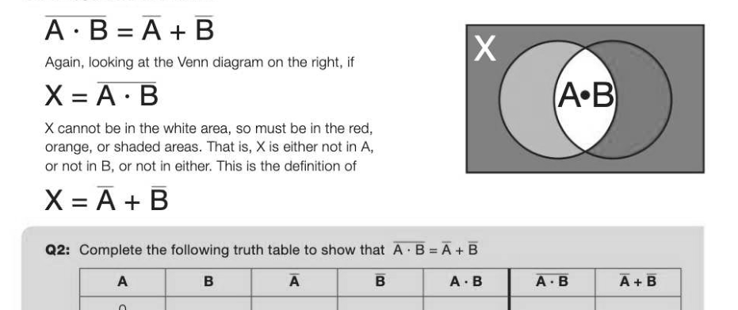
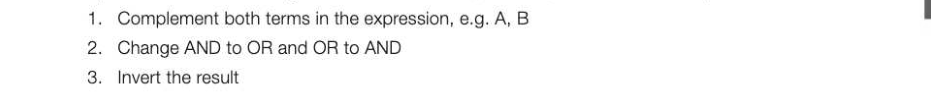
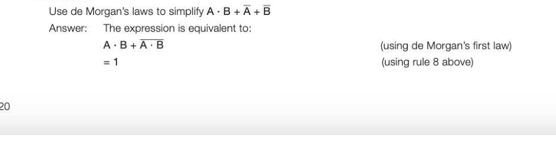
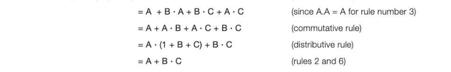
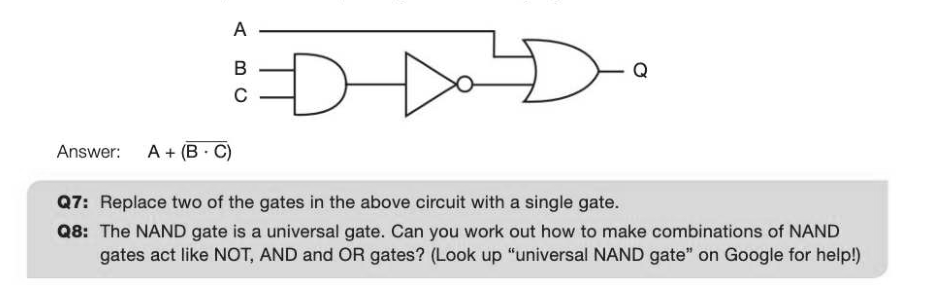
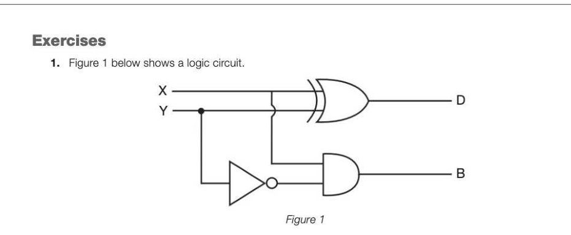
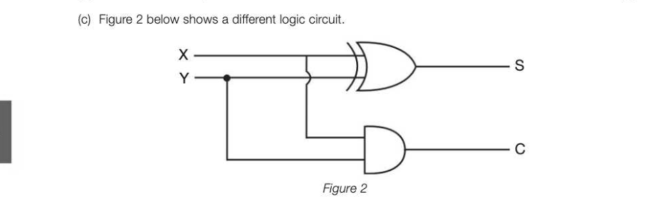
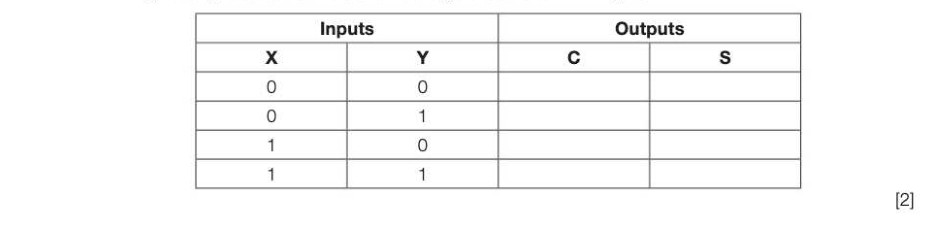
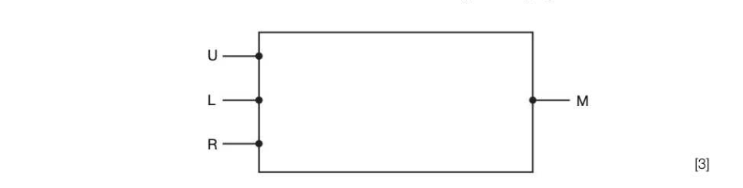
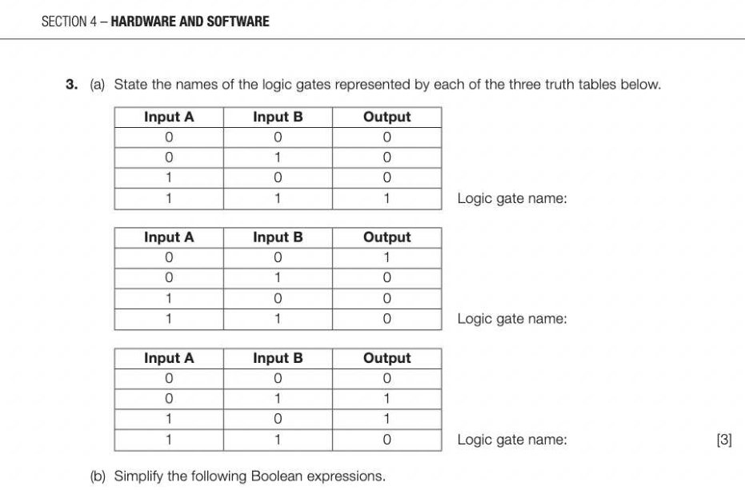

# Chapter 24 — Boolean algebra
## Objectives

- Be familiar with the use of Boolean identities and De Morgan's laws to manipulate and simplify Boolean expressions Write a Boolean expression for a given logic gate circuit, and vice versa

## De Morgan's laws

Augustus de Morgan (1806-1871) was a Cambridge Mathematics professor who formulated two theorems or laws relating to logic. These laws can be used to manipulate and simplify Boolean expressions. Although his theoretical work had little practical application in his lifetime, it became of major significance in the next century in the field of digital electronics, in which TRUE and FALSE can be replaced by ON and OFF or the binary numbers 0 and 1. Using de Morgan's laws, any Boolean function can be converted to one which uses only NAND functions or only NOR functions, and these can be further converted to an expression using all NAND functions or all NOR functions. Thus, any integrated circuit can be built from just one type of logic gate. This is an advantage in manufacturing where costs can be kept down by using only one type of gate.

## De Morgan's first law

A+B=A:-B The truth of this is clear from the Venn diagram on the right. Suppose we have a variable X defined by X X=A+B Looking at the Venn diagram, A + B is represented by the white area. Since X is not in A + B, it consists of all the shaded area. This can be defined as everything not in A and not in B, i.e.

## De Morgan's second law

To implement each of de Morgan's laws to find A + B, or A- B, follow the three steps:

## Drawing circuits using NAND and NOR gates

We saw in the last chapter that a NAND gate is equivalent a combination of an AND gate and a NOT gate. A— A-B ss Cs AS B = #2>e-= is equivalent to g __| Q Q=NOT (AAND B), which is the same as Q=A-B Likewise, a NOR gate is a combination of an OR gate and a NOT gate. 22) #2) >o—ms is equivalent to 3) ee Q=NOT (A ORB), which is the same as Q=A+B

## Rules of Boolean algebra

In addition to de Morgan's laws, there are several identities or "rules" which will help you to simplify Boolean expressions. The most useful are listed below.

## General rules

1. X-0= 0

## Commutative rules

10.X-Y=Y-X 1.X+Y=Y+X

## Associative rules

12.X+(¥+Z2)=(K-+Y)-Z 13.X+(¥+Z)=(K+Y)4+Z

## Distributive rules

14. X-(Y+Z)=X-V+X-Z 15. (K+ Y)+(W+Z)=X-W+X-Z+Y-WHY-Z

## Absorption rules

16.X + (K-Y) =X 17.X-(K+Y)=X

## Example 1

Use de Morgan's laws and the rules of Boolean algebra to simplify the following Boolean expression: Q=K-¥)-(¥+2) Answer: Q =(X-Y)+(¥+2Z) (using de Morgan's second law) =(X-Y)+(¥-Z) (using de Morgan's first law) This is an acceptably simplified answer. It could also be expressed as: Q=X-Y+Y-Z

## Example 2

## Example 3

Use Boolean algebra to show that (A + B) -(A+C)=A+B-C Answer: (A+B)-(A+C) =A-A+B-A+B-C+A-C (distributive rule)

The final line makes use of the fact that anything OR'd with 1 is 1.

## Example 4

A single output Q is produced from three inputs X, Y and Z. Q is 1 only if X and Y are 1, or Zis 1 and Y is 0. Write the Boolean expression to represent this circuit. Answer: There are three separate logic gates involved here: X AND Y, Z AND (NOT Y). The output from these three gates are input to an OR gate. Q=(-Y)+(Z-Y) Represent this equation diagrammatically using a combination of AND, OR and NOT gates. Answer:

## Example 5

Write the Boolean expression corresponding to the following logic circuit.

---

## Exercises

*Figure 1*

(a) Write a Boolean expression for D. 1} (b) Write a Boolean expression for B. (1)

*Figure 2*

(i) Complete the truth table for the logic circuit shown in Figure 2.

(ii) What arithmetic function does the logic circuit in Figure 2 perform? (1) (d) Without using a truth table, simplify the Boolean expression below. K+Y)- K+) Show the stages of your working. [3] AQA Comp 2 Qu 2 January 2012

## Exercises continued

2. (a) Complete the truth tables for the following logic gates. (2) AND gate XOR gate Input X Input Y Output Q Input X Input Y Output Q ie} te) 0 0 i} 1 0 1 1 te) 1 ie} 1 1 1 1 (b) A line-following robot has three sensors. It moves along a black line on a white background whilst the following conditions are met: e the ultrasonic sensor U does not detect any obstacle

- either, but not both, of the infrared sensors L and R are on the black line.
Sensor U returns 1 if it detects an obstacle and 0 if the path is clear. Sensors L and R each return 1 if they detect black and 0 if they detect white. A logic circuit will process the input from the sensors and produce an output M. M should be 1 if the robot is to move and 0 if the robot should stop. (i) Represent the output M as a Boolean expression. [3] (i) The following symbols are used to represent logic gates: ao > NAND Using a combination of any of the above logic gates draw a logic circuit for this system in the box below. You will not need to use all of the different types of logic gates.

(c) Apply de Morgan's laws to the following expression and simplify the result. Q=A+@6-A) Show the stages of your working. [3] AQA Comp 2 Qu 8 June 2012

(i) B-(A+A) (1) (i) A-B+B (1) (ii) B-@+B) (2) (c) Draw a logic circuit for the following Boolean expression: Q=A@B-B You will need to make use of the D- symbols below when 2S drawing your logic circuit. (2) AQA Comp 2 Qu 6 June 2013

## Section 5

Computer organisation and architecture In this section: Chapter 25 Internal computer hardware 126 Chapter 26 The processor 132 Chapter 27 The processor instruction set 138 Chapter 28 Assembly language 142 Chapter 29 Input-output devices 148 Chapter 30 Secondary storage devices 154
