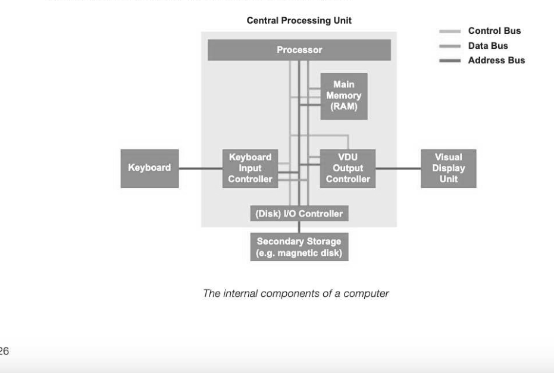
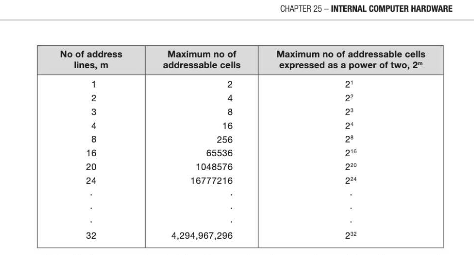
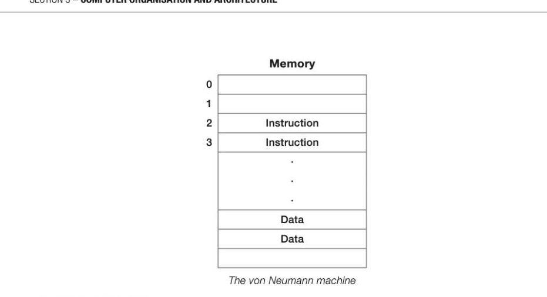
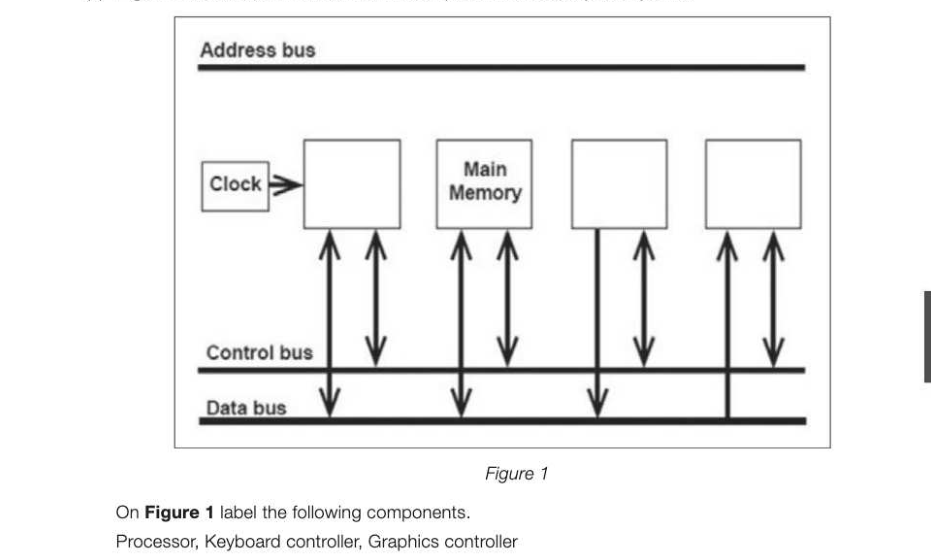

# Chapter 25 — Internal computer hardware
## Objectives

- List the basic internal components of a computer system
- Understand the role of the processor, main memory, buses and I/O controllers and how they relate to each other
e Understand the need for, and the means of communication between components

- Explain the difference between von Neumann and Harvard architectures and describe where each

## Introduction

A computer system has both internal components — those within the Central Processing Unit (CPU) — and external components such as input/output and storage devices. This chapter describes the internal components. These include:

- processor
- main memory address bus, control bus, data bus V/O controllers
Asimplified block diagram of these components is shown below.

## The Processor

The processor responds to and processes the instructions that drive the computer. It contains the control unit, the arithmetic/logic unit (ALU) and registers. The control unit coordinates and controls all the operations carried out by the computer. It operates by repeating three operations: Fetch — causes the next instruction to be fetched from main memory Decode — decodes the instruction Execute — causes the instruction to be executed The ALU can perform different sorts of operations on data. Arithmetic operations include addition, subtraction, multiplication and division. Logical operations consist of comparing one data item with another to determine whether the first data item is smaller than, equal to or greater than the second data item. Bitwise logical operations (AND, OR etc.) and shift operations can manipulate individual bits. Registers are special memory cells that operate at very high speed. All arithmetic and logical operations take place within registers.

## Buses

The processor is connected to main memory by three separate buses. When the CPU wishes to access a particular main memory location, it sends this address to memory on the address bus. The data in that location is then returned to the CPU on the data bus. Control signals are sent along the control bus. In the figure below, you can see that data, address and control buses connect the processor, memory and I/O controllers. These three buses are known collectively as the system bus. Each bus is a shared transmission medium, so that only one device can transmit along a bus at any one time. Data and control signals travel in both directions between the processor, memory and I/O controllers. Addresses, on the other hand, travel only one way along the address bus: the processor sends the address of an instruction, or of data to be stored or retrieved, to memory or to an I/O controller. Address Bus Direction of transmission along the buses

## Control bus

The control bus is a bi-directional bus, meaning that signals can be carried in both directions. The data and address buses are shared by all components of the system. Control lines must therefore be provided to ensure that access to and use of the data and address buses by the different components of the system does not lead to conflict. The purpose of the control bus is to transmit command, timing and specific status information between system components. Control lines include:

- Memory Write: causes data on the data bus to be written into the addressed location
- Memory Read: causes data from the addressed location to be placed on the data bus
- Interrupt request: indicates that a device is requesting access to the CPU
e Bus Request: indicates that a device is requesting the use of the data bus

- Bus Grant: indicates that the CPU has granted access to the data bus
- Clock: used to synchronise operations
- Reset: initialises all components

## Data bus

The data bus, typically consisting of 8, 16, 32 or 64 separate lines provides a bi-directional path for moving data and instructions between system components. The width of the data bus is a key factor in determining overall system performance. For example, if the data bus is 8 bits wide, and each instruction is 16 bits long, then the processor must access the main memory twice just to fetch the instruction.

## Address bus

Memory is divided up internally into units called words. A word is a fixed size group of digits, typically 8, 16, 32 or 64 bits, which is handled as a unit by the processor, and different types of processor have different word sizes. Each word in memory has its own specific address. When the processor wishes to read a word of data from memory, it first puts the address of the desired word on the address bus. The width of the address bus determines the maximum possible memory capacity of the system. For example, if the address bus consisted of only 8 lines, then the maximum address it could transmit would be (in binary) 11111111 or 255, giving a maximum memory capacity of 256 (including address 0). A system with a 32-bit address bus can address 2° (4,294,967,296) memory locations giving an addressable memory space of 4GiB. The address bus is also used to address I/O ports during input/output operations.

Relationship between number of address lines m and maximum number of addressable memory cells

## 1/0 Controllers

An I/O controller is a device which interfaces between an input or output device and the processor. Each device has a separate controller which connects to the control bus. I/O controllers receive input and output requests from the processor, and then send device-specific control signals to the device they control. They also manage the data flow to and from the device. The controller is an electronic circuit board consisting of three parts:

- an interface that allows connection of the controller to the system or I/O bus
- aset of data, command and status registers
- an interface that enables connection of the controller to the cable connecting the device to the computer
An interface is a standardised form of connection defining such things as signals, number of connecting pins/sockets and voltage levels that appear at the interface. An example is a Universal Serial Bus (USB) connection, which can be used with many different peripherals.

## Memory and the stored program concept

Computers as we know them were first built in the 1940s, and two of the early pioneers were Alan Turing and John von Neumann. The von Neumann architecture specifies the basic components of the computer and processor in which a shared memory and bus is used for both data and instructions. The stored progam concept can be defined as follows: machine code instructions are fetched and executed serially by a processor that performs arithmetic and logical operations. « Aprogram must be resident in main memory to be executed «The machine code instructions are fetched from memory one at a time, decoded and executed in the processor Virtually all computers today are built on this principle, and so the general structure as shown in the figure below is sometimes referred to as the von Neumann machine.

## Harvard architecture

The Harvard architecture is a computer architecture with physically separate memories for instructions and data. Harvard architecture is used extensively with embedded Digital Signal Processing (DSP) systems. The two different memories can have different characteristics; for example, in embedded systems instructions may be held in read-only memory while data memory requires read-write memory. In some systems, there is much more instruction memory than data memory so the instruction addresses and address bus are wider than the data addresses and data bus. Embedded systems include special- purpose computers built in to devices often operating in real time, such as those used in navigation systems, traffic lights, aircraft flight control systems and simulators. Harvard architecture can be faster than von Neumann architecture because data and instructions can be fetched in parallel instead of competing for the same bus.

---

## Exercises

1. The data bus, control bus and address bus are three important parts of a modern computer. (a) In this context, explain what is meant by the term bus. [2] (b) Fill in the gaps in the paragraph below. The data bus can be used to transfer data and. between the main memory and the processor. The control bus carries control signals. An example of a control signal is... (c) Figure 1 shows some of the internal components of a computer system.

*Figure 1*

Draw all the connections between the address bus and the components. Make sure that you clearly show the direction of each connection. [5]

BD3E;Store contents of accumulator at address 3E E405;Add 5 to the accumulator BDFF;Store contents of accumulator at address FF AC42;Load accumulator with contents of address 42 BD3F;Store contents of accumulator at address 3F (a) What is the name of this language? (1) (b) The machine for which this program is written has limited addressing capability. What are the highest and lowest memory addresses that can be addressed by this machine? [2]
