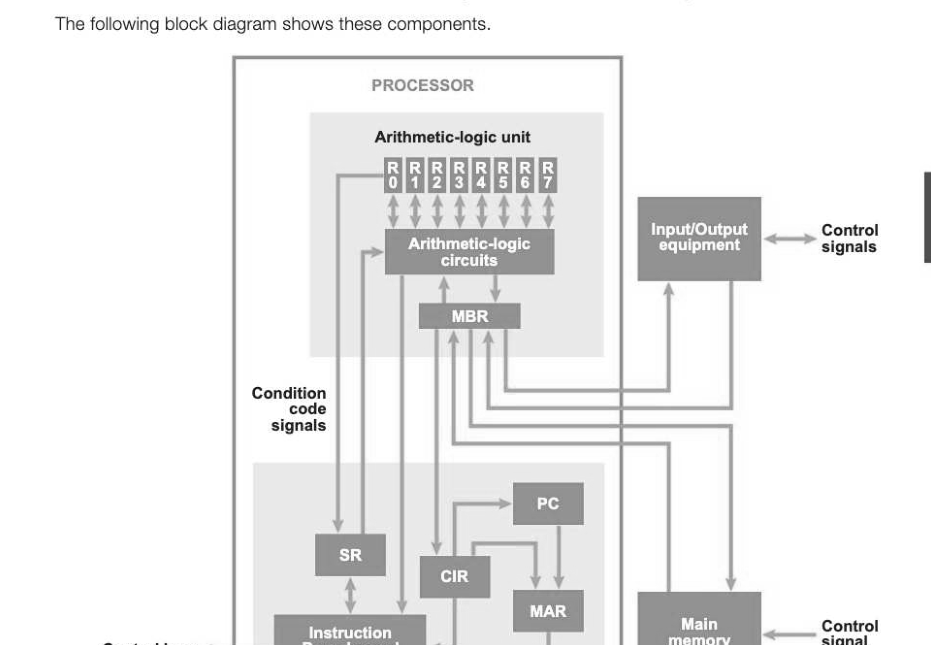
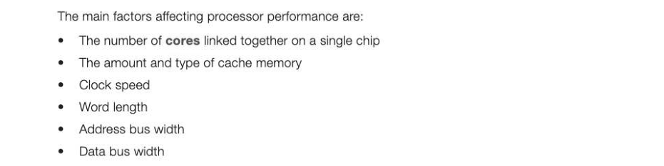
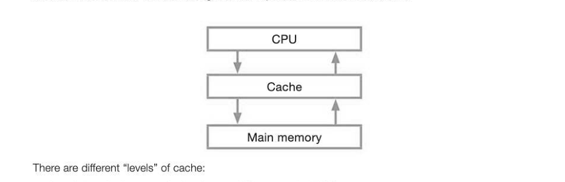
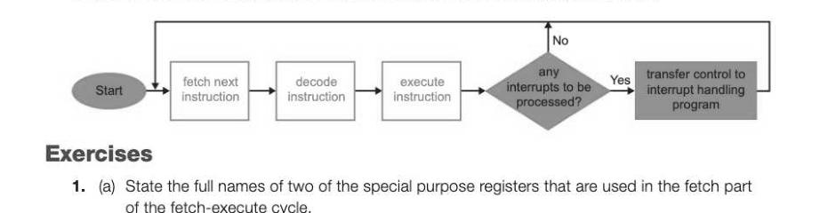
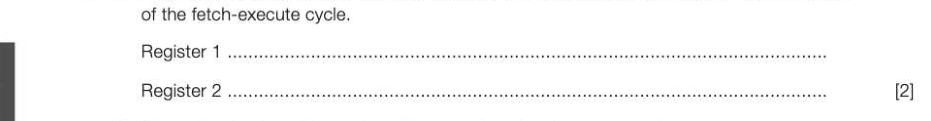
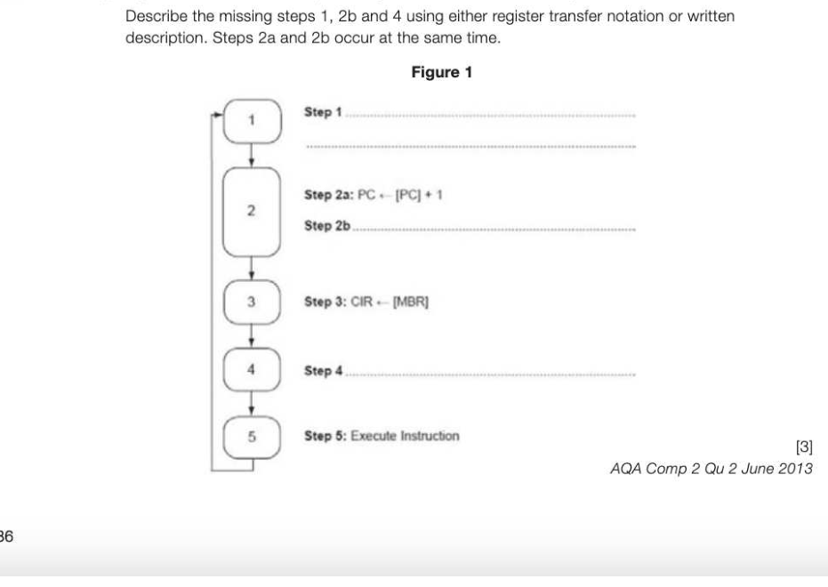
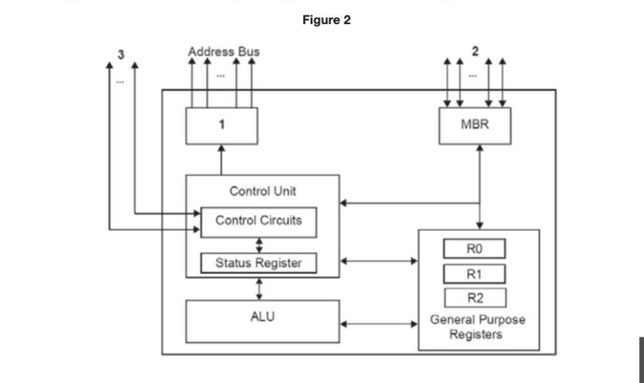
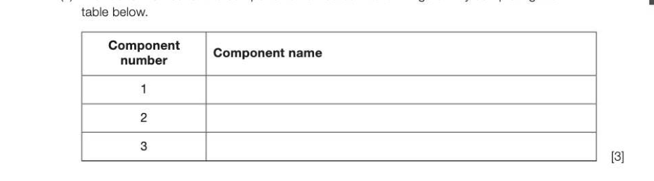

# Chapter 26 — The processor
## Objectives

e Explain the role and operation of the processor and its major components ° Describe the Fetch-Execute cycle

- Describe the factors affecting processor performance

## Components of the processor

The processor components were briefly described in the last chapter — here their operation is described in more detail.

## Arithmetic Logic Unit (ALU)

The ALU performs arithmetic and logical operations on the data. It can perform instructions such as ADD, SUBTRACT, MULTIPLY, DIVIDE on fixed or floating point numbers. It can also perform shift operations, shifting bits to the left or right within a register. It can carry out Boolean logic operations, comparing two values and using operators such as AND, OR, NOT, XOR.

## Control Unit

The Control Unit controls and coordinates the activities of the CPU, directing the flow of data between the CPU and other devices. It accepts the next instruction, breaks down its processing into several sequential steps such as fetching addresses and data from memory, manages its execution and stores the resulting data back in memory or registers.

## The system clock

The system clock generates a series of signals, switching between 0 and 1 billions of times per second and synchronising CPU operations. A 3GHz processor's clock ticks three billion times per second. Each CPU operation starts as the clock changes from 0 to 1 (or in some systems from 1 to 0), and the CPU cannot perform operations faster than the clock cycle (the time the clock takes to go from 0 to 1 and back to 0). Some CPU operations take multiple clock cycles.

## General-purpose registers

There are typically up to 16 general purpose registers in the CPU. All arithmetic, logical or shift operations take place in registers, which are very fast memory numbered, for example, RO to R15. For example, instructions to add the value held in location 164 to the number held in location 150 and

An accumulator is another word for a general purpose register, generally only used when there is just a single register in which to store the result of each calculation or logical expression. Although most modern computers have many registers, some special-purpose processors still use a single accumulator, in order to simplify the design.

## Dedicated registers

These include: the program counter (PC), which holds the address of the next instruction to be executed. This may be the next instruction in a sequence of instructions, or, if the current instruction is a branch or jump instruction, the address to jump to, (copied from the current instruction register to the PC). the current instruction register (CIR), which holds the current instruction being executed. the memory address register (MAR), which holds the address of the memory location from which data (or an instruction) is to be fetched or to which data is to be written. the memory buffer register (MBR), which is used to temporarily store the data read from or written to memory. It is also sometimes known as the memory data register. the status register (SR), which contains bits that are set or cleared depending on the result of an instruction. For example, one bit will be set if an overflow has occurred, other bits will indicate whether the result of the last instruction was negative, zero or caused a Carry.

Control bus <—| Decoder and signal Control circuits Program control unit

## The Fetch-Execute cycle

The sequence of operations involved in executing an instruction can be divided into three phases — fetching, decoding and executing it. This cycle is repeated over and over as each instruction of the program is executed.

## How the registers are used in the Fetch-Execute cycle

(Fetch phase) 1. The address of the next instruction is copied from the program counter (PC) to the memory address register (MAR). The address is sent via the address bus to main memory. The instruction held at that address is returned along the data bus to the memory buffer register (MBR). Simultaneously, the content of the PC is incremented so that it holds the address of the next instruction. 3. The contents of the MBR are copied to the current instruction register (CIR). (Decode phase) 4. The instruction held in the CIR is decoded. The instruction is split into opcode and operand and the opcode is used to determine the type of instruction and what hardware to use to execute it. Additional data is fetched if necessary, and passed to the registers. (Execute phase) 5. The instruction is executed, using the ALU if necessary, and results are stored in the accumulator, general purpose register or memory.

## Factors affecting processor performance

## Number of cores

In a traditional computer (von Neumann machine) instructions are fetched and executed one at a time in a serial manner. However, many computers nowadays have multiple cores, having for example, a dual- core or quad-core processor. Each core is theoretically able to process a different instruction at the same time with its own fetch- execute cycle, making it two or even four times faster with a quad-core chip. However, although a dual-core processor has twice the power, it does not always perform twice as fast, because the software may not be able to take full advantage of both processors.

## Amount and type of cache memory

Cache is a very small amount of expensive, very fast memory inside or very near to the CPU. When an instruction is fetched from main memory it is copied into the cache so if it is needed again soon after, it can be fetched from cache, which is much quicker than going back to main memory. As cache fills up, unused instructions or data still being held are replaced with more recent ones.

Level 1 cache is extremely fast but small (between 2-64KB) Level 2 cache is fairly fast and medium-sized (256KB-2MB)

- Some CPU's also have Level 3 cache

## Clock speed

All processor activities begin on a clock pulse, although some activities may take more than one clock cycle to complete. One clock cycle per second = 1 Hertz (Hz), and clock speed is measured in Gigahertz (GHz), 1 billion cycles per second. Typical speeds for a PC are between 2 and 4 GHz. The greater the clock speed, the faster instructions will be executed.

## Word length

The word size of a computer is the number of bits that the CPU can process simultaneously. Bits may be grouped into 8-, 16-, 32-, 64- or 128-bit 'words', and processed as a unit during input and output, arithmetic and logic instructions. A processor with a 32-bit word size will operate faster than a processor with a 16-bit word size, and word size is a major factor in determining the speed of a processor. Typical word lengths are 32 or 64 bits.

## Address bus and data bus width

Both the addresses of data and instructions, and the data and instructions themselves, are transmitted along buses. The width of the address bus determines the maximum memory address that can be directly referenced. For example, if the width of the address bus is 16 bits, the maximum address that can be transmitted is 11111111 11111111 in binary which is 2" - 1 or 65,535. In all, 65,536 addresses, from 0 to 65,535, can be referenced. In order to send larger addresses, say up to 2° - 1, the address needs to be sent in two groups of 16 bits, which has a detrimental effect on performance. Increasing the width of the address bus would allow more memory locations to be accessed. The width of the data bus determines how many bits can be transferred simultaneously. This is usually but not always the same as the word size of the computer. Not all processors with a 32-bit word for example have a 32-bit data bus, and so the data may have to be fetched in two groups of 16 bits. Increasing the bus size to 32 bits will therefore increase performance.

## The role of interrupts (A Level only)

An interrupt is a signal sent by a software program or a hardware device to the CPU. A software interrupt occurs when an application program terminates or requests certain services from the operating system. A hardware interrupt may occur, for example, when an I/O operation is complete or an error such as Printer out of paper' occurs. When the CPU receives an interrupt signal, it suspends execution of the running program or process and puts the values of each register and the program counter onto the system stack, while an Interrupt Service Routine is called to deal with the interrupt. Depending on the type of interrupt, a particular routine will be run in order to service it. Once the interrupt has been serviced, the original values of the registers are retrieved from the stack and the fetch-execute cycle resumes from the point that it left off. A test for the presence of interrupts is carried out at the end of each instruction cycle.

---

## Exercises

1. (a) State the full names of two of the special purpose registers that are used in the fetch part

(b) Figure 1 below is an incomplete diagram of the fetch-execute cycle.

*Figure 1*

## Exercises continued

2. Figure 2 below shows an incomplete diagram of the components of a processor.

*Figure 2*

(a) Provide full names for the components numbered 1 to 3 in Figure 2 by completing the

(b) What is the role of the Control Unit? (1) (c) State the full name of the processor component that would perform subtraction and comparison operations. (1) (d) What is meant by the term register? (1) (e) State one example of when the status register might have a bit set. (1) AQA Comp 2 Qu 3 January 2012
