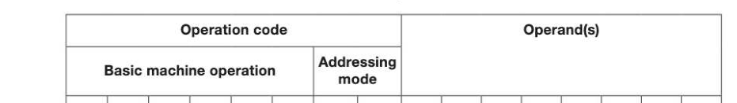
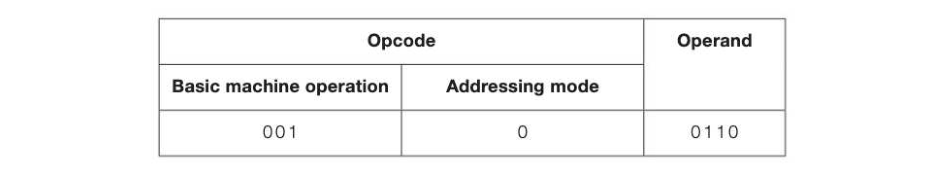

# Chapter 27 — The processor instruction set
## Objectives

- Understand the term 'processor instruction set'
- Learn that instructions consist of an opcode and one or more operands, where an operand could be a value, a memory address or a register
- Understand and apply immediate and direct addressing modes

## The processor instruction set

Each different type of processor has its own instruction set, comprising all the instructions which are supported by its hardware. The instruction set of a typical computer includes the following types of instructions:

- Data transfer such as LOAD, STORE
- Arithmetic operations such as ADD, SUBTRACT
- Comparison operators to compare two values
- Logical operators — AND, OR, NOT, XOR
- Branching - conditional and unconditional
- Logical — shift bits right or left

## 5-27 ° Halt

## Format of a machine code instruction

The basic structure of a machine code instruction may take the format shown below:

t) 1 (1) t) t) 1 tC) 1 0 0 (1) 0 (1) t) 1 1 The number of bits allocated to the operation code (opcode) and the operand will vary according to the architecture and word size of the particular processor type. The above example shows an instruction held in one 16-bit word. In this particular machine, all operations are assumed to be held in a single register called the accumulator. In more complex architectures, each machine code instruction may occupy up to 32 bits and allow for two operands, for example specifying that:

- anumber stored at address 578 is to be loaded into register 3
- the number stored at address 580 is to be added to the contents of register 1
- the number in register 6 is to be stored in address 600

## Addressing modes

The operation code (opcode) consists of binary digits representing the basic operation such as ADD or LOAD, and a 2-digit code representing the addressing mode. We will show examples of just two addressing modes — immediate and direct addressing. These two addressing modes could be indicated by, for example, 00 or 01 in the two 'addressing mode' bits. (Note that real processors have more than two addressing modes so two or more bits would be required.) In immediate addressing, the operand is the actual value to be operated on, say 3 or 75. In direct addressing, the operand holds the memory address of the value to be operated on. Example: Suppose that the operation code 010001, with addressing mode 00, means "Load the operand into the accumulator". The instruction below with addressing mode 00, in this example meaning immediate addressing, will result in the actual value 3 being loaded into the accumulator. (1) 1 t) i) (1) 1 C1) 0 t) (1) v1) 1 1

## A simple model

In this course, a simple model will be used in which the addressing mode is incorporated into the bits allocated to the opcode. The opcode will therefore define both the basic machine code operation and the addressing mode. For example, in this model an 8-bit instruction will be represented as follows:

Assuming that the code 001 means ADD, and addressing mode 0 means immediate addressing, the above instruction means "Add the number 6 to the contents of the accumulator".

## Assembly language instructions

Machine code was the first "language" used to enter programs by early computer programmers. The next advance in programming was to use mnemonics instead of binary codes, and this was called assembly code or assembly language. Each assembly language instruction translates into one machine code instruction. Different mnemonic codes are used by different manufacturers, so there are several versions of assembly language. Typical statements in machine code and assembly language are:

## Machine code Assembly code Meaning

0100 1100 LDA #12 Load the number 12 into the accumulator 0010 0010 ADD #2 Add the number 2 to the contents of the accumulator 01444111 STO 15 Store the result from the accumulator in location 15 The # symbol in this assembly language program signifies that the immediate addressing mode is being used.

---

## Exercises

1. Acomputer with a 16-bit word length uses an instruction set with 6 bits for the opcode, including the addressing mode. (a) What is an instruction set? (1) (b) How many instructions could be included in the instruction set of this computer? (1) (c) What is the largest number that can be used as data in the instruction? (1) (d) What would be the effect of increasing the space allowed for the opcode by 2 bits? [2] (e) What would be the benefits of increasing the word size of the computer? (2)

Complete the following assembly language statements, which are to be the equivalent of the above high level language statement. The LOAD and STORE instructions imply the use of the accumulator register. LOAD [3]

## Exercises continued

3. Figure 1 and Figure 2 show different versions of the same program. 3) w) (2) () vy) (2) 200 LOAD 7 200 01010110 00000111 201 ADD 3 201 11010000 00000011 202 ADD 6 202 11010000 00000110 203 STORE 255 203 11110000 44449114 (a) What type of programming language is shown in Figure 2? (1 (b) In both figures there is a column labelled (x) What would be a suitable heading for this column? (1) (c) In both figures the instruction is split into two parts. What are the names of the instruction parts in columns (y) and (z)? (2) (d) What is the relationship between the instructions in Figure 1 and Figure 2? (1) AQA Comp 2 Qu 4 June 2011
