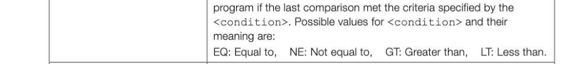
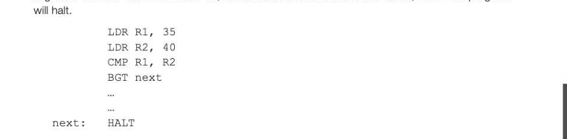
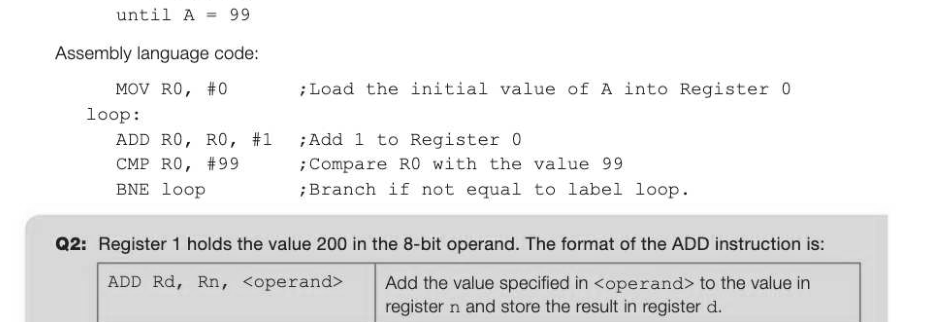
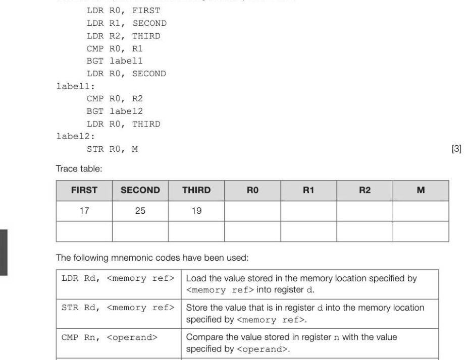
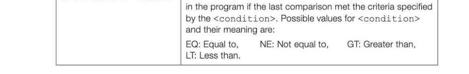
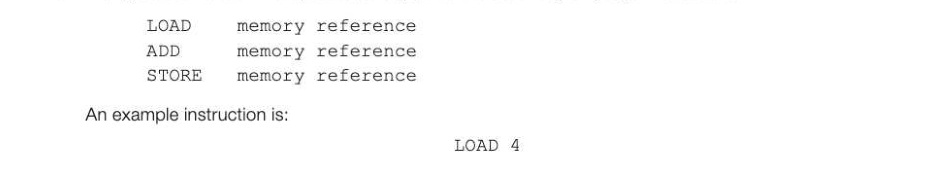
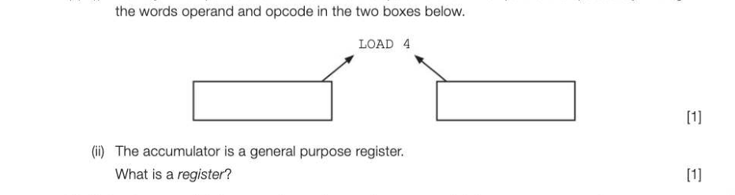

# Chapter 28 — Assembly language
## Objectives

e Use basic machine code operations expressed in mnemonic-form assembly language « Understand and apply immediate and direct addressing modes

## Assembly language

Assembly language uses mnemonics to represent the operation codes and addresses. Typically, 2-, 3- or 4-character mnemonics are used to represent all the machine code instructions. The assembler then translates the assembly language program into machine code for execution. The following table shows typical mnemonics for data transfer, arithmetic, branch and compare instructions in the instruction set of a particular computer. LDR Rd, <memory ref> Load the value stored in the memory location specified by <memory ref> into register d. STR Rd, <memory ref> Store the value that is in register d into the memory location specified by <memory ref>. ADD Rd, Rn, <operand> Add the value specified in <operand> to the value in register n and store the result in register d. SUB Rd, Rn, <operand> Subtract the value specified by <operand> from the value in register n and store the result in register d. MOV Rd, <operand> Copy the value specified by <operand> into register d. CMP Rn, <operand> Compare the value stored in register n with the value specified by <operand>. B <label> Always branch to the instruction at position <labe1> in the program. B<condition> <label> Conditionally branch to the instruction at position <labe1> in the



HALT Stops the execution of the program.


*Table 1*

<operand> can be interpreted in two different ways, depending on whether the first symbol is a # or an R:

- #-—use the decimal value specified after the #, e.g. #27 means use the decimal number 27
- Rn-use the value stored in register n, e.g. R6 means use the value stored in register 6.
- Assume the available registers that the programmer can use are numbered 0 to 7.

## Examples

All the examples below use instructions from Table 1.

## Data transfer and arithmetic operations

Add 12 to the number stored in memory location 52 and save the result in memory location 53.


## Compare and branch instructions

The value in a memory location can be compared with the value in a register using a CMP (compare) instruction. The code can then be made to conditionally branch to a given label in the program depending on whether the number held in the register was Equal to (BEQ), Not Equal to (BNE), Greater Than (BGT) or Less Than (BLT) the number held in the memory location. Example: Compare the two numbers held in memory locations 35 and 40. If the value in location 35 is greater than the value in location 40, branch to the instruction labelled next, where the program



Example: Write the assembly language equivalent of the following high-level language instructions, explaining each assembly language instruction used.

```
A←0
repeat
   A←fAt+l
```



## Logical bitwise operators

Assembly language instructions for logical operations are shown in Table 2 below. AND Rd, Rn, <operand> | Perform a bitwise logical AND operation between the value in register n and the value specified by <operand> and store the result in register d. ORR Rd, Rn, <operand> | Perform a bitwise logical OR operation between the value in register n and the value specified by <operand> and store the result in register d. EOR Rd, Rn, <operand> | Perform a bitwise logical exclusive or (XOR) operation between the value in register n and the value specified by <operand> and store the result in register d. MVN Rd, <operand> Perform a bitwise logical NOT operation on the value specified by <operand> and store the result in register d. LSL Rd, Rn, <operand> | Logically shift left the value stored in register n by the number of bits specified by <operand> and store the result in register d. LSR Rd, Rn, <operand> | Logically shift right the value stored in register n by the number of bits specified by <operand> and store the result in register d. HALT Stop the execution of the program.


*Table 2*

The instructions OR, NOT, AND and XOR (exclusive OR) produce the following results: OR NOT AND XOR

## Inputs A 1010 1010 1010 1010

B 1100 1100 1100

## Result 1110 0101 1000 0110

The NOT function can be used to find the two's complement of a number:


The assembly language instructions to carry out this operation with B indicating a binary, rather than a decimal value, would be something like: MVN R1, #01100111B perform NOT operation, store result in R1 ADD R1, R1, #1;add 1 to result in R1 The OR function can be used to set certain bits to 1 without affecting the other bits in the binary code. For example, a system has eight lights that can be turned on (output 1) or off (output 0), controlled by an 8-bit binary code. At present, lights 1 to 4 are on. We now wish to turn on lights 5 and 7 as well.

## Light numbers 12345678

## Present output 11110000

## OR with 00001010

## Result 11111010

The assembly language code for this operation could be: LDR R2, LIGHT;load contents of LIGHT into R2 ORR R3, R2, #00001010B 7OR with binary 00001010 and store in R3 STR R3, LIGHT #Store result back in LIGHT The AND function can be used to mask out certain bits of a number. For example, if we input the ASCII character 3 at the keyboard, the ASCII pattern 00110011 is input. In order to change this to a pure binary digit, we need to mask out the first 4 bits. LDR R2, NUM zload ASCII digit from NUM into R2 AND R3, R2, #00001111B AND with binary 00001111 and store in R3 STR R3, NUM;Store result back in NUM

## Logical shift operations

A logical shift right causes the least significant bit to be shifted into the carry bit and a zero moves in to occupy the vacated space. Suppose R1 contained the following bit pattern: (0) 1 (0) (0) (0) 1 1 1 (o) (carry bit)

## After the instruction

LSR R2, R1, #1;Logically shift right the value in R1 by 1 place, store in R2 R2 will hold the bit pattern This can be used for examining the least significant bit of a number. After the operation, the carry bit can be tested and a conditional branch instruction executed.


---

## Exercises

1. Memory locations FIRST, SECOND and THIRD each contain an integer. With the aid of the following trace table, explain what the following assembly code does.



B<condition> <label> Conditionally branch to the instruction at position <labe1>



2. (a) Ina particular machine code, the opcode is stored in 6 bits and the operand is stored in 12 bits. What is the maximum number of operations in the machine's instruction set? a] (b) Explain, with the aid of examples, the difference between immediate and direct addressing. 4]

## Exercises continued

3. A-single accumulator microprocessor supports the assembly language instructions:



which would copy the contents of the referenced memory location 4 into the accumulator register. (a) (i) Identify which part of the instruction is the operand and which part is the opcode by writing



(b) Using the assembly language instructions, write an assembly language program that adds together the values stored in memory locations 12 and 13, storing the resulting total in memory location 14. [3] AQA Comp 2 Qu 5 January 2010 4. Aprocess can only begin if bits 0, 3, 5 and 6 of an 8-bit accumulator are set to 1. The status of the other bits has no effect on the process. Write the key assembly language instructions to check whether the process can take place. [3]
