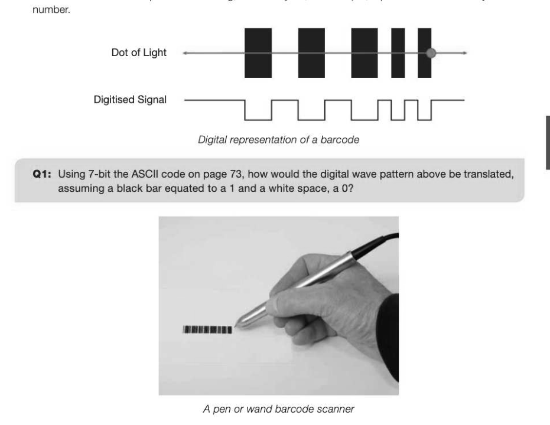

# Chapter 29 — Input-output devices
## Objectives

- Learn the main characteristics and principles of operation of:

« Understand the purposes and suitability of these devices

## Barcodes

Barcodes first started appearing on grocery items in the 1970s, and today, they are used for identification in thousands of applications from tracking parcels, shipping cartons, passenger luggage, blood, tissue and organ products around the world to the sale of items in shops and the recording of the details of people attending events. A handheld barcode scanner used for scanning medical samples There are two different types of barcode: Linear barcodes such as the one shown above and 2D barcodes such as the Quick Response (QR) code, which can hold more information than the 1D barcode. A 2D barcode 2D barcodes are used for example in ticketless entry to concerts, or access through gates to board a Eurostar train or passenger airline. They are also used in mobile phone apps which enable the user to take a photo of the code which may then provide them with further information such as a map of their location, product details or a website URL.

## Barcode readers

There are four different barcode readers available, each using a slightly different technology for reading and decoding a barcode. The four types are pen-type readers, laser scanners, CCD readers and camera- based readers.

## Pen-type readers

In a pen-type reader, a light source and a photo diode are placed next to each other in the tip of a pen. To read a barcode, the tip of the pen is dragged across all the bars at an even speed. The photo diode measures the intensity of the light reflected back from the light source and generates a waveform that is used to measure the widths of the bars and spaces in the barcode. Dark bars in the barcode absorb light and white spaces reflect light so that the voltage waveform generated by the photo diode, once converted from analogue to digtal, is an exact duplicate of the bar and space pattern in the barcode. The simplest encoding translates areas of light and dark as 1s and Os. These can be used to create ASCII character codes for an alphanumeric string, which may be, for example, a product code or library book

Because of their simple design, the pen-type scanner is the most durable type of barcode scanner, and can be tightly sealed against dust, dirt, and other environmental hazards. However, their applications are limited because they must come into direct contact with a barcode to read it. Because of their small size and low weight, this type of barcode scanner is ideally suited for use with portable (laptop) computers or very low volume scanning applications.

## Laser scanners

Laser scanners work in the same way as pen scanners except they use a laser beam as the light source. The laser reflects off a moving mirror which allows the barcode to be read in many different positions. They are available in a variety of forms, the most familiar being the in-counter units in supermarkets. They are reliable and economical for low-volume applications. & Laser scanner

## CCD (Charge-Coupled Device) readers

CCD readers use an array of hundreds of tiny light sensors lined up in a row in the head of the reader. Each sensor measures the intensity of the light immediately in front of it. Each individual light sensor in the CCD reader is extremely small and because there are hundreds of sensors lined up in a row, a voltage pattern identical to the pattern in a barcode is generated in the reader by sequentially measuring the voltages across each sensor in the row.

## Camera-based readers

A camera-based imaging scanner uses a camera and image processing techniques to decode a 1D or 2D bar code. An imaging scanner can read a barcode on any surface, printed or onscreen, and can also read a code that is damaged or poorly printed. Image processing has to be carried out by the software as the barcode might be at any rotation or variety of distances from the scanner. They are used in multiple applications such as:

- age verification by scanning an individual's driving licence
- couponing — a 2D barcode coupon is emailed to a customer, which can be scanned from their phone screen at the POS (Point of Sale). Unique codes for each customer and promotion can be stored in the bar code, so that tracking coupon usage is easy
- event ticketing — tickets can be issued electronically and then scanned off a phone screen
Consumers can use a cell phone to scan a QR code which can, for example:

- display a catalogue of movies or DVDs
- play an MP3 when scanned
- display nutrition information about a product
ital cameras A digital camera uses a CCD or CMOS (Complementary Metal Oxide Semiconductor) sensor comprising millions of tiny light sensors arranged in a grid. When the shutter opens, light enters the camera and projects an 'image' onto the sensor at the back of the lens. Like the CCD barcode reader, each sensor measures the brightness of each pixel, turns light into electricity and stores the amount of charge as binary data. The image on the camera's screen is a greyscale representation of what the sensors are 'seeing'. To record colour, the sensors are often placed under a mosaic of red, green and blue filters to separate out the different colour wavelengths. The processor can then approximate binary values for the three RGB channels of each individual pixel based on the values of neighbouring pixels. The binary data is recorded onto the camera's memory card so that the image can be reproduced using suitable software. ACCD sensor tends to produce higher quality images and they are used in higher end cameras. They are also more reliable since the technology has been around for much longer. This however, is at the cost of power consumption, using up to 100 times that of a CMOS sensor. Bayer colour filter applied to a sensor array

## Radio Frequency Identification (RFID)

In much the same way as barcodes, RFID tags are increasingly being used to identify and track everything from household products and cars to bank cards and animals. The difference however, is that an RFID tag can be read without line of sight and from up to 300 metres away. They can also pass stored data from the tag to the receiver and vice versa. An RFID chip consists of a small microchip transponder and an antenna. The microchip at the centre of the image below can be manufactured to be less than 1mm in size but the antenna must be larger in order for it to communicate with a base unit. This can increase the size of the smallest tags to about that of a large grain of rice. These can be embedded in special capsules and injected under the skin for the identification of pets.

## Passive and active tags

Active tags are physically larger as they include a battery to power the tag so that it actively transmits a signal for a reader to pick up. These are used to track things likely to be read from further away, such as cars as they pass through a motorway toll booth or runners in a marathon as they pass mile markers. Passive tags are much cheaper to produce as they do not have a battery. They rely on the radio waves emitted from a reader up to a metre away to provide sufficient electromagnetic power to the card using its coiled antenna. Once energised, the transponder inside the RFID tag can send its data to the reader nearby. These are most common in tagging items such as some groceries, music CDs, and for smart cards such as Transport for London's Oyster Card or a contactless bank card.

## Laser printer

Laser printers offer high-quality, high-speed printing. Their function is similar to that of a photocopier, using powdered ink called toner. The printer generates a bitmap image of the printed page and using a laser unit and mirror, 'draws' a negative, reverse image onto a negatively charged drum. The laser light causes the affected areas of the drum to lose their charge. The drum then rotates past a toner hopper to attract charged toner particles onto the areas which have not been lasered. The particles are transferred onto a sheet of paper and then bonded onto it using pressure and heat. Laser printers are becoming increasingly affordable and are frequently used as home printers, in businesses and in professional printing services. Colour laser printers are far more expensive to run than black and white versions. They contain four toner cartridges (Cyan, Magenta, Yellow and Black or CMYK) and the paper must go through a similar process to the black-only printer four times; once for each colour. The usage of laser printers for print jobs other than text is limited by the quality of the print produced, which at about 1200 dpi makes photorealistic prints impossible and best left to inkjet printers. Heated Fuser Paper Tray

---

## Exercises

1. A supermarket uses a computerised stock control system. Each product is identified by a unique product code which is printed on the product as a bar code. The bar codes are input into the stock control system at the till using a bar code reader. One of the digits in the bar code is a check digit. AIO (a) Describe the principles of operation of a bar code reader, excluding the use of the check digit. [4] (b) Explain the purpose of the check digit. (1) (c) Some unpackaged items such as loose fruit and vegetables do not have a product code printed on them. Name an input device that the till operator could use to enter details of these items. 1) AQA Comp 2 Qu 9 January 2010 2. A Radio Frequency Identification (RFID) system is made up of a transponder built into an RFID tag and an interrogator or reader. One example of use is to detect unauthorised removal of library books from a library. Explain the principles of operation of this RFID system. (2) AQA Comp 2 Qu 11 January 2009 3. Some countries have introduced electronic passports for their citizens. The passport stores data about the passport holder using a Radio Frequency Identification (RFID) tag. Explain how the RFID tag could be read at passport control in an airport. [2]
