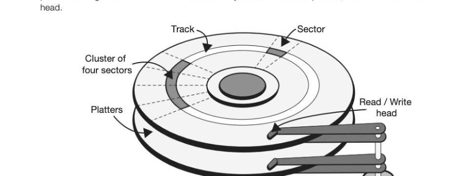
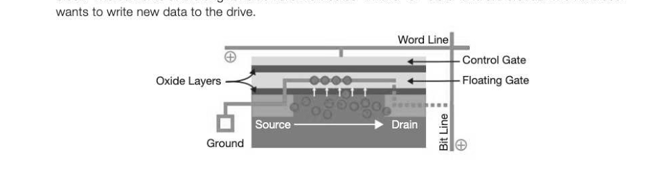

# Chapter 30 — Secondary storage devices
## Objectives

- Explain the need for secondary storage within a computer system
- Know the main characteristics and principles of operations of:

e Understand the purposes and suitability of these devices

## The need for secondary storage

Acomputer's primary store is Random Access Memory. Unlike RAM, secondary storage is not directly accessible to the processor and has slower access speeds. Secondary storage, however, has the advantage that it retains its contents when the computer's power is turned off. This includes the computer's internal hard disk, optical media and solid state disks.

## How storage devices store data

Hard disks, optical disks and solid state disks all use different methods to store data, but in each case, use a technique which allows them to create and maintain a toggle state without power to represent either a 1 or a0.

## Hard disk

A hard disk uses rigid rotating platters coated with magnetic material. Ferrous (iron) particles on the disk are polarised to become either a north or south state. This represents 0 and 1. The disk is divided into tracks in concentric circles, and each track is subdivided into sectors. The disk spins very quickly at speeds of up to 10,000 RPM. Like an old record player, a drive head (like the needle on a record player) moves across the disk to access different tracks and sectors. Data is read or written to the disk as it passes under the drive head. The head, however, is not in contact with the disk, but floats a fraction of a millimetre above it. When the drive head is not in use, it is parked to one side of the disk in order to prevent damage from movement. A hard disk may consist of several platters, each with its own drive

Although hard disks are less portable than optical or solid state media, their huge capacity makes them very suitable for desktop purposes. Smaller, denser surface areas spinning under the read-write heads mean that newer 3.5 inch disks have capacities of up to several terabytes.

## Optical disk

Optical disks come in three different formats: read-only (e.g. CD-ROM), recordable (e.g. CD-R) and rewritable (e.g. CD-RW). An optical disk works by using a high powered laser to "burn" (change the chemical properties of) sections of its surface, making them less reflective. A laser at a lower power is used to read the disk by shining light onto the surface and a sensor is used to measure the amount of light that is reflected back. A read-only CD-ROM disk pressed during manufacture has pits in its surface. Those areas that have not been pitted, are called lands. At the point where a pit starts or ends, light is scattered and therefore not reflected so well. Reflective and non-reflective areas are read as 1s and Os. There is only one single track on an optical disk, arranged as a tight spiral. A CD-ROM holds about 650MB of data, whereas a Blu-Ray disk (designed to supersede the DVD disk) can hold 50GB. Although these disks do not vary in size, their added capacity is owing to the shorter wavelength in the laser they use. This creates much smaller pits, enabling a greater number to fit in the same space along the track and also means that the track can be more tightly wound, and therefore much longer. Recordable disks use a reflective layer with a transparent dye coating that becomes less reflective when a spot laser "burns" a spot in the track. Rewriteable compact disks use a laser and a magnet in order to heat a spot on the disk and then set its state to become a 0 or a 1 using the magnet before it cools again. A DVD-RW uses a phase change alloy that can change between amorphous and crystalline states by changing the power of the laser beam. Optical storage is very cheap to produce and easy to send through the post for distribution purposes. Disks are also used for small backups or for storing music, photographs or films. Disk data can however be corrupted or damaged easily by excessive sunlight or scratches.

## Solid-state disk (SSD)

Solid state disks are packaged to look like hard disk drives, rectangular in shape and sized to match industry-standard dimensions for hard drives, typically 2.5 and 3.5 inches. A 480 GB solid state drive Inside, however, instead of platters and a read-write head, there is an array of chips arranged on a board. These components are put into the standard size "housing" so that they fit into existing laptops and desktop PCs. Solid state memory comprises millions of NAND flash memory cells, and a controller that manages pages and blocks of memory. Each cell works by delivering a current along the bit and word lines to activate the flow of electrons from the source towards the drain. The current on the word line however is strong enough to force a few electrons across an insulated oxide layer into a floating gate. Once the current is turned off, these electrons are trapped. The state of the NAND cell is determined by measuring the charge in the floating gate. No charge (with no electrons) is considered a 1 and some charge is considered a 0. Data is stored in pages (typically 4KiB each), grouped into blocks of say, 512KiB. NAND flash memory cannot overwrite existing data. The old data must be erased before data can be written to the same location, and although data can be written in pages, the technology requires the whole block to be erased. As writing to a specific block of NAND cells cannot be done directly, a separate block is created to mirror the data to be transferred to the solid state memory and the data is then written to the new block. The contents of the original block are marked as "invalid" or "stale" and are erased when the user

Although capacity is still relatively low, solid state media have faster access speed than hard disks. With no need to move a read-write head across the disk, one piece of data can be accessed just as quickly as any other, even if they are not close together. SSDs consume far less power than traditional hard drives, meaning that in a laptop, for example, battery life is extended and they stay cooler. In addition, they are less susceptible to damage. They are also silent in operation, lighter and highly portable — all considerable advantages in personal devices such as mobile phones and MP3 players for example.

---

## Exercises

1. (a) Describe how data is written to and read from a CD-R disk. [3] (b) A school has archived all its students' reports on to CD-R. Some years later, a copy of a particular student's reports is requested. Unfortunately it is found that the documents cannot be opened. Give two reasons why this may be the case. [2] In 1995, a high capacity hard disk drive had a storage capacity of 512 mebibytes. In 2012, a typical hard disk drive of the same physical size had a capacity of 1 tebibyte. (a) Describe the principles of operation of a hard disk drive. [4] (b) How many times greater is the storage capacity of a 1 tebibyte hard disk drive than that of a 512 mebibyte hard disk drive? Show each stage of your working. a] Final answer: tt] (c) Give one development in the design of hard disk drives that has enabled this increase in storage capacity. a] (d) If you are considering purchasing a high-end desktop or laptop you might be offered the option of a solid-state drive (SSD) rather than a traditional hard disk drive. A solid-state drive is a data storage device that uses solid-state memory, similar to that in USB flash drives (memory sticks), to store data that is accessed in a similar way to a traditional hard disk drive. Ignoring any differences in price and assuming that both drives have the same capacity, state two reasons why you might choose the solid-state drive. (2] AQA Comp 2 Qu 5 January 2013

## Section 6

Communication: technology and consequences In this section: Chapter 31 Communication methods 159 Chapter 32 Network topology 164 Chapter 33 Client-server and peer-to-peer Chapter 34 Wireless networking, CSMA and SSID 171 Chapter 35 Communication and privacy 176 Chapter 36 The challenges of the digital age 179
