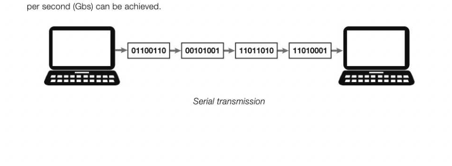
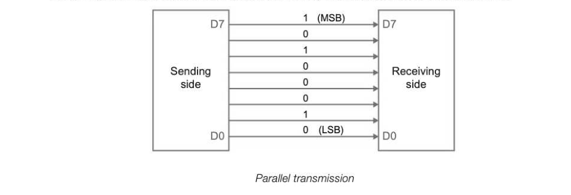
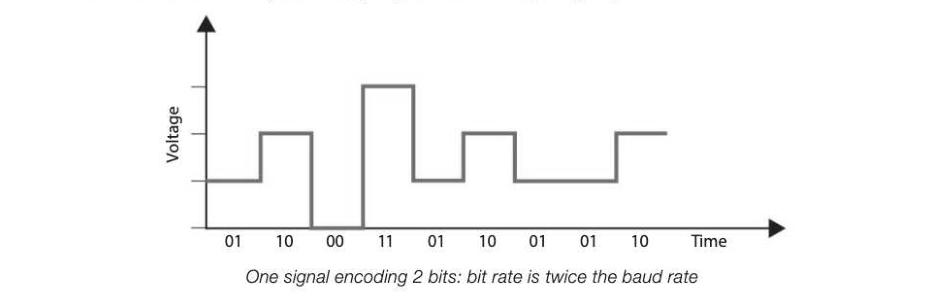
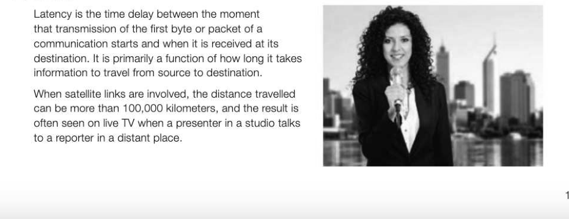
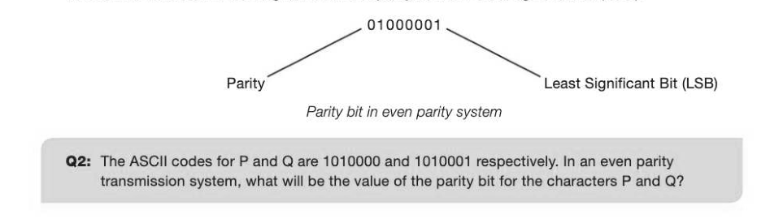
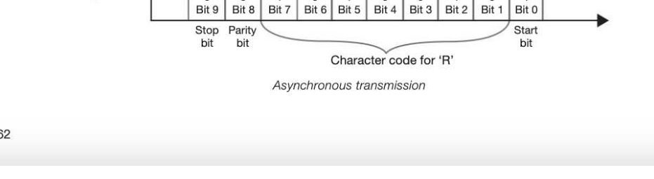
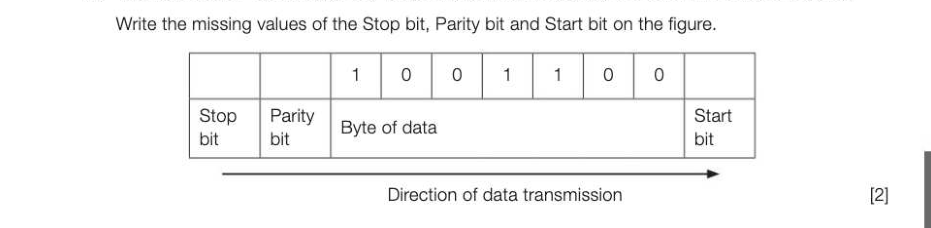

# Chapter 31 — Communication methods
## Objectives

- Define serial and parallel transmission methods and discuss the advantages of serial over parallel transmission
- Define and compare synchronous and asynchronous data transmission Describe the purpose of start and stop bits in asynchronous data transmission
- Define baud rate, bit rate, bandwidth, latency, protocol
- Differentiate between baud rate and bit rate Understand the relationship between bit rate and bandwidth

## Electronic data communication

Data communication involves sending and receiving data from one computer or device to another. Data communication applications include e-mail, supermarket EPOS (electronic point of sale) terminals, cash dispensers, cell phones and VOIP (Voice Over Internet Protocol). Data communication also takes place within the CPU and between the CPU and its peripheral devices; for example, data and addresses are transmitted along the data bus and address bus between the processor and memory, and data is transferred between memory and storage and other peripheral devices.

## Serial and parallel data communication

Data can be sent in one of two ways: serial or parallel. Using serial data transmission, bits are sent via an interface one bit at a time over a single wire from the source to the destination. Very high data transfer rates can be achieved — for example using fibre-optic cable, data transfer rates ranging from around 50 Megabits per second (Mbs) to 100 Gigabits

Using parallel data transmission, several bits are sent simultaneously over a number of parallel wires. Parallel communication is used in integrated circuits and within random access memory (RAM).

When parallel transmission is used, each individual wire has slightly different properties, there is a possibility that bits could travel at slightly different speeds over each of the wires. This produces a problem known as skew. Parallel transmission is only reliable n over short distances.

## Advantages of serial over parallel transmission

The advantages of serial over parallel links are summarised below. The significant reduction in the size and complexity of connectors in serial transmission results in much lower associated costs. Designers of devices such as smartphones use connectors that are small, durable and still produce acceptable performance. "Crosstalk" creates interference between parallel lines, and can result in corrupted words which then need to be retransmitted. This is more pronounced as the signal frequency increases, and worsens with the length of the communication link. Serial links are reliable over much greater distances than parallel links. Because of the lack of interference at higher frequencies, signal frequency can be much higher with serial transmission, resulting in a higher net data transfer rate even though less data is transmitted per cycle. (See bit rate and baud rate below.)

## Bit rate and baud rate

The speed at which data is transmitted serially is measured in bits per second (bit rate). The baud rate is the rate at which the signal changes. In baseband mode, only two voltage levels are most commonly used, one to represent zero and the other to represent one. In this case the bit rate and the baud rate are the same. bit rate of channel = (baud rate) x (number of bits per signal )

In the figure above, (a simplified version of reality), four different "voltage levels" on the vertical scale represent four different bit patterns, so 00, 01, 10 or 11 can be encoded at each signal. With eight different voltage levels or frequencies, each signal can encode 3 bits. Thus, for example, a baud rate of 1 MBd (megabaud) = 3 Mbit/s or 3,000,000 bits per second.

## Bandwidth

Bandwidth is the range of frequencies that a transmission medium can carry. The larger the range, the greater the amount of data that can be transmitted in a fixed amount of time. It is usually expressed in bits per second (bps), since there is a direct relationship between bandwidth and bit rate. Think of a pipe carrying water — the larger the width of the pipe, the more water can be sent along it. Modern networks typically have speeds measured in millions of bits per second (Mbps).

## Latency

## Parity

Computers use either even or odd parity. In an even parity machine, the total number of 'on' bits in every byte (including the parity bit) must be an even number. When data is transmitted, the parity bit is set at the transmitting end and parity is checked at the receiving end, and if the wrong number of bits are 'on', an error has occurred. In the diagram below the parity bit is the most significant bit (MSB).

## Synchronous transmission

Using synchronous transmission, data is transferred at regular intervals that are timed by a clocking signal, allowing for a constant and reliable transmission for time-sensitive data, such as real-time video or voice. Parallel communication typically uses synchronous transmission - for example, in the CPU, the clock emits a signal at regular intervals and transmissions along the address bus, data bus and control bus start on a clock signal, which is shared by both sender and receiver.

## Asynchronous transmission

Using asynchronous transmission, one byte at a time is sent, with each character being preceded by a start bit and followed by a stop bit. The start bit alerts the receiving device and synchronises the clock inside the receiver ready to receive the character. The baud rate at the receiving end has to be set up to be the same as the sender's baud rate or the signal will not be received correctly. The stop bit is actually a "stop period", which may be arbitrarily long. This allows the receiver time to identify the next start bit and gives the receiver time to process the data before the next value is transmitted. A parity bit is also usually included as a check against incorrect transmission. Thus for each character being sent, a total of 10 bits is transmitted, including the parity bit, a start bit and a stop bit. The start bit may be a 0 or a 1, the stop bit is then a 1 or a 0 (always different). A series of electrical pulses is sent

g s Low: ofo|1fo]1fofo]1]fo]1

This type of transmission is usually used by PCs, and is economical for relatively small amounts of data. The main advantage is that there does not need to be a way of sharing the clock signal.

## Protocol

Protocol: a set of rules relating to communication between devices. In order to allow equipment from different suppliers to be networked, a standardised set of rules (protocols) has been devised covering standards for physical connections, cabling, mode of transmission, speed, data format, error detection and correction. Any pieces of equipment which use the same communication protocol can be linked together.

---

## Exercises

1. Data is being transmitted along a serial link using asynchronous data transmission and odd parity. (a) Explain what serial data transmission is and how it differs from parallel data transmission. (2) (b) The figure below shows a byte of data being transmitted along the serial link using odd parity.

(c) Explain what asynchronous data transmission is. (1) AQA Comp 3 Qu 3 June 2013 2. (a) Explain the terms bit rate and baud rate and the relationship between the two. [3] (b) What is /atency in the context of data communications? [2] 3. (a) What is meant by a communications protocol? (1) (b) Why is a communications protocol necessary when communicating over a network? (1) (c) Name five items that are commonly covered by a communications protocol. [5]
