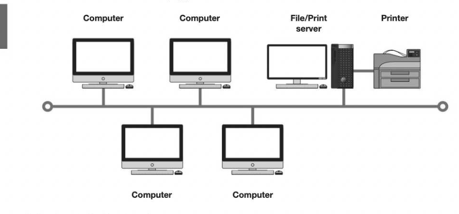
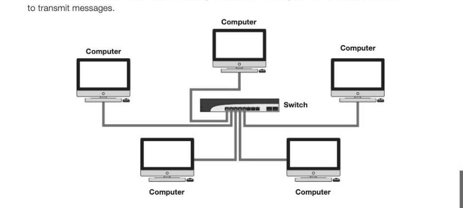

# Chapter 32 — Network topology
## Objectives

Describe the star and bus topologies for a local area network Differentiate between physical and logical network topologies Explain the operation of these network topologies Give the advantages and disadvantages of each

## Local area networks

Alocal area network (LAN) consists of a number of computing devices on a single site or in a single building, connected together by cables. The network may consist of a number of PCs, other devices such as printers and scanners, and a central server. Users on the network can communicate with each other, as well as sharing data and hardware devices such as printers and scanners. LANs can transmit data very fast but only over a short distance.

## Physical bus topology

ALAN can use different layouts or topologies. In a bus topology, all computers are connected to a single cable. The ends of the cable are plugged into a terminator.

## Advantage of a bus topology

Inexpensive to install as it requires less cable than a star topology and does not require any additional hardware

## Disadvantages of a bus topology

If the main cable fails, network data can no longer be transmitted to any of the nodes

- Performance degrades with heavy traffic
« Low security — all computers on the network can see all data transmissions

## Physical star topology

A star network has a central node, which may be a switch or computer which acts as a router

## Advantages of a star topology

- If one cable fails, only one station is affected, so it is simple to isolate faults
- Consistent performance even when the network is being heavily used
«Higher transmission speeds can give better performance than a bus network

- No problems with 'collisions' of data since each station has its own cable to the server
The system is more secure as messages are sent directly to the central computer and cannot be intercepted by other stations

- Easy to add new stations without disrupting the network

## Disadvantages of a star network

May be costly to install because of the length of cable required

- If the central device goes down, network data can no longer be transmitted to any of the nodes

## Operation of a star network

In a star network, each node is connected to a central device, typically a switch. A switch keeps a record of the unique MAC address of each device on the network and can identify which particular computer on the network it should send the data to.

## Physical vs logical topology

The physical topology of a network is its actual design layout, which is important when you select a wiring scheme and design the wiring for a new network. The logical topology is the shape of the path the data travels in, and describes how components communicate across the physical topology. The physical and logical topologies are independent of each other, so that a network physically wired in star topology can behave logically as a bus network by using a bus protocol and appropriate physical switching. For example, any variety of Ethernet uses a logical bus topology when components communicate, regardless of the physical layout of the cable. 9° Computer File/Print

Computer Printer =e Computer Computer =. © In the diagram, the computers on the left are connected with a single cable coming from the switch, in a physical bus configuration. The computers on the right hand side are each separately connected to the switch, in a physical star configuration. Logically, however, the network on the right can be arranged as a bus network and data will be sent to each computer in turn, as on the left. Each individual cable between the switch and the device will act as a bus and the Ethernet bus protocol will be used to control access to the cable, even though there are only two devices (the switch and the device at the other end of the individual cable) which could attempt to put data onto the cable simultaneously.

## Operation of a logical bus network

Data cannot be simultaneously transmitted in both directions, i.e. duplex transmission is not possible. Every station receives all network traffic, and the traffic generated by each station has equal transmission priority. A device wanting to communicate with another device on the network sends a broadcast message onto the wire that all other devices see, but only the intended recipient actually accepts and processes the message.

## MAC address

Every computer device, whether it's a PC, smartphone, laptop, printer or other device which is capable of being part of a network, must have a Network Interface Card (NIC). Each NIC has a unique Media Access Control address (MAC address), which is assigned and hard-coded into the card by the manufacturer and which uniquely identifies the device. The address is 48 bits long, and is written as 12 hex digits, for example: 00-09-5D-E3-F7-62 Because they are unique, MAC addresses can be used to track you. When you walk around, your smartphone scans for nearby Wi-Fi networks and broadcasts its MAC address. You can find out the MAC address of your PC by selecting Command Prompt from the Start menu in Windows, and then typing ipconfig /a11. This will display the physical address, i.e. MAC address. Displaying your computer's MAC address

---

## Exercises

1. (a) Draw diagrams representing physical star and bus topologies. [4] (b) Describe three advantages of a physical star topology over a bus topology, and one disadvantage of the star topology. [4] (c) Describe how a network wired in a star topology can behave logically as a bus network. [2] 2. A student claims that "an individual piece of hardware may be tracked and identified by its MAC address", (a) What is a MAC address? (1) (b) Explain briefly how a MAC address is used and state whether you agree with the statement above. [3]
