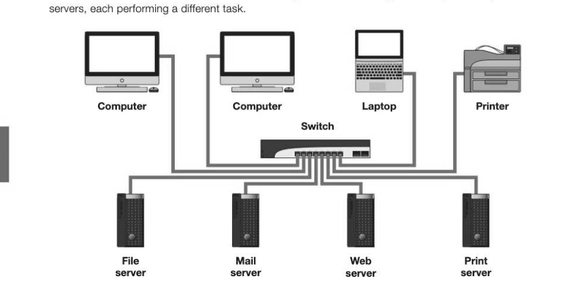
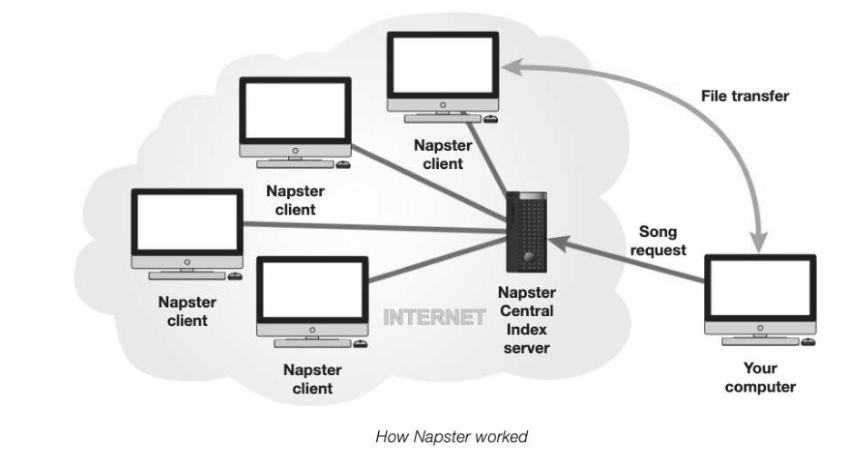

# Chapter 33 — Client-server and peer-to-peer
## Objectives

- Explain client-server networking
- Explain peer-to-peer networking
- Describe situations when each of these might be used

## Client-server networking

In a client-server network, one or more computers known as clients are connected to a powerful central computer known as the server. Each client may hold some of its own files and resources such as software, and can also access resources held by the server. In a large network, there may be several

- File server holds and manages data for all the clients
- Print server manages print requests
- Web server manages requests to access the Web
- Mail server manages the email system
- Database server manages database applications
In a client-server network, the client makes a request to the server which then processes the request.

## Advantages of a client-server network

- Security is better, since all files are stored in a central location and access rights are managed by the server
- Backups are done centrally so there is no need for individual users to back up their data. If there is a breakdown and some data is lost, recovery procedures will enable it to be restored
«Data and other resources can be shared

## Disadvantages of a client-server network

© It is expensive to install and manage

- Professional IT staff are needed to maintain the servers and run the network

## Peer-to-peer networks

In a peer-to-peer network, there is no central server. Individual computers are connected to each other, either locally or over a wide area network so that they can share files. In a small local area network, such as in a home or small office, a peer-to-peer network is a good choice because:

- itis cheap to set up
e it enables users to share resources such as a printer or router

- it is not difficult to maintain
Peer-to-peer networks are also used by companies providing, for example, video on demand. The problem arises when thousands of people simultaneously want to download the latest episode of a particular TV show. Using a peer-to-peer network, hundreds of computers can be used to hold parts of the video and so share the load.

## The downside of peer-to-peer networking

Peer-to-peer networking has been widely used for online piracy, since it is impossible to trace the files which are being illegally downloaded. In 2011, the US Chamber of Commerce estimated that piracy sites attracted 53 billion visits each year. The analyst firm NetNames estimated that in January 2013 alone, 432 million unique Web users actively searched for content that infringes copyright. Case study: Piracy sites In January 1999, 19-year-old Shawn Fanning and Sean Parker created the Napster software, which enabled the peer-to-peer "sharing" of music — in actual fact, the theft of copyright music. Instead of storing the MP3 files on a central computer, the songs are stored on users' machines. When you want to download a song using Napster, you are downloading it from another person's machine, which may be next door or on the other side of the world. All you need is a copy of the Napster utility and an Internet connection. Napster was sued for copyright infringement in 2000 but argued that they were not responsible for copyright infringement on other people's machines. However, they lost the case and were pushed into bankruptcy, but the service has since reinvented itself on a legitimate, subscription basis.

## The consequences of piracy

In 2014, Popcorn Time was launched, allowing a decentralised peer-to-peer service for illegal streaming of movies. Popcorn Time has already been translated into 32 languages and has been described as a "nightmare scenario" for the movie industry. The more movies that are stolen and illegally downloaded online, the fewer resources moviemakers have to invest in new films. In 2013 there was a 21% drop in the 18-24 age group buying tickets to watch movies, and numbers may plummet further in the next few years. A 2011 report by the London-based International Federation of the Phonographic Industry (IFPI) estimated that 1.2 million European jobs would be destroyed by 2015 in the music, movie, publishing and photography industries because of online piracy.

---

## Exercises

1. Explain the difference between client-server and peer-to-peer networking, and give an example of where each might be used. (3)] 2. Why is it illegal to download music from some Internet sites? (1) Describe the consequences to the individual artists and to society as a whole, of online piracy. [5]
