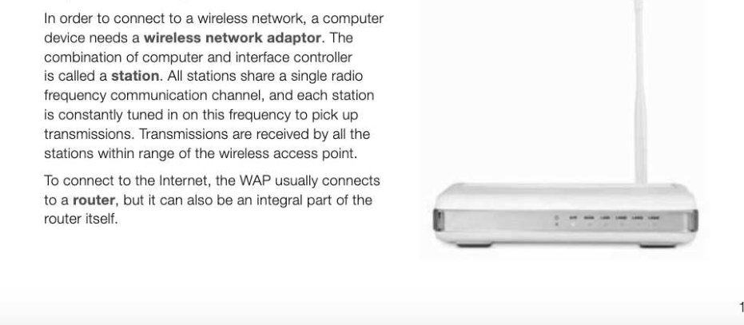
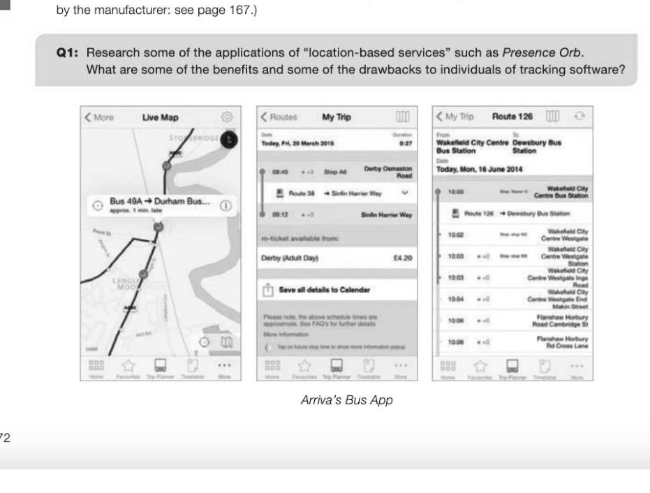
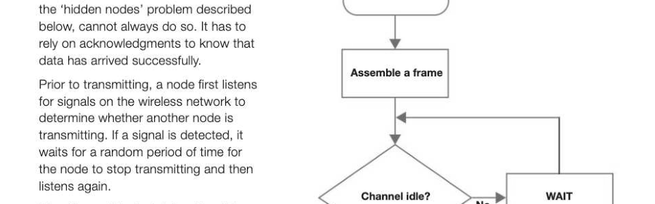
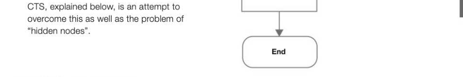
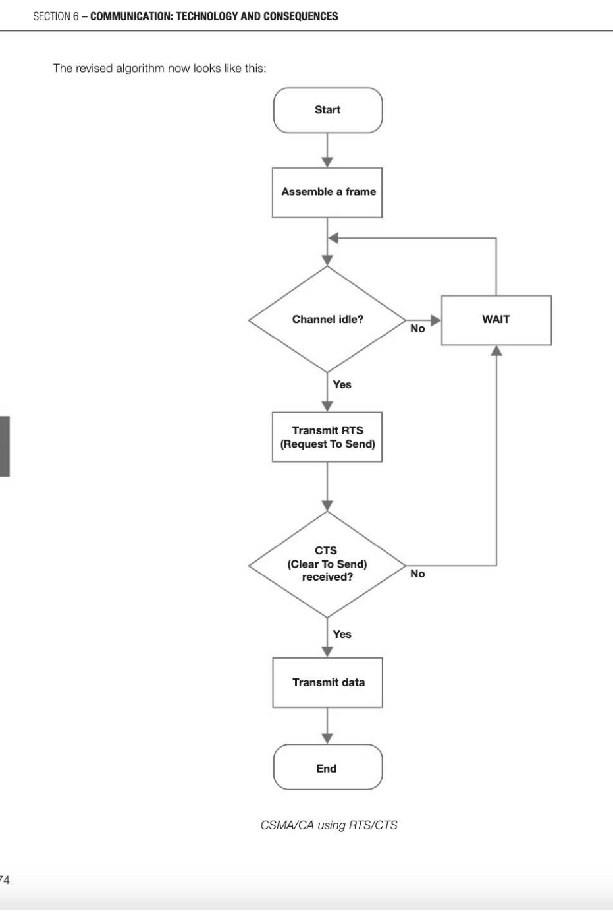

# Chapter 34 — Wireless networking, CSMA and SSID
CSMA and SSID

## Objectives

«Explain the purpose of Wi-Fi

- Describe the components required for wireless networking
« Explain how wireless networks are secured

- Explain the wireless protocol CSMA/CA
- Describe the purpose of Service Set Identifier (SSID)

## Wi-Fi

Wi-Fi is a local area wireless technology that enables you to connect a device such as a PC, smartphone, digital audio player, laptop or tablet computer to a network resource or to the Internet via a wireless network access point (WAP). An access point has a range of about 20 metres indoors, and more outdoors. TJ) « LJ ) « Laptop Wireless Printer computer access point A laptop connected wirelessly to a printer In 1999, the Wi-Fi Alliance was formed to establish international standards for interoperability and backward compatibility. The Alliance consists of a group of several hundred companies around the world, and enforces the use of standards for device connectivity and network connections.

## Components required

## Securing a wireless network

Wi-Fi Protected Access (WPA) and Wi-Fi Protected Access II (WPA2), which has replaced it, are two security protocols and security certification programs used to secure wireless networks. WPA2 is built into wireless network interface cards, and provides strong encryption of data transmissions, with a new 128-bit key being generated for each packet sent. Each wireless network has a Service Set Identification (SSID) which is the informal name of the local network — for example, HOME-53C1. The purpose of the SSID is to identify the network, and if, for example, you visit someone else's house with a laptop and wish to connect to their Wi-Fi network in order to use the Internet, when you try to log on to the Internet the computer will ask you to enter the name of the network. Your computer may be within the range of several networks, so having chosen the correct SSID you will then be asked for the password or security key - an identifier of up to 32 bytes, usually a human-readable string. SSIDs must be locally unique. It is possible to disable the broadcast of your SSID to hide your network from others looking to connect to a named local network. However, this will not hide your network completely.

## Whitelists

Some network administrators set up MAC address whitelists (the opposite of blacklists) to control who is allowed on their networks. (The MAC address is a unique identifier assigned to a network interface card

## CSMA/CA

CSMA/CA (Carrier Sense Multiple Access/Collision Avoidance) is a protocol for carrier transmission in wireless local area networks. This protocol attempts to avoid collisions occuring on a data channel, but due to Start

It is still possible that data will collide No using this system as two nodes might transmit at the same time as they both sense the channel is idle. This is Yes detected because the receiver would not send an acknowledgment back to the sender that the data is received. RTS/ Transmit data

## CSMA/CA with RTS/CTS

Having determined that no other node is transmitting, the station wanting to transmit sends a Request to Send (RTS) signal, and the WAP sends a Clear to Send (CTS) signal back if and when the channel is idle. This counteracts the problem of "hidden nodes", i.e. a node that can be heard by the WAP but not by the node trying to transmit. This is shown in the figure below, in which nodes A and C can each communicate with the WAP at B, but are hidden from each other.

---

## Exercises

1. (a) What components are required for wireless networking? [2] (b) Explain two measures that may be taken to make a wireless network secure from hackers. [4] (c) Explain the CSMA/CA with Request to Send/Clear to Send (RTS/CTS) protocol. [4] (d) How does the RTS/CTS system reduce the possibility of a data transmission being corrupted? [2] Wi-Fi location-based technology is increasingly being used by retailers to maximise sales to potential customers. Describe briefly how this works. What are the benefits of this technology to the retailers and their customers? What are the potential dangers to individuals of widespread use of this technology? [8]
