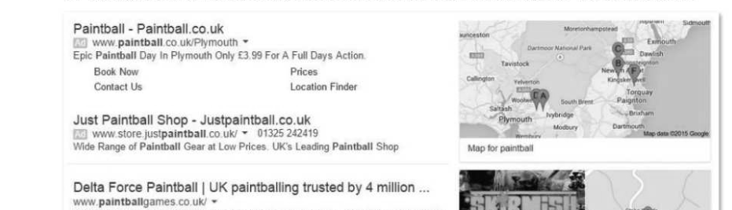

# Chapter 36 — The challenges of the digital age
## Objectives

- Discuss how developments in computer science have enabled massive transformations in the capacity to distribute, publish, communicate and disseminate personal information
- Understand that software and their algorithms embed moral and cultural values
« Understand the real and potential impact that digital technology has on employment, the distribution of wealth and the lives of millions of people

## The economic impact of the Internet

The Internet has its origins in the 1960s with ARPANET, the first North American wide area network. In 1974, two engineers called Bob Kahn and Vint Cerf devised a protocol for linking up individual networks into what they termed the Internet — the "internetworking of networks". In the 1980s Tim Berners-Lee, working for CERN in Geneva, invented, or designed, the World Wide Web. He wrote his initial Web proposal in March 1989 and in 1990 built the first Web browser, called WorldWideWeb. His vision was that "all the bits of information in every computer in CERN, and on the planet, would be available to me and to anyone else. There would be a single global information space." Berners-Lee had little interest in money and gave away his technology for nothing, but one of the most significant consequences of his invention was a complete reshaping of the economy throughout the world. Has it created jobs, or simply created the "1% economy" in which the top Internet companies. like Google, Amazon, Facebook, Instagram and others have accumulated huge wealth at the expense of thousands of workers?

## Amazon

Amazon started as an online bookstore in 1994 but soon diversified into DVDs, software, video games, toys, furniture, clothes and thousands of other products. In 2013 the company turned over $75 billion in sales. It now accounts for 65% of all digital purchases of book sales, but in Britain, for example, there are now fewer than 4,000 bookstores, one third less than in 2005. Where a bookshop employs 47 people for every $10 million in sales, Amazon employs 14 to generate the same revenue. eBay eBay, essentially an electronic platform bringing together buyers and sellers of goods, grew from a user base of 41,000 trading goods worth $7.2 million in 1995, to 162 million users trading goods worth $227.9 billion in 2014.

## Google

In 1996, Larry Page and Sergey Brin, two Stanford University Computer Science postgraduate students, created Google. There were already several successful search engines like Yahoo and AltaVista on the market, but Page and Brin came up with a game-changing algorithm, which they called PageRank, for determining the relevance of a Web page based on the number and quality of its incoming links. The idea was that you could estimate the importance of a Web page by the number and status of other web pages that link to it. Every time you make a search, the Google search engine becomes more knowledgeable and thus more useful. Even more valuable to Google is the fact that Google learns more about you every time you search.

By 1998, Google was getting 10,000 queries every day. By 1999, they were getting 70 million daily requests. Their next step was to figure out how to make money out of their free technology, and they came up with AdWords, which enabled advertisers to place keyword-associated ads down the right hand side of the page. The image below shows what comes up when a user in Dorchester searches for "Paintball", with the nearest companies, sponsored advertisements and a map with their locations.

Paintball in the UK with the world's largest paintball provider Delta Force Paintball -

Delta Force Paintball - Plymouth @ Ledgate Lane Plot! Corre www paintbalgames co.uk " Spatkwol. Plympton sae ean pl nse tg and shel cn, who vty f 2 Google reviews - Google+ page 0844 477 5115 nage Torbay Paintball ®) Totnes Road Addres:Stte eames ty Vicods,Penroyvania Road Exeter, ~ Deven EX SB www Google} torbaypaintballl age co.uk Y 01803 Denbury 400647 Hours: Open today 9:0 am - 6.00 pm By 2014, Google had joined Amazon as a winner-takes-all company, with 1.5 billion daily searches and revenues of $50 billion.

## The destruction of jobs

A 2013 paper by Carl Benedikt Frey and Michael Osborne entitled "The Future of Employment: how susceptible are jobs to computerisation?" estimates that 47% of total US employment is at risk. They examine the impact of future computerisation on more than 700 individual occupations, and note the shifting of labour from middle-income manufacturing jobs to low-income service jobs which are less susceptible to computerisation. At the same time, with falling prices of computing, problem-solving skills are becoming relatively productive, explaining the substantial employment growth in occupations involving cognitive tasks where skilled, well-educated labour has a comparative advantage. The disappearance of middle-income occupations has caused a polarization of labour, with growing employment in high-income cognitive jobs and low-income manual labour. Driverless cars developed by Google are an example of how computerisation is no longer confined to routine manufacturing tasks. The possibility of drones delivering your parcels is no longer in the realms of science fiction. In the 10 jobs that have a 99% likelihood of being replaced by software and automation within the next 25 years, Frey and Osbourne include tax preparers, library assistants, clothing factory workers, and photographic process workers. In fact, jobs in the photographic industry have already all but vanished. In 1989, when Tim Berners- Lee invented the Internet, Kodak employed 145,000 people in research labs, offices and factories in Rochester US and had a market value of $31 billion. In 2013 the company filed for bankruptcy and Rochester became virtually a ghost town.

Meanwhile, in 2010, a young entrepreneur called Kevin Systrom started up Instagram, which enabled users to create photos on their smartphones with filters to give them, for example, a warm and fuzzy glow. An Instagram moment Twenty-five thousand iPhone users downloaded the app when it launched on 6th October 2010. A month later, Systrom's Instagram had a million members. By early 2012, it had 14 million users and by November, 100 million users, with the app hosting 5 billion photos. When Systrom sold Instagram to Facebook for a billion dollars in 2012 (less than two years after the startup), Instagram still only had thirteen full-time employees working out of a small office in San Fransisco. It is a good example of a service that is not providing any jobs at all in the winner-takes-all economics of the digital marketplace.

## User-generated content

In his book "The Cult of the Amateur", Andrew Keen argues that "MySpace and Facebook are creating a youth culture of digital narcissism; open-source knowledge-sharing sites like Wikipedia are undermining the authority of teachers in the classroom, the YouTube generation are more interested in self-expression than in learning about the outside world; the cacophony of anonymous blogs and user-generated content is deafening today's user to the voices of informed experts and professional journalism; kids are so busy self-broadcasting themselves on social networks that they no longer consume the creative work of professional musicians, novelists, or filmmakers." Keen asserts that a thriving music, video and publishing economy is being replaced by the multi-billion dollar monopolist YouTube. The traditional copyright-intensive industries accounted for almost 510 billion Euros in the European Union during the period 2008-2010, and generated 3.2% of all jobs, amounting to more than 7 million jobs. What will happen if large numbers of these jobs disappear?

## Trolls on the Internet

Trolls, cyber-bullying and misogyny have become a fact of everyday life on the Internet. It wasn't supposed to be this way - the Internet was going to inspire a generation to voice a broad diversity of opinion and empower those who traditionally had no voice. After the 2010-11 Arab Spring, many people argued that the social media networks were helping to overthrow dictatorships and empower the people. But the Arab Spring deteriorated into vicious religious and ethnic civil wars, culminating in the rise of the so-called ISIS, which uses social networks to post atrocities and radicalise young Muslims.

Feminist writers and journalists, academics like Mary Beard and political campaigner Caroline Criado- Perez, who petitioned the Bank of England to create a bank note featuring a woman's face, receive hundreds of death threats and rape threats for no other reason than that they are women who have dared to appear on the media. Thousands of other women and teenage girls are victims of similar trolling on the Internet. Savage bullying on various social networking sites has led to several tragic cases of suicide. The Internet has brought great benefits, but all of us have a responsibility to use it wisely and well.

## Algorithms and ethics

Computer scientists and software engineers who devise the multitude of algorithms used by YouTube, Facebook, Amazon and Google, and by organisations from banks and Stock Exchanges to the Health Service and the police, have significant power and therefore the responsibility that goes with it. In some US cities, algorithms determine whether you are likely to be stopped and searched on the street. Banks use algorithms to decide whether to consider your application for a mortgage or a loan. Algorithms are applied to decision-making in hiring and firing, healthcare and advertising. It has been reported, for example, that some algorithms which decide what advertisements are shown on your browser screen classify web users into categories which include "probably bipolar", "daughter killed in car crash", "rape victim", and "gullible elderly." Did the programmer who wrote that algorithm have any qualms about his work? When algorithms prioritise, they "bring attention to certain things at the expense of others". Facebook's 'News Feed' product filters posts, stories and activities undertaken by friends. Content for the Newsfeed is selected or omitted according to a ranking algorithm which Facebook, with its billion-plus user base, continually develops and tests to show users the content they will be most interested in. But it has been suggested that these social interactions may influence people's emotions and state of mind; the emotions expressed by friends via online social networks may influence our own moods and behaviour." Clearly, then, those who devise the ranking algorithms potentially have the ability to influence the emotional state of people using Facebook. Should computer scientists consider the institutional goals of a prospective employer, or the social worth of what they do, before accepting a job? Phillip Rogway, Professor of Computer Science at the University of California, found that on a Google search of deciding among job offers, not one suggested that this was a factor.

## The Internet of things

As digital technologies are used in more and more areas of our lives, spreading into our offline environments through the so-called 'Internet of things', previously inert objects are expected to become networked and start making decisions for us. Algorithms will allow the refrigerator to decide what food needs replacing, a door will decide who to let in. Should your door call the police if the door is opened by someone without a tracking device? Should your house report a child, who screams excessively, to the Social Services?

## Driverless cars

The prospect of large numbers of self-driving cars on our roads raises ethical questions about the morality of different algorithms which could be used in the face of causing "unavoidable harm" - who gets harmed and who gets spared.

(a) The car can stay on course and kill several pedestrians, or swerve and kill one passer-by (b) The car can stay on course and kill one pedestrian, or swerve and kill its passenger (c) The car can stay on course and kill several pedestrians, or swerve and kill its passenger The MIT Technology Review asked: "Should different decisions be made when children are on board, since they both have a longer time ahead of them than adults, and had less say in being in the car in the first place? If a manufacturer offers different versions of its moral algorithm, and a buyer knowingly chose one of them, is the buyer to blame for the harmful consequences of the algorithm's decisions?" One of the commonly held principles that form a commonly held set of pillars for moral life is the obligation not to inflict harm intentionally; in medical ethics, the physician's guiding principle is "Do no harm". Going further, the moral duties of all scientists, including computer scientists, should also include trying to promote the common good.

## Challenges facing legislators in the digital age

Legislation relating to privacy can be broadly categorised into laws intended to protect personal privacy and those which have been passed in the interests of national security, crime detection or counter- terrorism. Some laws relate specifically to computing, for example: «the Data Protection Act (1998) which is designed to ensure that personal data is kept accurate, up- to-date, safe and secure and not used in ways which would harm individuals. the Computer Misuse Act, which makes it an offence to access computer material without permission, or to modify it without permission. Other laws such as the Copyright, Designs and Patents Act (1988) have a more general application, covering the intellectual property rights of many types of work including books, music, art, computer Programs and other original works.

The rapidly changing field of computing and worldwide communications poses particular challenges to legislators.

- Countries have different laws, and it is sometimes hard to prove in which country an offence was
committed, and equally hard to trace the offender or to prosecute.

- New applications in Computing are constantly being invented and with them, new ways of committing
offences for which there is no legislation. Legislators have to balance the rights of the individual with the need for security and protection from terrorist or criminal activity. Many countries, for example, have enacted legislation restricting or banning the use of strong cryptography.

---

## Exercises

1. Networking sites frequently feature angry, violent or inaccurate content. Should Facebook, Twitter, Ask.com and others take responsibility for content posted on their sites? What sort of content should not be allowed? Would it be possible to develop software to facilitate such a task? Discuss. {5) 2. Some of the jobs likely to disappear over the next decade owing to computerisation include manufacturing jobs, clerical jobs and even service jobs, where people will be replaced by robots. Give examples of other jobs which may be lost owing to computerisation. What will be the social effects of the job losses? [5] 3. In September 2015, the Environmental Protection Agency (EPA) found that many VW cars being sold in America had a "defeat device" embedded in the software that could detect when diesel engines were being tested, changing the performance accordingly to improve results. The German car giant has since admitted cheating emissions tests in the US. In October 2015, the company posted its first loss for 15 years, of 2.5 billion euros. In 2016 VW will recall millions of cars and in addition to the cost of doing this, could face fines from the EPA of up to $18 billion. Research this case and find answers to some the questions this case raises. For example:

- Who is responsible for wilfully using "defeat devices" in the software used in the emissions tests?
- What was the motivation of the perpetrators?
- Who in the company is ultimately responsible for this situation?
- Do you consider that the software engineers involved "caused great harm"? If so, in what way?
4. Decisions are often made about us on the basis of algorithms of which we may be completely unaware. Car insurance premiums are calculated based largely on your age, experience, address, occupation and vehicle details. Health insurance premiums are affected by age, occupation, personal and parental medical histories. Are the algorithms that calculate these premiums fair? Discuss how the algorithms used embed moral and/or cultural values. State with reasons who benefits from the decisions made by these algorithms and whether anyone is harmed. [4]

## References

The following books have been useful in writing Sections 1 to 6 of this book and will provide interesting and illuminating background reading for this course, for both teachers and students. Beecher, Karl, "Brown dogs and barbers — What's Computer Science all about?", 2014 Greenwald, Glen, "No Place to Hide: Edward Snowden, the NSA and the Surveillance State", McLelland and Stewart, 2014 Harding, Luke, "The Snowden files: The Inside Story of the World's Most Wanted Man", Vintage Books, 2014 Hey, Tony and Papay, Gyuri, "The Computing Universe", Cambridge University Press, 2015 Keen, Andrew, "The Cult of the Amateur", Nicholas Brealey Publishing, 2007, 2008 Keen, Andrew, "The Internet is not the Answer", Atlantic Books, London, 2015 Levitin, Anany and Levitin, Maria, "Algorithmic puzzles", Oxford University Press, 2011

## Section 7

## Data structures

In this section: Chapter 37 Queues 188 Chapter 38 Lists 194 Chapter 39 Stacks Chapter 40 Hash tables and dictionaries 202 Chapter 41 Graphs 207 Chapter 42 Trees 211 Chapter 43 Vectors 217
