# Chapter 37 — Queues
## Objectives

Understand the concept of an abstract data type Be familiar with the concept and uses of a queue Describe the creation and maintenance of data within a queue (linear, circular, priority) Describe and apply the following to a linear, circular and priority queue

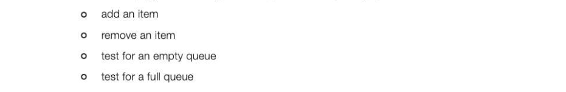

## Introduction to data structures

Programming languages such as Python, Visual Basic or Java all have built-in elementary data types such as integer, real, Boolean and char, and some built-in composite data types such as string, array or list, for example. Abstract data types such as queues, stacks, trees and graphs can easily be shown in graphical form, and it is not hard to understand how to perform operations such as adding, deleting or counting elements in each structure. However, programming languages require data types to represent them. An abstract data type (ADT) is a logical description of how the data is viewed and the operations that can be performed on it, but how this is to be done is not necessarily known to the user. It is up to the programmer who creates the data structure to decide how to implement it, and it may be built in to the programming language. This is a good example of data abstraction, and by providing this level of abstraction we are creating an encapsulation around the data, hiding the details of implementation from the user. This is called information hiding. As a programmer, you will be quite familiar with this concept. When you call a built-in function such as random to generate a random number, or sqrt to find the square root of a number, you are not at all concerned with how these functions are implemented.

## Queues

A queue is a First In First Out (FIFO) data structure. New elements may only be added to the end of a queue, and elements may only be retrieved from the front of a queue. The sequence of data items in a queue is determined, therefore, by the order in which they are inserted. The size of the queue depends 'on the number of items in it, just like a queue at traffic lights or at a supermarket checkout. Queues are used in a variety of applications:

- Output waiting to be printed is commonly stored in a queue on disk. In a room full of networked computers, several people may send work to be printed at more or less the same time. By putting the output into a queue on disk, the output is printed on a first come, first served basis as soon as the printer is free.
- Characters typed at a keyboard are held in a queue in a keyboard buffer.
- Queues are useful in simulation problems. A simulation program is one which attempts to model a real-life situation so as to learn something about it. An example is a program that simulates customers
arriving at random times at the check-outs in a supermarket store, and taking random times to pass through the checkout. With the aid of a simulation program, the optimum number of check-out counters can be established.

## Operations on a queue

The abstract data type queue is defined by its structure and the operations which can be performed on it. It is described as an ordered collection of items which are added at the rear of the queue, and

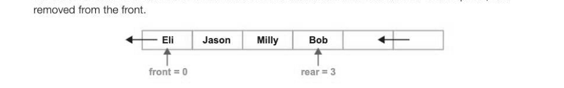

When Eli leaves the queue, the front pointer is made to point to Jason; the elements themselves do not move. When Adam joins the queue, the rear pointer points to Adam. Think of a queue in a doctor's surgery — people leave and join the queue, but no one moves chairs.

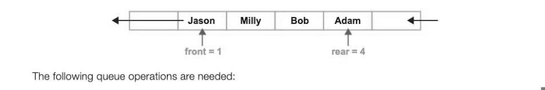

- enQueue(item) Add a new item to the rear of the queue
© deQueue() Remove the front item from the queue and return it

- isEmpty() Test to see whether the queue is empty
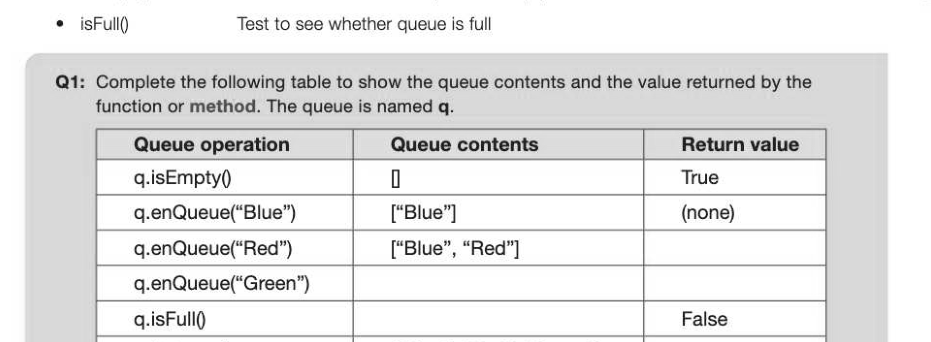

q.isEmpty() ["Blue", "Red", "Green"] q.deQueue() q.enQueue("Yellow")

## Dynamic vs static data structures

A dynamic data structure refers to a collection of data in memory that has the ability to grow or shrink in size. It does this with the aid of the heap, which is a portion of memory from which space is automatically allocated or de-allocated as required. Languages such as Python, Java and C support dynamic data structures, such as the built-in list data type in Python. Dynamic data structures are very useful for implementing data structures such as queues when the maximum size of the data structure is not known in advance. The queue can be given some arbitrary maximum to avoid causing memory overflow, but it is not necessary to allocate space in advance. A static data structure such as a static array is fixed in size, and cannot increase in size or free up memory while the program is running. An array is suitable for storing a fixed number of items such as the months of the year, monthly sales or average monthly temperatures. The disadvantage of using an array to implement a dynamic data structure such as a queue is that the size of the array has to be decided in advance by the programmer, and if the number of items added fills up the array, then no more can be added, regardless of how much free space there is in memory. Python does not have a built-in array data structure. A further disadvantage is that memory which has been allocated to the array cannot be reallocated even if most of it is unused. However, an advantage of a static data structure is that no pointers or other data about the structure need to be stored, in contrast to a dynamic data structure.

## Implementing a linear queue

There are basically two ways to implement a linear queue in an array or list: 1. As items leave the queue, all of the other items move up one space so that the front of the queue is always the first element of the structure, e.g. q[0]. With a long queue, this may require significant processing time. 2. Alinear queue can be implemented with pointers to the front and rear of the queue. An integer

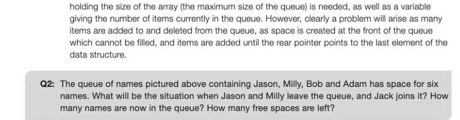

## A circular queue

One way of overcoming the limitations of implementing a queue as a linear queue is to use a circular queue instead, so that when the array fills up and the rear pointer points to the last element of the array, say q[5], it will be made to point to the first element, q[0], when the next person joins the queue, assuming this element is empty. This solution requires some extra effort on the part of the programmer, and is less flexible than a dynamic data structure if the maximum number of items is not known in advance.

## Pseudocode for implementing a circular queue

To initialise the queue:

## SUB initialise

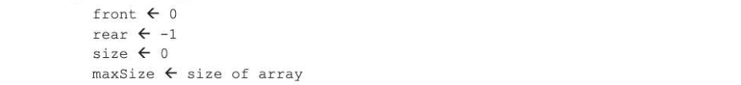

## ENDSUB

To test for an empty queue:

## SUB isEmpty

IF size = 0 THEN 7-37

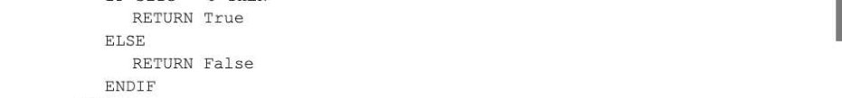

## ENDSUB

To test for a full queue:

## SUB isFull

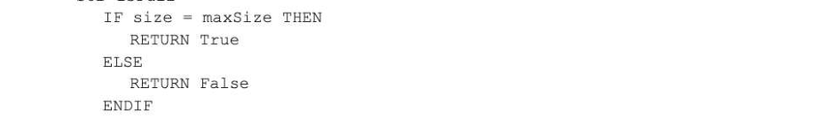

## ENDSUB

To add an element to the queue:

## SUB enqueue (newItem)

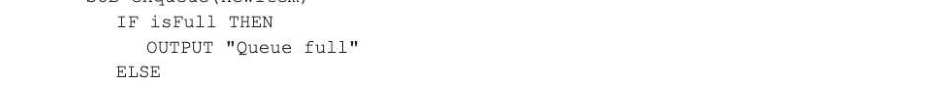

```
rear ← (rear + 1) MOD maxSize
q{rear] ← newItem
size ← size +1
```

ENDIF

## ENDSUB

To remove an item from the queue: SUB dequeue

```
    IF isEmpty THEN
       OUTPUT "Queue empty"
       item ← Null
   ELSE
       item ← q[front]
       front ← (front + 1) MOD maxSize
       size ← size - 1
   ENDIF
   RETURN item
ENDSUB
```

## Priority queues

In some situations where items are placed in a queue, a system of priorities is used. For example an operating system might schedule jobs in order of priority, or a printer may give shorter print jobs priority over longer ones. A priority queue acts like a queue in that items are dequeued by removing them from the front of the queue. However, the logical order of items within the queue is determined by their priority, with the highest priority items at the front of the queue and the lowest priority items at the back. It is therefore possible that a new item joins the queue at the front, rather than at the rear. Such a queue could be implemented by checking the priority of each item in the queue, starting at the rear and moving it along one place until an item with the same or lower priority is found, at which point the new item can be inserted. An example of how to do this is included in the next chapter on Lists.


---

## Exercises

1. (a) Explain why a queue may be implemented as a circular queue. [2] (b) Explain what is meant by a dynamic data structure and why an inbuilt dynamic data structure in a programming language may be useful in implementing a queue. Include an explanation of what is meant by the heap in this context. [4] () Print jobs are put in a queue to be printed. The queue is implemented in an array, indexed from

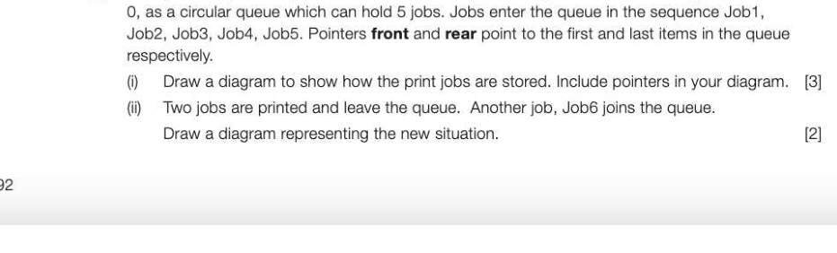

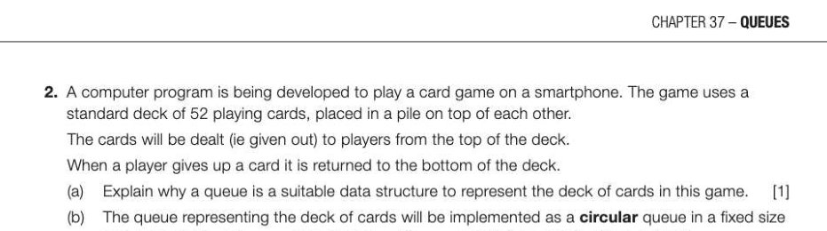

array named DeckQueue. The array DeckQueue has indices running from 1 to 52. Figure 1 shows the contents of the DeckQueue array and its associated pointers at the start of a game. The variable QueueSi ze indicates how many cards are currently represented in the

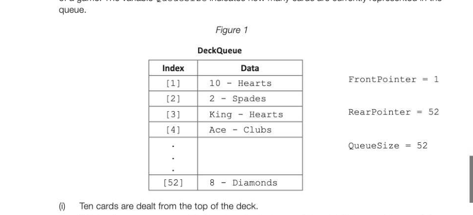

*Figure 1*

What values are now stored in the Front Pointer and RearPointer pointers and the QueueSize variable? (1) (ii) | Next, a player gives up two cards and these are returned to the deck. What values are now stored in the Front Pointer and RearPointer pointers and the QueueSize variable? (1) (ii) Write a pseudo-code algorithm to deal a card from the deck. Your algorithm should output the value of the card that is to be dealt and make any require d modifications to the pointers and to the QueueSize variable. It should also cope appropriately with any situation that might arise in the DeckQueue array whilst a game is being played. (3)] AQA Unit 3 Qu 5 June 2014
