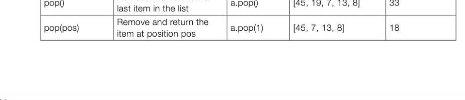
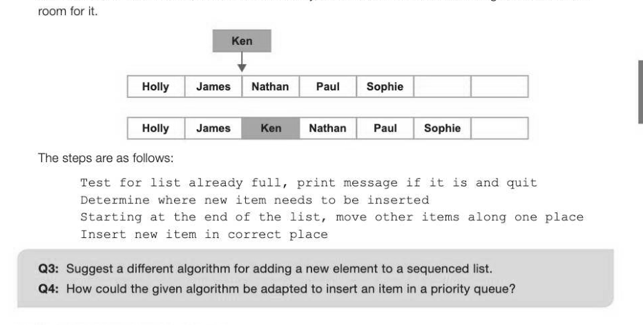
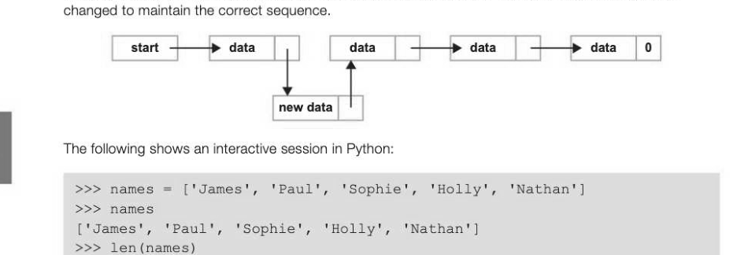
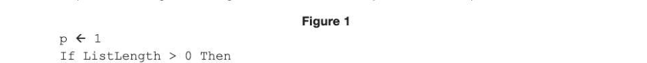
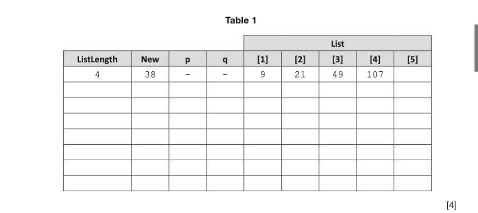

# Chapter 38 — Lists
## Objectives

- Explain how a list may be implemented as either a static or dynamic data structure
- Show how items may be added to or deleted from a list

## Definition of a list

In computer science, a list is an abstract data type consisting of a number of items in which the same item may occur more than once. The list is sequenced so that we can refer to the first, second, third,... item and we can also refer to the last element of the list. A list is a very useful data type for a wide variety of operations, and can be used, for example, to implement other data structures such as a queue, stack or tree. Some languages such as Python have a built-in list data type, so that for example a list of numbers could be shown as [45, 13, 19, 13, 8]

## Operations on lists

Some possible list operations are shown in the following table. The list a is assumed to hold the values [45, 13, 19, 13, 8] initially, with the first element referred to as a[O]. isEmpty() Test for empty list a.isEmpty() [45, 13, 19, 13, 8] False Add a new item to list to append(item) the end of the list a.append(33) | [45, 13, 19, 13, 8, 33] Remove the first remove(item) occurrence of an item a.remove(13) | [45, 19, 13, 8, 33] from list search(item) Search for an item in list a.search(22) | [45, 19, 13, 8, 33] False length) Return the numberof | a tength) —_—| (45, 19, 13, 8, 33) 5 items index(item) Return the position of item | a.index(8) [45, 19, 13, 8, 33] 3 Insert a new item at insert(pos, item) a.insert(2,7) [45, 19, 7, 13, 8, 33] position pos Remove and return the pop() a.pop() [45, 19, 7, 13, 8] 33



## Using an array

It is possible to maintain an ordered collection of data items using an array, which is a static data structure. This may be an option if the programming language does not support the list data type and if the maximum number of data items is small, and is known in advance. The programmer then has to work out and code algorithms for each list operation. The empty array must be declared in advance as being a particular length, and this could be used, for example, to hold a priority queue.

## Inserting a new name in the list

If the list needs to be held in sequential order in the array, the algorithm will first have to determine where a new item has to be added, and then if necessary, move the rest of the items along in order to make



## Deleting a name from the list

Suppose the name Ken is to be deleted from the list shown below. The names coming after Ken in the list need to be moved up to fill the gap. | Hotty | James | Ken | Nathan | Paul | Sophie | | First, items are moved up to fill the empty space by copying them to the previous spot in the array: [ Holly I James [ Nathan I Paul I Sophie I Sophie i ]

Finally the last element, which is now duplicated, is replaced with a blank. | Holly | James | Nathan | Paul | Sophie Using a dynamic data structure to implement an ordered list Programming languages such as Python have a built-in dynamic 1ist data structure which is internally implemented using a linked list. Functional abstraction hides all the details of how all the associated functions and methods are implemented, making the programmer's task much easier! As items are added to the list, the pointers are adjusted to point to new memory locations taken from the heap. When items are deleted, pointers are again adjusted and the freed-up memory is de-allocated and returned to the heap. start —1> data | +—» data | +—» data | ——> data | 0 | As new nodes are added, new memory locations can be dynamically pulled from the heap, a pool of memory locations which can be allocated or deallocated as required. The pointers then need to be



Note that append, pop and insert are methods on a list object, while len () is a function that takes the list as an argument.


---

## Exercises

1. A list data structure can be represented using an array. The pseudocode algorithm in Figure 1 can be used to carry out one useful operation on a list.



*Figure 1*

While p <= ListLength And List[p] < New Do

```
   p←epitl
EndWhile
For q ← ListLength DownTo p Do
   List(q + 1] ← List{q]
EndFor
```


(a) The initial values of the variables for one particular execution of the algorithm are shown in the trace table below, labelled Table 1. Complete the trace table for the execution of the algorithm.



*Table 1*

(b) Describe the purpose of the algorithm in Figure 1. (1) () A list implemented using an array is a static data structure. The list could be implemented using a linked list as a dynamic data structure instead. (i) | Describe one difference between a static data structure and a dynamic data structure. (1) (ii) _ If the list were to be implemented as a dynamic data structure, explain what the heap would be used for. (1) AQA Unit 3 Qu 10 June 2010
