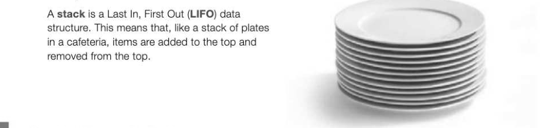
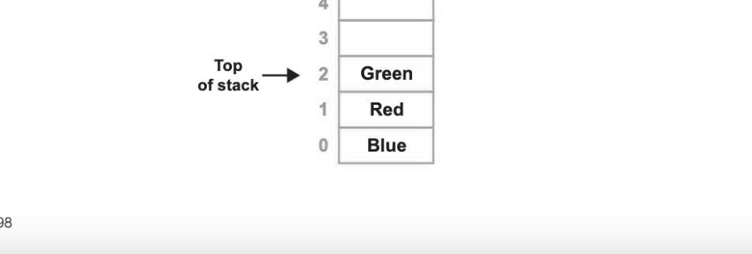
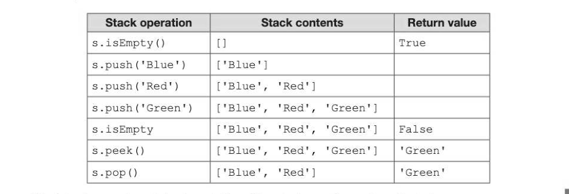
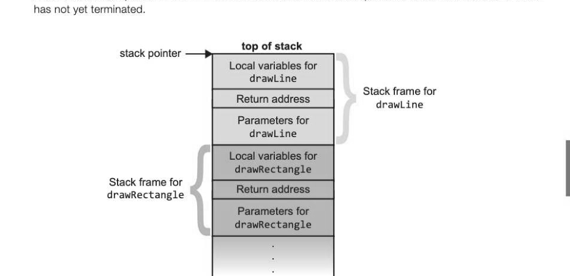

# Chapter 39 — Stacks
## Objectives

© Be familiar with the concept and uses of a stack

- Be able to describe the creation and maintenance of data within a stack
© Be able to describe and apply the following operations: push, pop, peek (or top), test for empty stack, test for full stack

- Be able to explain how a stack frame is used with subroutine calls to store return addresses, parameters and local variables

## Concept of a stack



## Applications of stacks

Astack is an important data structure in Computing. Stacks are used in calculations, and to hold return addresses when subroutines are called. When you use the Back button in your Web browser, you will be taken back through the previous pages that you looked at, in reverse order as their URLs are removed from the stack and reloaded. When you use the Undo button in a word processing package, the last operation you carried out is popped from the stack and undone.

## Implementation of a stack

A stack may be implemented as either a static or dynamic data structure. A static data structure such as an array can be used with two additional variables, one being a pointer to the top of the stack and the other holding the size of the array (the maximum size of the stack).



## Operations on a stack

The following operations are required to implement a stack:

- push(item) adds a new item to the top of the stack
- pop() removes and returns the top item from the stack
- peek() returns the top item from the stack but does not remove it
« isEmpty() tests to see whether the stack is empty, and returns a Boolean value © isFull() tests to see whether the stack is full, and returns a Boolean value



The following pseudocode implements four of the stack operations using a fixed size array. SUB isEmpty 7-39

```
    IF top = -1 THEN
       RETURN True
   ELSE
       RETURN False
   ENDIF
ENDSUB
SUB isFull
    IF top = maxSize THEN
       RETURN True
   ELSE
       RETURN False
   ENDIF
ENDSUB
SUB push (item)
    IF isFull THEN
       OUTPUT "Stack is full"
   ELSE
       top ← top + 1
       s(top)← item
   ENDIF
ENDSUB
```

SUB pop

```
    IF isEmpty THEN
       OUTPUT "Stack is empty"
   ELSE
       item ← s(top)
       top ← top - 1
       RETURN item
   ENDIF
ENDSUB
```

Some languages, such as Python, make it very easy to implement a stack using the built-in dynamic list data structure, with the top of the stack being the last element of the list. The function len (s) can be used to determine whether the stack is empty, and if it is not, pop () will remove and return the top (last) element. The built-in method append (item) will append or push an 7-39 item onto the top of the stack (the last element of the list).

## Overflow and underflow

A stack will always have a maximum size, because memory cannot grow indefinitely. If the stack is implemented as an array, a full stack can be tested for by examining the value of the stack pointer. An attempt to push another item onto the stack would cause overflow so an error message can be given to the user to avoid this. Similarly, if the stack pointer is -1, the stack is empty and underflow will occur if an attempt is made to pop an item.

## Functions of a call stack

A maior use of the stack data structure is to store information about the active subroutines while a computer program is running. The details are hidden from the user in all high level languages.

## Holding return addresses

The call stack keeps track of the address of the instruction that control should return to when a subroutine ends (the return address). Several subroutines may be nested, so that the stack may contain several return addresses which will be popped as each subroutine completes. For example, a subroutine which draws a robot may call subroutines drawCircle, drawRectangle etc. Subroutine drawRectangle may in turn call a subroutine drawLine. A recursive subroutine may contain several calls to itself, so that with each call, a new item (the return address) is pushed onto the stack. When the recursion finally ends, the return addresses that have been pushed onto the stack each time the routine is called are popped one after the other, each time the end of the subroutine is reached. If the programmer makes an error and the recursion never ends, sooner or later memory will run out, the stack will overflow and the program will crash.

## Holding parameters

Parameters required for a subroutine (such as, for example, the centre coordinates, line colour and thickness for a circle subroutine) may be held on the call stack. Each call to a subroutine will be given separate space on the call stack for these values.

## Local variables

A subroutine frequently uses local variables which are known only within the subroutine. These may also be held in the call stack. Each separate call to a subroutine gets its own space for its local variables. Storing local variables on the call stack is much more efficient than using dynamic memory allocation, which uses heap space.

## The stack frame

A call stack is composed of stack frames. Each stack frame corresponds to a call to a subroutine which




---

## Exercises

1. A Last In, First Out (LIFO) data structure has a pointer called top. (a) What is this type of data structure known as? (1) (b) Name and briefly describe one type of error that could occur when attempting to add a data item or remove a data item from the data structure. [2] (c) Describe briefly one use of this type of data structure in a computer system. [2] (d) Write a pseudocode procedure for reversing the elements of a queue with the aid of astack. [6]
