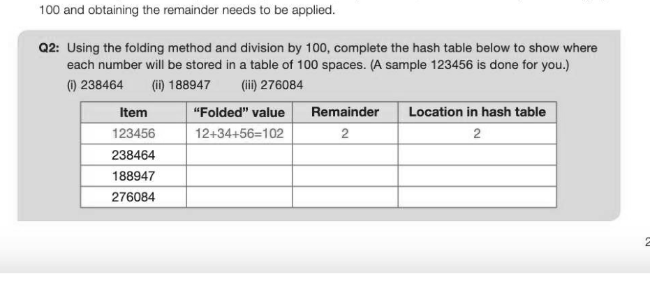
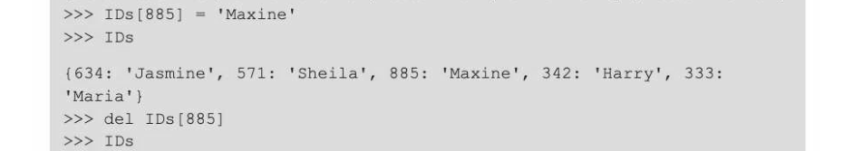
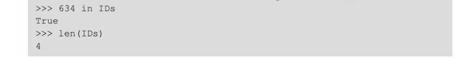
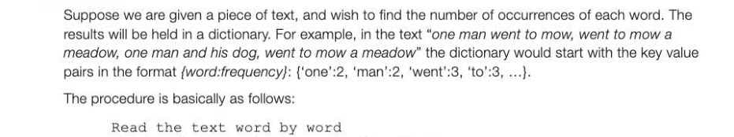

# Chapter 40 — Hash tables and dictionaries
## Objectives

- Be familiar with a hash table and its uses
- Be able to apply simple hashing algorithms
- Know what is meant by a collision and how collisions are handled using rehashing
- Be familiar with the concept of a dictionary
- Be familiar with simple applications of a dictionary

## Hashing

Large collections of data, for example customer records in a database, need to be accessible very quickly without having to look through all the records. This can be done by holding an index of the physical address on the file where the data is held. But how is the index created? The answer is that a hashing algorithm is applied to the value in the key field of each record to transform it into an address. Normally there are many more possible keys than actual records that need to be stored. For example, suppose 300 records are to be stored, each having a unique 6-digit identifier or key, and 1000 free spaces have been allocated to store the records. One common hashing algorithm is to divide the key by the number of available addresses and take the remainder as the address. Using the algorithm (address = key mod 1000):

What will happen when the record with key 631552 is to be stored? This will hash to the same address as 134552 and is called a synonym. Synonyms are bound to occur with any hashing algorithm, and two record keys hashing to the same address is referred to as a collision. Asimple way of dealing with collisions is to store the item in the next available free space. Thus 134552 would be stored at address 553, assuming this space is unoccupied.

## Hash table

Ahash table is a collection of items stored in such a way that they can quickly be located. The hash table could be implemented as an array or list of a given size with a number of empty spaces. An empty hash table that can store a maximum of 11 items is shown below, with spaces labelled 0,1, 2,...10. 0 1 2 3 4 5 6 78 9 10 [ Empty | Empty | Empty | Empty | Empty | Empty | Empty | Empty | Empty | Empty | Empty | Now assume we wish to store items 78, 55, 34, 19 and 29 in the table using the method described above, using division by 11 and taking the remainder. Collisions are stored in the next available free slot. First of all, calculate the hash value of each item to be stored.

Each of these items can now be inserted into their location in the hash table. 0 1 2 3 4 5 6 7 8 9 10 {55 | 78 | 34 | Empty | Empty | Empty | Empty] 29 | 19 | Empty | Empty |

## Searching for an item

When searching for an item, these steps are followed: apply the hashing algorithm

- examine the resulting cell in the list
- if the item is there, return the item
- if the cell is empty, the item is not in the table
© if there is another item in that spot, keep moving forward until either the item is found or a blank cell is encountered, when it is apparent that the item is not in the table

## Other hashing algorithms

To be as efficient as possible, the hashing algorithm needs to be chosen so that it generates the least number of collisions. This will depend to some extent on the distribution of the items to be hashed.

## Folding method

There are many other algorithms. The folding method divides the item into equal parts, and adds the parts to give the hash value. For example, a phone number 01543 677896 can be divided into groups of two, namely 01, 54, 36, 77, 89, 6. Adding these together, we get 263. If the table has fewer spaces than the maximum possible sum generated by this method, say 100 cells, then the extra steps of dividing by

## Hashing a string

Ahash function can be created for alphanumeric strings by using the ASCII code for each character. A portion of the ASCII table is shown below: To hash the word CAB, we could add up the ASCII values for each letter and, if there are 11 spaces in the hash table, for example, divide by 11 and take the remainder as its hash value. 67 +65+66=198 Hash value = 198 mod 11=0 so CAB goes in location 0 (assuming that location is empty).

## Collision resolution

The fuller the hash table becomes, the more likely it is that there will be collisions, and this needs to be taken into account when designing the hashing algorithm and deciding on the table size. For example, the size of the table could be designed so that when all the items are stored, only 70% of the table's cells are occupied. Rehashing is the name given to the process of finding an empty slot when a collision has occurred. The rehashing algorithm used above simply looks for the next empty slot. It will loop round to the first cell if the table of the end is reached. A variation on this would be to look at every third cell, for example (the "plus 3" rehash). Alternatively, the hash value could be incremented by 1, 3, 5, 7,... until a free space is found. Different hashing and rehashing methods will work more efficiently on different data sets — the aim is to minimise collisions.

## Uses of hash tables

Hash tables are primarily used for efficient lookup, so that for example an index would typically be organised as a hash table. A hash table could be used to look up, say a person's telephone number given their name, or vice versa. They can also be used to store data such as user codes and encrypted passwords that need to be looked up and verified quickly. Hash tables are used in the implementation of the data structure called a dictionary, which is discussed below.

## Dictionaries

A dictionary is an abstract data type consisting of associated pairs of items, where each pair consists of a key and a value. It is a built-in data structure in Python and Visual Basic, for example. When the user supplies the key, the associated value is returned. Items can easily be amended, added to or removed from the dictionary as required. In Python, dictionaries are written as comma-delimited pairs in the format key:value and enclosed in curly braces. For example: IDs = {342:'Harry', 634:'Jasmine', 885:''Max',571:'Sheila'}

## Operations on dictionaries

It is possible to implement a dictionary using either a static or a dynamic data structure. The implementation needs to include the following operations:

- Create a new empty dictionary

- Return True or False depending on whether key is in the dictionary
- Return the length of the dictionary
An interactive Python session is shown below: >>> IDs = (342: "Harry', 885:'Max', 571:'Sheila'} 634: 'Jasmine', >>> IDs {634: 'Jasmine', 571: 'Sheila', 885: 'Max', 342: 'Harry'}

{634: 'Jasmine', 571: 'Sheila', 885: "Max', 342: '"Harry', 333: 'Maria'}

{634: 'Jasmine', 571: 'Sheila', 342: "Harry', 333: 'Maria'}

Note that the pairs are not held in any particular sequence. The key is hashed using a hashing algorithm and placed at the resulting location in a hash table, so that a fast lookup is possible.

## Example 1

Check if the word exists in the dictionary If No, add the word to the dictionary with the value 1 Otherwise, increase the frequency value of the word by 1 Note that if the dictionary is implemented as a hash table, as in the Python built-in data structure, the words will not be in alphabetical sequence in the dictionary.

---

## Exercises

1. Student records held by a school are stored in a database which organises the data in files using hashing. (a) In the context of storing data in a file, explain what a hash function is. a] (b) The system allows for a maximum of 1000 unique 6-digit integer student IDs in the file holding current student records. Give an example of a hashing function that could be used to find a particular record. Ignore collisions. (2] 2. A bank has a number of safety deposit boxes in which customers can store valuable documents or possessions. The details of which box is rented by a customer with a particular account number are held in a dictionary data structure. Sample entries in the dictionary are: {0083456: 'C11', 0154368: 'B74', 1178612: 'BG', 0567123: 'A34'} (a) What value will be returned by a lookup operation using the key 1178612? (1) (b) The dictionary is implemented using a hash table, using the algorithm accountNumber mod 500 What value is returned by the hashing function when it is applied to account number 0093421? (1 (c) What is the maximum number of entries that can be made in the dictionary? tt] (da) (i) Explain what is meant by a collision. tt] (ii) Give an example of how a collision might occur in this scenario, using sample account numbers. [2] (ii) Describe one way of dealing with collisions in the hash table. a]
