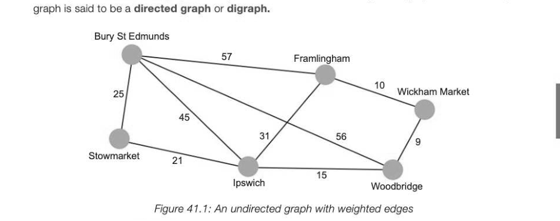
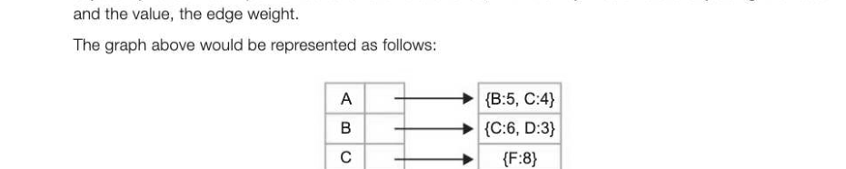
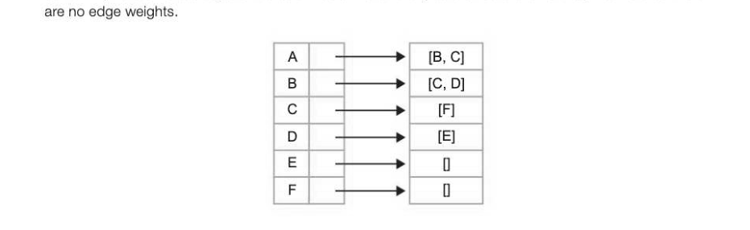
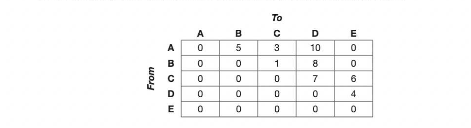

# Chapter 41 — Graphs
## Objectives

- Be aware of a graph as a data structure used to represent complex relationships
- Be familiar with typical uses for graphs
- Be able to explain the terms: graph, weighted graph, vertex/node, edge/arc, undirected graph, directed graph Know how an adjacency matrix and an adjacency list may be used to represent a graph
- Be able to compare the use of adjacency matrices and adjacency lists

## Definition of a graph

Agraph is a set of vertices or nodes connected by edges or arcs. The edges may be one-way or two way. In an undirected graph, all edges are bidirectional. If the edges in a graph are all one-way, the



*Figure 41.1: An undirected graph with weighted edges*

The edges may be weighted to show there is a cost to go from one vertex to another as in Figure 41.1. The weights in this example represent distances between towns. A human driver can find their way from one town to another by following a map, but a computer needs to represent the information about distances and connections in a structured, numerical representation.


*Figure 41.2: A directed, unweighted graph*

## Implementing a graph

'Two possible implementations of a graph are the adjacency matrix and the adjacency list.

## The adjacency matrix

A two-dimensional array can be used to store information about a directed or undirected graph. Each of the rows and columns represents a node, and a value stored in the cell at the intersection of row i, column j indicates that there is an edge connecting node i and node j. In the case of an undirected graph, the adjacency matrix will be symmetric, with the same entry in row O column 1 as in row 1 column 0, for example. An unweighted graph may be represented with 1s instead of weights, in the relevant cells.

## Advantages and disadvantages of the adjacency matrix

An adjacency matrix is very convenient to work with, and adding an edge or testing for the presence of an edge is very simple and quick. However, a sparse graph with many nodes but not many edges will leave most of the cells empty, and the larger the graph, the more memory space will be wasted. Another consideration is that using a static two-dimensional array, it is harder to add or delete nodes.

## The adjacency list

An adjacency list is a more space-efficient way to implement a sparsely connected graph. A list of all the nodes is created, and each node points to a list of all the adjacent nodes to which it is directly linked. The adjacency list can be implemented as a list of dictionaries, with the key in each dictionary being the node



```
Dp) +> »>=←23
E ——
F —>
```

The unweighted graph in Figure 41.2 would be represented as shown below, with the adjacency list containing lists of nodes adjacent to each node. A dictionary data structure is not required here as there



The advantage of this implementation is that is uses much less memory to represent a sparsely connected graph.

## Applications of graphs

Graphs may be used to represent, for example:

- computer networks, with nodes representing computers and weighted edges representing the 7-41 bandwidth between them
- roads between towns, with edge weights representing distances, rail fares or journey times
- tasks in a project, some of which have to be completed before others
- states in a finite state machine
- web pages and links

## Google's PageRank algorithm

In the 1990s two postgraduate Computer Science students called Larry Page and Sergey Brin met at Stanford University. Brin was working on data mining systems and Page was working on a system to rank the importance of a research paper according to how often it was cited in other papers. The pair realised that this concept could be used to build a far superior search engine to the existing ones, and they started to work on a new Search Engine for the Web. The problem they set themselves was how to rank the thousands or even millions of web pages that had a reference to the search term typed in by a user. To make a search engine useful, the most reliable and relevant pages need to appear first in the list of links. Until that point, pages had generally been ranked simply by the number of times the search term appeared on the page. Page's and Brin's insight was to realise that the usefulness and therefore the rank of a given page, say Page X, can be determined by how many visits to Page X result from other web pages containing links to the page. Taking this further, links from a Page Y that itself has a high rank are more significant than those from pages which have themselves only had a few visits. The importance or authority of a page is also taken into account so that a link from a.gov page or a page belonging to the BBC site, for example, may be given a higher PageRank rating.

An initial version of Google was launched in August 1996 from Stanford University's website. By mid- 1998 they had 10,000 searches a day, and realised the potential of their invention. They represented the Web as a directed graph of pages, using an algorithm to calculate the PageRank (named after Larry Page) of each page. Every web page is a node and any hyperlinks on the page are edges, with the edge weightings dependent on the PageRank algorithm. Using PageRank, B has a higher page rank than C because it is a more authoritative source. By 2015, Google was processing 40,000 search queries every second, worldwide. David Vise, the author of The Google Story noted that "Not since Gutenberg'... has any new invention empowered individuals, and transformed access to information, as profoundly as Google." 7-44 ('Gutenberg invented the printing press in the fifteenth century)


---

## Exercises

1. The figure below shows an adjacency matrix representation of a directed graph (digraph).



(a) Draw a diagram of the directed graph, showing edge weights. [3] (b) Draw an adjacency list representing this graph. [3] (c) Give one advantage of using an adjacency matrix to represent a graph, and one advantage of using an adjacency list. Explain the circumstances in which each is more appropriate. [3] 2. Graph algorithms are used with GPS navigation systems, social networking sites, computer networks, computer games, exam timetabling, matching problems and many other applications. Describe two practical applications of graphs. [6]
