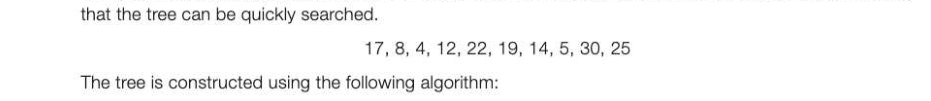
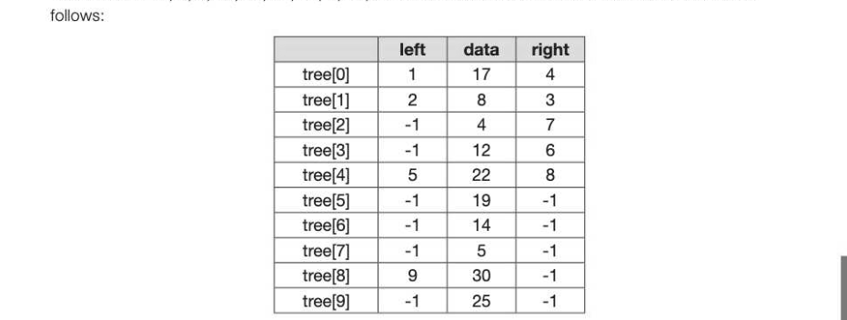
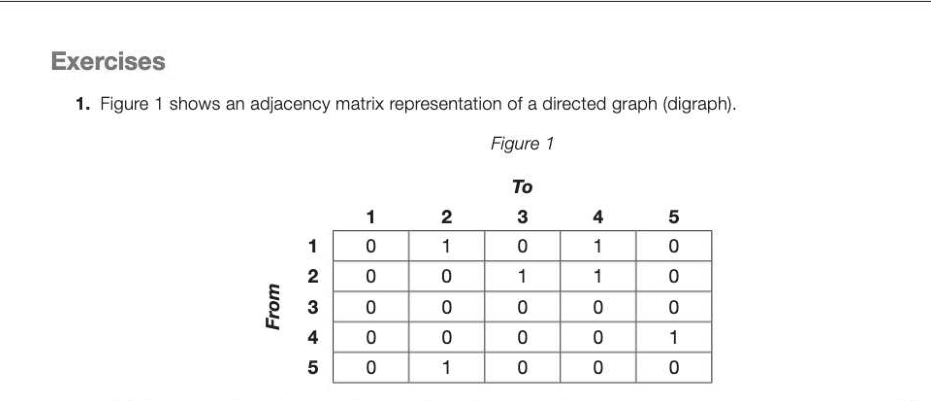

# Chapter 42 — Trees
## Objectives

Know that a tree is a connected, undirected graph with no cycles Know that a binary tree is a rooted tree in which each node has at most two children

- Be familiar with typical uses for rooted trees

## Concept of a tree

Trees are a very common data structure in many areas of computer science and other contexts. A family tree is an example of a tree, and a folder structure where a root directory has many folders and sub-folders is another example. Like a tree in nature, a rooted tree has a root, branches and leaves, the difference being that a rooted tree in computer science has its root at the top and its leaves at the bottom. Typical uses for rooted trees include:

- manipulating hierarchical data, such as folder structures or moves in a game making information easy to search (see binary tree search below) manipulating sorted lists of data
The uses of various tree-traversal algorithms are covered in Section 8, Chapter 44. Generations of a family may be thought of as having a tree structure: + Root node + Leaf node The tree shown above has a root node, and is therefore defined as a rooted tree. Here are some terms used in connection with rooted trees: Node: The nodes contain the tree data Edge: An edge connects two nodes. Every node except the root is connected by exactly one edge from another node in the level above it Root: This is the only node that has no incoming edges Child: The set of nodes that have incoming edges from the same node Parent: Anode is a parent of all the nodes it connects to with outgoing edges Subtree: The set of nodes and edges comprised of a parent and all descendants of the parent. A subtree may also be a leaf Leaf node: A node that has no children

Note that a rooted tree is a special case of a connected graph. A node can only be connected to one parent node, and to its children. It is described as having has no cycles because there can be no connection between children, or between branches, for example from Ben to Anna or Petra to Kate.

## A more general definition of a tree

Atree is a connected, undirected graph with no cycles. "Connected" implies that it is always possible to find apath from a node to any other node, by backtracking if necessary. "No cycles" means that it is not possible to find a path in the tree which returns to the start node without traversing an edge twice. Note that a tree does not have to have a root.

## A binary search tree

A binary tree is a rooted tree in which each node has a maximum of two children. A binary search tree holds items in such a way that the tree can be searched quickly and easily for a particular item, new items can be easily added, and the whole tree can be printed out in sequence. A binary search tree is a typical use of a rooted tree.

## Constructing a binary search tree

Suppose the following list of numbers is to be inserted into a binary tree, in the order given, in such a way

Place the first item at the root. Then for each item in the list, visit the root, which becomes the current node, and branch left if the item is less than the value at the current node, and right if the item is greater than the value at the current node. Continue down the branch, applying the rule at each node visited, until a leaf node is reached. The item is then placed to the left or right of this node, depending on whether it is less than or greater than the value at that node. Following this algorithm, 17 is placed at the root. 8 is less than 17, so is placed at a new node to the left of the root.

4 is less than 17, so we branch left at the root, branch left at 8, and place it to the left. 12 is less than 17, so we branch left at the root, branch right at 8, and place it to the right. The final tree looks like this: To search the tree for the number 19, for example, we follow the same steps. 19 is greater than 17, so branch right. 19 is less than 22, so branch left. There it is!

## Traversing a binary tree

There are three ways of traversing a tree:

- Pre-order traversal
- In-order traversal
- Post-order traversal
The names refer to whether the root of each sub-tree is visited before, between or after both branches have been traversed.

## Pre-order traversal

Draw an outline around the tree structure, starting to the left of the root. As you pass to the left of a node (where the red dot is marked), output the data in that node.

The nodes will be visited in the sequence 17, 8, 4, 5, 12, 14, 22, 19, 30, 25 A pre-order traversal may be used to produce prefix notation, used in functional programming languages. Asimple illustration would be a function statement, x = sum a,b rather thanx = a + b,in which the operation comes before the operands rather than between them, as in infix notation.

## In-order traversal

Draw an outline around the tree structure, starting to the left of the root. As you pass underneath a node (where the red dot is marked), output the data in that node. The nodes will be visited in the sequence 4, 5, 8, 12, 14, 17, 19, 22, 25, 30. The in-order traversal visits the nodes in sequential order.

## Post-order traversal

Draw an outline around the tree structure, starting to the left of the root. As you pass to the right of a node (where the red dot is marked), output the data in that node. The nodes will be visited in the sequence 5, 4, 14, 12, 8, 19, 25, 30, 22, 17. Post-order traversal is used in program compilation to produce Reverse Polish Notation (Chapter 55). Algorithms for implementing a binary tree and each of these traversals will be covered in Chapter 44.

## Implementation of a binary search tree

A binary search tree can be implemented using an array of records, with each node consisting of: © left pointer

- data item
- right pointer
Alternatively, it could be held in a list of tuples, or three separate lists or arrays, one for each of the pointers and one for the data items. The numbers 17, 8, 4, 12, 22, 19, 14, 5, 30, 25 used to construct the tree above could be held as

For example, the left pointer in tree[0] points to tree[1] and the right pointer points to tree[4]. The value -1 is a 'rogue value' which indicates that there is no child on the relevant side (left or right).

---

## Exercises

*Figure 1*

(a) Complete this unfinished diagram of the directed graph. [2] @ 7-42 © ° (b) Directed graphs can also be represented by an adjacency list. Explain under what circumstances an adjacency matrix is the most appropriate method to represent a directed graph, and under what circumstances an adjacency list is more appropriate. [2] (c) A tree is a particular type of graph. What properties must a graph have for it to be a tree? [2] (d) Data may be stored as a binary tree. Show how the following data may be stored as a binary tree for subsequent processing in alphabetic order by drawing the tree. Assume that the first item is the root of the tree and the rest of the data items are inserted into the tree in the order given. Data items: Jack, Bramble, Snowy, Butter, Squeak, Bear, Pip [3] (e) A binary tree such as the one created in part (d) could be represented using one array of records or, alternatively, using three one dimensional arrays. Describe how the data in the array(s) could be structured for one of these two possible methods of representation. [3] AQA Comp 3 Qu 7 2010
