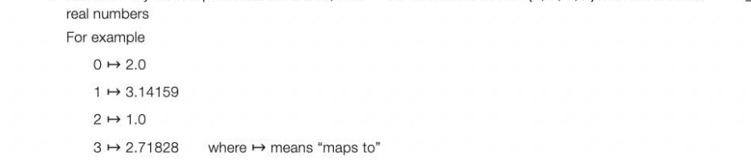
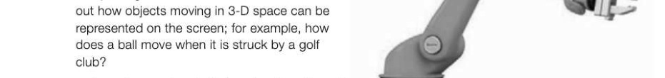
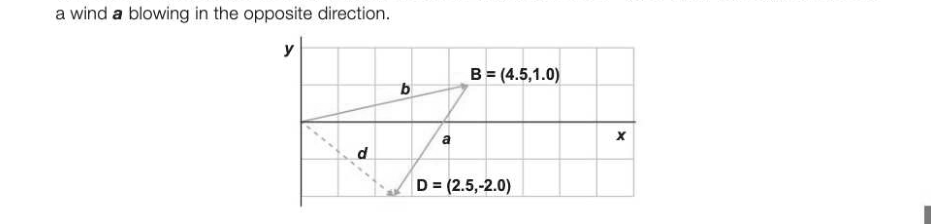
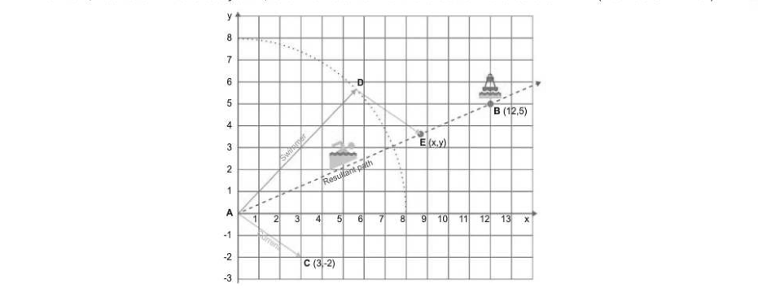
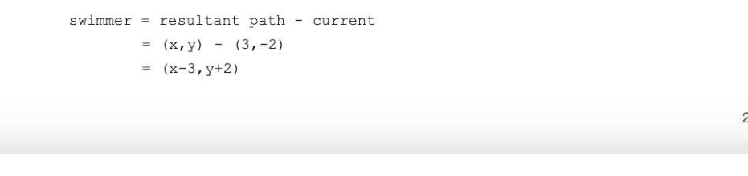
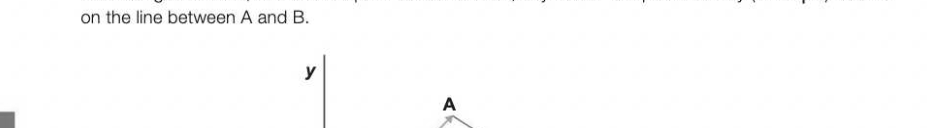
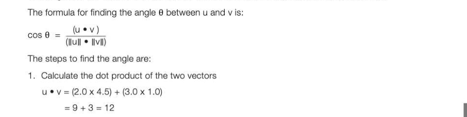
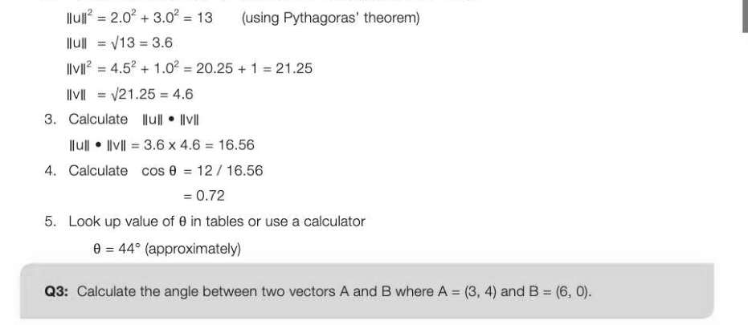
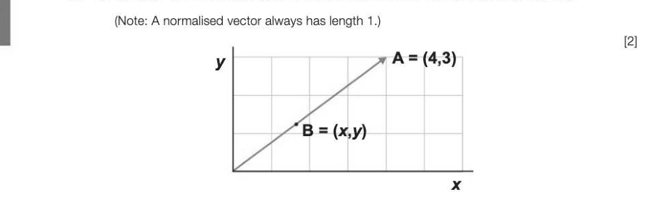

# Chapter 43 — Vectors
## Objectives

© Be familiar with the concept of a vector and notations for specifying a vector as a list of numbers, as a function or as a geometric point in space

- Represent a vector using a list, dictionary or array data structure Perform operations on vectors: addition, scalar vector multiplication, convex combination, dot or scalar product Describe applications of dot product of two vectors

## Vector notation

A vector can be represented as:

- alist of numbers
- afunction
© away of representing a geometric point in space There are several different notations for specifying a given vector. 1. Alist of numbers may be written as (2.0, 3.14159, -1.0, 2.71828]. 2 A4-vector over IR such as [2.0, 3.14159, -1.0, 2.71828] may be written as IR4 3. A vector may be interpreted as a function, f: S + IR where S is the set {0, 1, 2, 3} and R the set of



Note that all the entries must be drawn from the same field, e.g. R. Vectors in up to 3 dimensions, ie up to IR? can also be conveniently represented geometrically, and this will be explained later in the chapter. Implementation of vectors in a programming language In Python, for example, a vector may be represented as a list: (2.0, 3.14159, -1.0, 2.71828] In a different language, it could be represented in a one-dimensional array. The 4-vector example could be represented as a dictionary: {0:2.0, 1:3.14159, 2: -1.0, 3: 2.71828}

## Vectors in computer science

Many applications in Computing involve processing spatial information. For example:

- acomputer controlling a robot arm needs to keep track of its current coordinates, and work out how to move it to its next location
- computer games and simulations need to work


- on-board computers in fly-by-wire aircraft need


In order to perform these tasks, the computer must represent spatial information and movement in a numerical way. In mathematics, vectors and matrices are used to do this, and these concepts are crucial for any computer application which involves spatial movement.

## Vectors in mathematics

In mathematics, a very common use of vectors is as a numerical way of describing and processing spatial information such as position, velocity, acceleration or force. 7-43 Velocity may be represented by a vector showing both speed and direction. This can be shown graphically by an arrow with its tail at the origin and its head at coordinates (x,y). Speed is represented by length a, and direction by the angle between A and the x-axis. A= (2.0,3.0) B=(4.5,1.0) x The graphical representation shows how a vector consisting of just two numbers can represent both magnitude and direction.

## Adding and subtracting vectors

Vectors may be added by adding the x and y coordinates separately: C=A+B=(2.04+4.5, 3.0 + 1.0) = (6.5, 4.0) The resultant vector can be represented graphically by moving the vector b so that it joins on to the end of a. The resulting vector • will represent the new magnitude and direction. Physically, you can imagine an aeroplane flying at speed b, with a wind a blowing at an angle to the direction of flight: the aeroplane will actually travel with the combined speed and direction shown by the vector • in the graph below.

"C= (6.5,4.0) We can also subtract the vector a from the vector b, to get a vector d = (2.5, -2.0). This might represent



## Example

A vector Current represents the speed (in km/hr) and direction of a current. A swimmer, who swims at 8km/hr, has to swim to a buoy at B, and we need to find the direction he should swim in (marked Swimmer).



The vector Swimmer must lie on the arc of radius 8 shown in red, since any point on this arc represents the distance the swimmer will travel in one hour. To find the direction he must swim in, we need to transpose the current vector so that it its tail is on the arc and its head on the desired resultant path. If he keeps swimming in direction AD he will eventually reach the buoy at B.



## Scaling vectors

Avvector can be scaled by multiplying it by a value. In the figure below, B = 3* A.


## Convex combination of two vectors

Aconvex combination of vectors is an expression of the form au+Bv wherea+B-=1anda, B20 eg. 0.7 *(5.0, 3.0) + 0.3 * (4.0,2.0) = (3.5, 2.1) + (1.2, 0.6) = (4.7, 2.7) In the diagram below, if A and B represent two vectors, any vector C represented by (@A + BB) must lie



## 7-43 ←

B x

## Dot product of two vectors

To find the dot product (sometimes called the scalar product) of two vectors, each component of the first vector is multiplied by the corresponding component of the second vector, and the products are added together. The dot product of two vectors u and v where u = [u,..., Un] and v = [V4,..., Val is UP V= Uy Vyt Up Vo +... + Un Vn Thus [2, 3, 4] © (5, 2, 1]=10+6+4=20 Notice that the result of the dot product is a number, not a vector, and it can be used as a way to compare two vectors.

## Finding the angle between two vectors

Graphics programmers often need to find the angle between two vectors, and the dot product may be used to do this. Consider the two vectors u and v in the figure below:


The lengths of the vectors u and v can be written in mathematical notation as |lull and IIvil.



2. Calculate the values of |lull and |lvil (i.e. the length of each vector) 7-43



Since cos 90° = 0, two vectors u and v are orthogonal (at right angles to each other) if and only if uev=0.


---

## Exercises

1. Two vectors A and B are defined as A = (1, 3) and B = (10, 4). Calculate: (a) A+B 1] (b) AeB (1) (©) 3*A a} 2. (a) Aand B are two vectors implemented as lists. Trace through the following pseudocode and state what is printed. What does the program calculate? (3) SUB calcX (A,B)

```
     calcAB ← 0
     for i ← 0 TO len(A) - 1
         calcAB ← calcAB + (A[i] * B[i])
     END FOR
     RETURN calcAB
ENDSUB
#main
A ← [3,4]
B ← [2,1]
x ← calcX(A,B)
OUTPUT x
```

(b) (i) What are the coordinates (x, y) of the normalised vector B in the following diagram?



(ii), Write a pseudocode subroutine normalise (A) to normalise a vector A(x, y). [4] 3. (a) Calculate the dot product of the vectors u = (3, 4) and v = (-1.5, -2) (1)


to calculate the cosine of the angle 6 between the two vectors. [2] (c) Plot the points roughly to verify that u and v point in opposite directions. [2]

## Section 8

## Algorithms

In this section: Chapter 44 Recursive algorithms 224 Chapter 45 Big-O notation 229 Chapter 46 Searching and sorting 235 Chapter 47 Graph traversal algorithms Chapter 48 Optimisation algorithms 249 Chapter 49 Limits of computation 254
