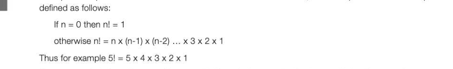
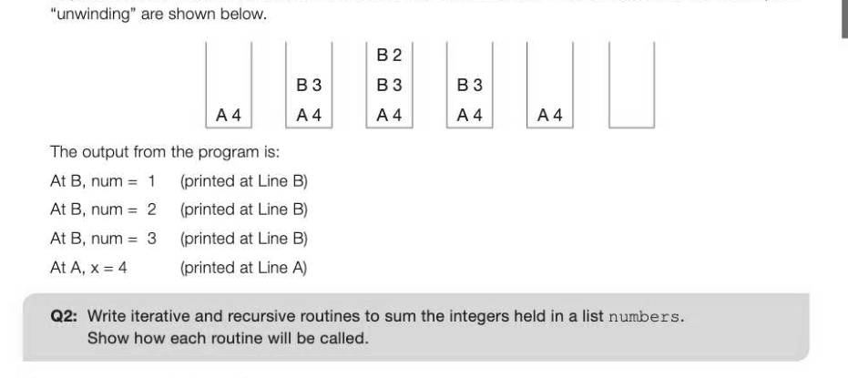
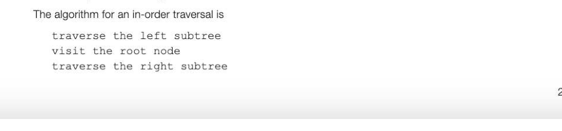
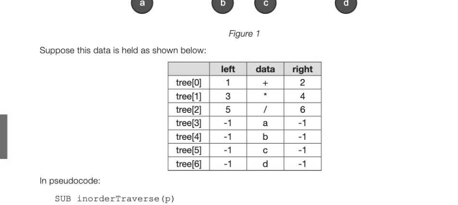
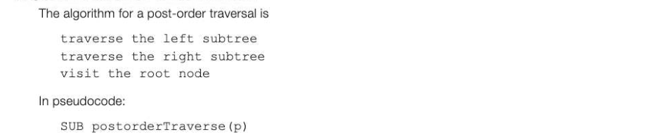
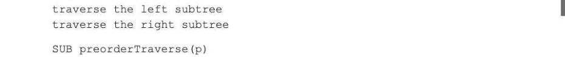
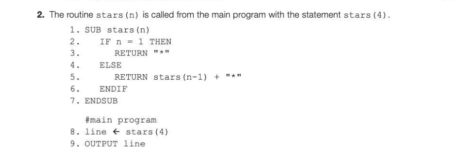

# Chapter 44 — Recursive algorithms
## Objectives

Be familiar with the use of recursive techniques in programming languages Be able to solve simple problems using recursion Be able to trace recursive tree-traversal algorithms: pre-order, post-order, in-order Be able to describe uses of tree-traversal algorithms

## Definition of a recursive subroutine

A subroutine is recursive if it is defined in terms of itself. The process of executing the subroutine is called recursion. A recursive routine has three essential characteristics:

- Asstopping condition or base case must be included which when met means that the routine will not call itself and will start to 'unwind'
- For input values other than the stopping condition, the routine must call itself
- The stopping condition must be reached after a finite number of calls
Recursion is a useful technique for the programmer when the algorithm itself is essentially recursive.

## 8-44 Example

A simple example of a recursive routine is the calculation of a factorial, where n! (read as factorial n) is



If we were calculating this manually, we probably calculate 5 x 4 =20, then multiply 20 by 3 and so on. The calculation could be written as 5! = ((((6 x 4) x 3) x 2) x 1) = (((20 x 3) x 2) x 1) = (GO x 2) x 1) = 120 x 1 = 120 This is essentially how recursion works. In pseudocode, it can be written like this: SUB calcFactorial (n)

```
       IF n = 0 THEN
          factorial ← 1
       ELSE
          factorial ← n * calcFactorial(n-1)
          OUTPUT factorial #LINE A
       ENDIF
       RETURN factorial
ENDSUB
```

Nothing will be printed until the routine has stopped calling itself. As soon as the stopping condition is reached, in this case n = 0, the variable factorial is set equal to 1, the return statement at the end of the subroutine is reached and control is passed back (for the first time, but not the last) to the next

## Use of the call stack

In Chapter 39 the use of the call stack was discussed. Each time a subroutine is called, the return address, parameters and local variables used in the subroutine are held in a stack frame in the call stack. Consider the following example: 1. SUB printList (num)

```
2. num ← num - 1
3. if num > 1 then printList (num)
4. print ("At B, num = ", num) //Line B
5. ENDSUB
6. #main program
7.x ←4
8. printList (x)
9. print ("At A, x =", x) //Line A
```

Return addresses, parameters and local variables (not used here) are put on the stack each time a subroutine is called, and popped from the stack each time the end of a subroutine is reached. At Line 8, for example, Line 9 (referred to here as Line A) is the first return address to be put on the stack with the parameter 4 when printlist (x) is called from the main program, with the parameter 4. Representations of the current state of the stack each time a recursive call is made, and the subsequent



## Tree traversal algorithms

In the previous chapter, three tree traversal algorithms were described: in-order, pre-order and post- order. The pseudocode algorithm for each of these traversals is recursive.



## Example of in-order traversal

An algebraic expression is represented by the following binary tree. It could be represented in memory as, for example, three 1-dimensional arrays or as a list with each list element holding the data and left and right pointers to the left and right subtrees. The value of the root node is stored as the first element of the list.



```
   IF tree[p].left <> -1 THEN
       inorderTraverse (tree[p] .left)
   ENDIF
   OUTPUT (tree[p] .data)
   IF tree[p].right <> -1 THEN
       inorderTraverse (tree[p].right)
   ENDIF
ENDSUB
```

The routine is called with a statement inorderTraverse (0) Tracing through the algorithm, the nodes are output in the order a * b + •/ d.

## Use of in-order traversal algorithm

An in-order traversal may be used to output the values held in the nodes in alphabetic or numerical sequence. An example is given in Chapter 42.

## Algorithm for post-order traversal



```
    IF tree[p].left <> -1 THEN
       postorderTraverse (tree[p] .left)
   ENDIF
    IF tree[p].right <> -1 THEN
       postorderTraverse (tree[p] .right)
   ENDIF
   OUTPUT (tree[p] .data
ENDSUB
```

The nodes are output in the sequence a b * • d/ +. This is the sequence in which algebraic expressions are written using Reverse Polish Notation, which is covered in Chapter 55.

## Algorithm for pre-order traversal

The algorithm for a pre-order traversal is visit the root node 8-44



```
   OUTPUT (tree [p] .data)
    IF tree[p].left <> -1 THEN
       preorderTraverse (tree [p] .left)
   ENDIF
    IF tree[p].right <> -1 THEN
       preorderTraverse (tree[p].right)
   ENDIF
ENDSUB
```

A pre-order traversal may be used for copying a tree, and for producing a prefix expression from an expression tree such as the one shown in Figure 1, where the nodes will be output in the order +*ab/c d. Prefix is used in some compilers and calculators.


---

## Exercises

1. (a) Explain briefly the main features of a recursive procedure from the programmer's point of view. What is required from the system in order to enable recursion to be used? [3] (b) The following recursive subroutine carries out a list operation. SUB listProcess (numList)

```
IF length(numlist) > 0 THEN
```


```
   ENDIF
   RETURN numList
ENDSUB
```

(i) | Complete the following trace table if the list numbers is defined in the main program as

```
      numbers ← [3,5,10,2]
and the subroutine is called with the statement
      new ← listProcess (numbers)
         4 3 5 10 2 3
                                                                                [6]
```

(i) | Explain what the subroutine does. (1



(a) How many times is the subroutine stars called? Explain your answer. [4] (b) What is printed by the final line of the program (line 9)? (1) (c) What will be printed at line 9 if line 5 is replaced with the following statement?
