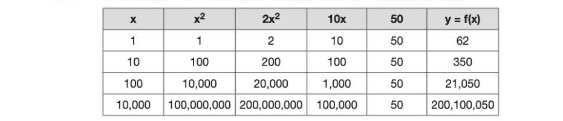
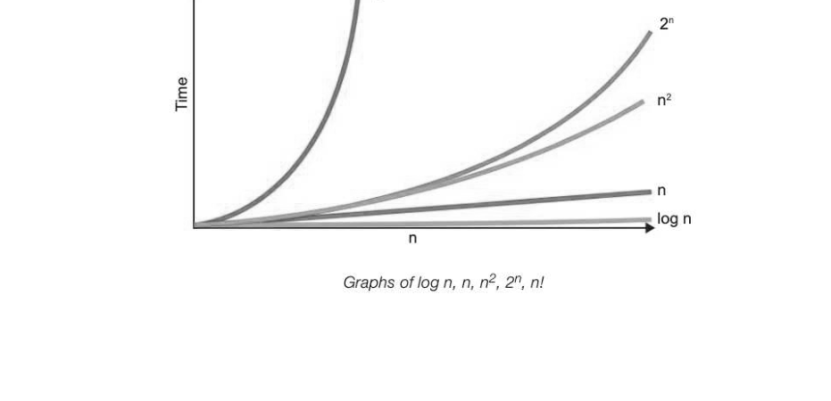
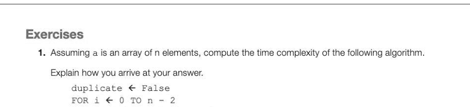
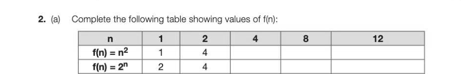
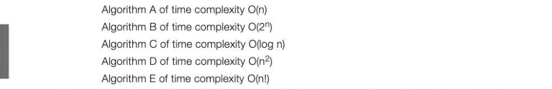

# Chapter 45 — Big-O notation
## Objectives

© Be familiar with the concept of a function as a mapping from one set of values to another

- Be familiar with the concept of linear, polynomial, exponential and logarithmic functions
© Be familiar with the notion of permutation of a set of objects or values

- Be familiar with the Big-O notation to express time complexity
- Be able to derive the time complexity of an algorithm

## Comparing algorithms

Algorithms may be compared on how much time they need to solve a particular problem. This is referred to as the time complexity of the algorithm. The goal is to design algorithms which will run quickly while taking up the minimal amount of resources such as memory. In order to compare the efficiency of different algorithms in terms of execution time, we need to quantify the number of basic operations or steps that the algorithm will need, in terms of the number of items to be processed. For example, consider these two algorithms, which both calculate the sum of the first n integers. SUB sumIntegersMethod]l (n)

```
   sum ← 0
   FOR i←•1T0n
       sum ← sum +n
   ENDFOR
   RETURN sum
ENDSUB
```

The second algorithm computes the same sum using a different algorithm: SUB sumIntegersMethod2 (n)

```
   sum ← n * (n+1)/2
   RETURN sum
ENDSUB
```

The first algorithm performs one operation (sum ← 0) outside the loop and n operations inside the FOR loop, a total of n + 1 operations. As n increases, the extra operation to initialise sum is insignificant, and the larger the value of n, the more inefficient this algorithm is. Its order of magnitude or time complexity is basically n. The second algorithm, on the other hand, takes the same amount of time whatever the value of n. Its time complexity is a constant. We will return to this idea later in the Chapter, but first, we need to look at some of the maths involved in calculating the time complexity of different algorithms.

## Introduction to functions

The order of magnitude, or time complexity of an algorithm can be expressed as a function of its size. A function maps one set of values onto another.

```
INPUT x
             FUNCTION f: OUTPUT f(x)
```

## A linear function

Alinear function is expressed in general terms as f(x) = ax + • Values of the function f(x) = 3x + 4 are shown below for x = 1, 10, 100, 10,000


Notice that the constant term has proportionally less and less effect on the value of the function as the value of x increases. The only term that is significant is 3x, and f(x) increases in a straight line as x increases.

## A polynomial function

A polynomial expression is expressed as f(x) = ax™ + bx +c Values of the function f(x) = 2x2 + 10x + 50 are shown below for x = 1, 10, 100, 10,000



The values of b and c have a smaller and smaller effect on the answer as x increases, compared with the value of a. The only term that really matters is the term in x?, if we are approximating the value of the function for a large value of x.

## An exponential function

An exponential function takes the form f(x) = ab*. This function grows very large, very quickly!

## A logarithmic function

A logarithmic function takes the form f(x) = a logy x "The logarithm of a number is the power that the base must be raised to make it equal to the number." Values of the function f(x) = logs x are shown below for x = 1, 8, 1,024, 1,048,576.


## Permutations

The permutation of a set of objects is the number of ways of arranging the objects. For example, if you have 3 objects A, B and C you can choose any of A, B or C to be the first object. You then have two choices for the second object, making 3 x 2 = 6 different ways of arranging the first two objects, and then just one way of placing the third object. The six permutations are ABC, ACB, BAC, BCA, CAB, CBA. The formula for calculating the number of permutations of four objects is 4 x 3 x 2 x 1, written 4! and spoken as "four factorial". (Note that 10! = 3.6 million... so don't try getting 10 students to line up in all possible ways!)

## Big-O notation

Now that we have got all the maths out of the way and hopefully understood, we can study the so-called Big-O notation which is used to express the time complexity, or performance, of an algorithm. ('O' stands for 'Order'.) The best way to understand this notation is to look at some examples.

## O(1) (Constant time)

O(1) describes an algorithm that takes constant time (the same amount of time) to execute regardless of the size of the input data set. Suppose array a has n items. The statement

```
length ← len(a)
```

will take the same amount of time to execute however many items are held in the array.

## O(n) (linear time)

O(n) describes an algorithm whose performance will grow in linear time, in direct proportion to the size of the data set. For example, a linear search of an array of 1000 unsorted items will take 1000 times longer than searching an array of 1 item.

## O(n?) (Polynomial time)

O(n?) describes an algorithm whose performance is directly proportional to the square of the size of the data set. A program with two nested loops each performed n times will typically have an order of time complexity O(n?). The running time of the algorithm grows in polynomial time.

## O(2") (Exponential time)

O(2") describes an algorithm where the time taken to execute will double with every additional item added to the data set. The execution time grows in exponential time and quickly becomes very large.

## O(log n) (Logarithmic time)

The time taken to execute an algorithm of order O(log n) (logarithmic time) will grow very slowly as the size of the data set increases. A binary search is a good example of an algorithm of time complexity O(log n). Doubling the size of the data set has very little effect on the time the algorithm takes to complete. (Note that in Big-O notation the base of the logarithm, 2 in this case, is not specified because it is irrelevant to the time complexity, being a constant factor.)

## O(n!) (Factorial time)

The time taken to execute an algorithm of order O(n!) will grow very quickly, faster than O(2"). Suppose that the problem is to find all the permutations of n letters. If n=2, there are 2 permutations to find. If n=6, there are 720 permutations — far more than 2", which is only 64.



## Calculating the time complexity of an algorithm

Here are two different algorithms for finding the smallest element in an array called arrayx of size n. Assume the index starts at 0. The first algorithm puts the first value in the array equal to a variable called minimum. It then compares each subsequent item in the array to the first item, and if it is smaller, replaces minimum with the new lowest value.

```
minimum ← arrayX[0]
FORk ←17T0n-1
    IF arrayX[(k] < minimum THEN
       minimum ← arrayX[k]
   ENDIF
ENDFOR
```

To calculate the time complexity of the algorithm in Big-O notation, we need to count the number of basic operations relevant to the size of the problem that it performs. The basic operation here is the IF statement, and as this is performed n times, the time complexity is O(n). The second algorithm compares each value in the array to all the other values of the array, and if the current value is less than or equal to all the other values in the array then it is the minimum.

```
FOR k ←0TOn-1
    isMinimum ← True
   FOR} ←0T0n-1
       IF arrayX[k] > arrayX[j] THEN
          isMinimum ← false
       ENDIF
   ENDFOR
    IF (isMinimum) THEN
       minimum ← arrayX(k]
   ENDIF
ENDFOR
```

To calculate the time complexity of this algorithm, we count the number of basic operations it performs. There are two basic operations in the outer loop, (isMinimum ← true and the final IF statement) which are each performed n times. The inner loop has one basic operations performed n2 times. This gives us a time complexity of 2n + n2, but as discussed earlier, the only significant term is the one in n2. The time complexity is therefore O(n2).


---

## Exercises



```
FOR j ←i+i1TOn-1
   IF a[{i] = a[j] THEN duplicate ← True
ENDFOR
```

ENDFOR 3]



f(n) = logon 10) 1 3.585 f(n) =n! 1 479,001,600 (4) (b) Place the following algorithms in order of time complexity, with the most efficient algorithm first. (2)



(c) Explain why algorithms with time complexity O(n!) are generally considered not to be helpful in solving a problem. Under what circumstances would such an algorithm be considered? 3] (d) The merge sort algorithm has time complexity O(n log n). For a list of 1,024 items in random sequence, is this algorithm more or less efficient than a sort algorithm of time complexity O(n2)? Explain your answer, with the aid of an example. [3]
