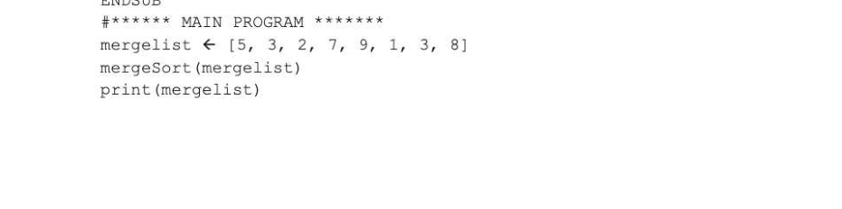
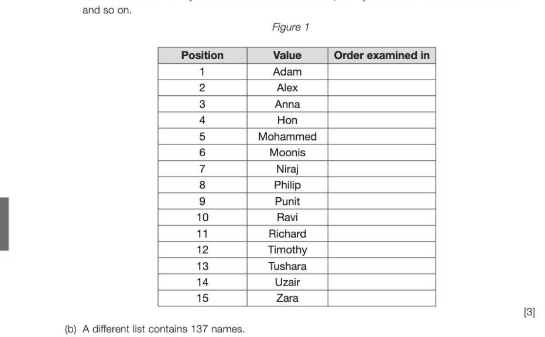

# Chapter 46 — Searching and sorting
## Objectives

Know and be able to trace and analyse the time complexity of the linear search and binary search algorithms

- Be able to trace and analyse the time complexity of the binary tree search algorithm
- Know and be able to explain and trace and analyse the time complexity of the bubble sort algorithm Be able to trace and analyse the time complexity of the merge sort algorithm

## Linear search

Sometimes it is necessary to search for items in a file, or in an array in memory. If the items are not in any particular sequence, the data items have to be searched one by one until the required one is found or the end of the list is reached. This is called a linear search. The following algorithm for a linear search of a list or array alist (indexed from 0) returns the index of itemSought if it is found, -1 otherwise. SUB linearSearch (alist, itemSought)

```
    index ← -1
    i←•o
    found ← False
   WHILE i < length(alist) AND NOT found
       IF alist[i] = itemSought THEN
          index ← i
          found ← True
       ENDIF
       i•e•iti
   ENDWHILE
   RETURN index
ENDSUB
```

## Time complexity of linear search

We can determine the algorithm's efficiency in terms of execution time, expressed in Big-O notation. To do this, you need to compute the number of basic operations that the algorithm will require for n items. The loop is performed n times for a list of length n, and the basic operation in the loop is the IF statement, giving a total of n steps in the algorithm. The time complexity of the algorithm basically depends on how often the loop has to be performed in the worst-case scenario. Therefore, the time complexity of the linear search is O(n).

## Binary search

The binary search is a much more efficient method of searching a list for an item than a linear search, but crucially, the items in the list must be sorted. If they are not sorted, a linear search is the only option. Suppose the items to be searched are held in an ordered array. The ordered array is divided into three parts; a middle item, the first part of the array starting at aList [0] up to the middle item and the second part starting after the middle item and ending with the final item in the list. The middle item is examined to see if it is equal to the sought item. If it is not, then if it is greater than the sought item, the second half of the array is of no further interest. The number of items being searched is therefore halved and the process repeated until the last item is examined, with either the first or second half of the array of items being eliminated at each pass. A subroutine for a binary search on an array of n items in an array aList is given below. first, last and midpoint are integer variables used to index elements of the array. The variable first will start at 0, the beginning of the array. The variable last starts at len(aList) - 1, the last array index. SUB binarySearch(aList, itemSought)

```
found ← False
index ← -1
first ← 0
last ← len(aList) - 1
WHILE first <= last AND found = False
   midpoint ← Integer part of ((first + last) / 2)
```

8-46 IF aList[midpoint] = itemSought THEN

```
          found ← True
          index ← midpoint
       ELSE
          IF abist [midpoint] < itemSought THEN
              first ← midpoint + 1
          ELSE
              last ← midpoint - 1
          ENDIF
       ENDIF
   ENDWHILE
   RETURN index #index = -1 if key not found
ENDSUB
```

## Time complexity of binary search

The binary search halves the search area with each execution of the loop — an excellent example of a divide and conquer strategy. If we start with n items, there will be approximately n/2 items left after the first comparison, n/4 after 2 comparisons, n/8 after 3 comparisons, and n/2! after i comparisons. The number of comparisons needed to end up with a list of just one item is i where n/2' = 1. One further comparison would be needed to check if this item is the one being searched for or not. Solving this equation for i, n=2) Taking the logarithm of each side, logs n =i logg 2 giving i = logs n (since logs 2 = 1) Therefore, the binary search is O(log n).

## A recursive algorithm

The basic concept of the binary search is in fact recursive, and a recursive algorithm is given below. The procedure calls itself, eventually "unwinding" when the procedure ends. When recursion is used there must always be a condition that if true, causes the program to terminate the recursive procedure, or the recursion will continue forever. Once again, first, last and midpoint are integer variables used to index elements of the array, with first starting at 0 and last starting at the upper limit of the array index. SUB binarySearch (aList, itemSought, first, last)

```
    IF last < first THEN
       RETURN -1 8-46
   ELSE
       midpoint ← integer part of (first + last) /2
       IF aList[midpoint] > itemSought THEN #key is in first half of list
          RETURN binarySearch(aList, itemSought, first, midpoint-1)
       ELSE
          IF aList[midpoint] < itemSought THEN
              RETURN binarySearch(aList, itemSought, midpoint+l, last
          ELSE
              RETURN midpoint
          ENDIF
       ENDIF
   ENDIF
ENDSUB
```

## Binary tree search

The recursive algorithm for searching a binary tree is similar to the binary search algorithm above, except that instead of looking at the midpoint of a list, or a subset of the list, on each pass, half of the tree or subtree is eliminated each time its root is examined. In the tree below, a maximum of 4 nodes has to be examined to find a value or return "not found". The time complexity is the same as the binary search, i.e. O(log n). SUB binarySearchTree (itemSought, currentNode)

```
IF currentNode = None THEN
   RETURN False
ELSE
   IF itemSought = item at currentNode THEN
       RETURN True
   ELSE
       IF itemSought < item at currentNode THEN
          IF left child exists THEN
              RETURN binarySearchTree (itemSought, left child)
```

## 8-46 ELSE

```
                 RETURN False
              ENDIF
              IF right child exists THEN
                 RETURN binarySearchTree (itemSought, right child)
             ELSE
                 RETURN False
             ENDIF
          ENDIF
       ENDIF
   ENDIF
ENDSUB
```

## Sorting algorithms

The bubble sort (see Chapter 9) is the simplest but by far the most inefficient sorting algorithm. It uses two nested loops to sort n items: FOR i = 0 to n-2

```
   FOR j = 0 to n-i-2
       IF item[j] > item[j+1] THEN swap the items
   ENDFOR
ENDFOR
```

The IF statement in the inner loop is performed (n-1) + (n-2) 2 + 1 times. This is equal to Yen(n-1), or Yen? - ¥en, using the formula for an arithmetic progression. Its time complexity is therefore a quadratic

## Merge sort

The merge sort uses a divide and conquer approach and is far more efficient for a large number of items. The list is successively divided in half, forming two sublists, until each sublist is of length one. The sublists are then sorted and merged into larger sublists until they are recombined into a single sorted list. The basic steps are:

- Divide the unsorted list into n sublists, each containing one element
- Repeatedly merge sublists to produce new sorted sublists until there is only one sublist remaining. This is the sorted list.
The merge process is shown graphically below for a list is in the initial sequence 5 3279138. Initial sequence split into sublists each of length 1 Final merged and sorted list

An algorithm for the merge sort is given below.

## SUB mergeSort (mergelist)

## IF len(mergelist) > 1 THEN

mid ← len(mergelist) div 2 #performs integer division lefthalf ← mergelist[:mid] #left half of mergelist into lefthalf righthalf ← mergelist[mid:] #right half of mergelist into righthalf


WHILE i < len(lefthalf) and j < len(righthalf) IF THEN

```
   mergelist[(k] ← lefthalf[i]
   i•iveil
ELSE
   mergelist[k] ← righthalf[j]
```


#check if left half has elements not merged WHILE i < len(lefthalf)

```
mergelist[k] ← lefthalf[i] #if so, add to mergelist
i•eitil
ke kt]
```

ENDWHILE #check if rt half has elements not merged WHILE j < len(righthalf)

```
mergelist[(k] ← righthalf[j] #if so, add to mergelist
jejgrti
ke k+l
```

ENDWHILE

## ENDIF

## ENDSUB



## Time complexity of merge sort

The merge sort is another example of a divide and conquer algorithm, but in this case, there are n sublists to be merged, so the time complexity has to be multiplied by a factor of n. The time complexity is therefore O(nlog n).

## Space complexity

The amount of resources such as memory that an algorithm requires, known as the space complexity, is also a consideration when comparing the efficiency of algorithms. The bubble sort, for example, requires n memory locations for a list of size n. The merge sort, on the other hand, requires additional memory to hold the left half and right half of the list, so takes much more memory space.


---

## Exercises

1. There are many methods of sorting a set of records into ascending order of key. What factors would you consider in deciding which of these methods is the most suitable for a particular application? —_[2] 2. The binary search method can be used to search for an item in an ordered list. (a) Show how the binary search method works by writing numbers on Figure 1 below to indicate which values would be examined to determine if the name "Richard" appears in the list. Write the number "1" by the first value to be examined, "2" by the second value to be examined



*Figure 1*

What is the maximum number of names that would need to be accessed to determine if the name "Rachel" appears in the list? (1) (c) Which of the following is the order of time complexity of the binary search method? Olloggn) — Of). O(n?) 0] AQA Unit 3 Qu 1 June 2017
