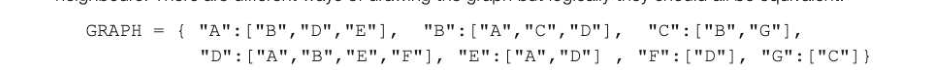
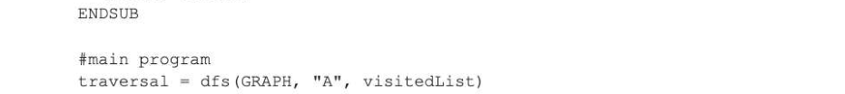
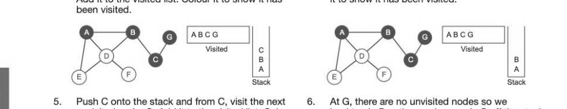
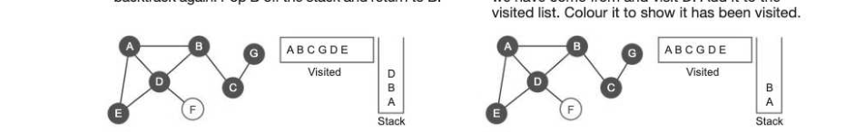
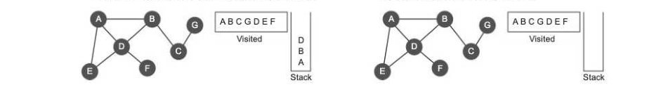
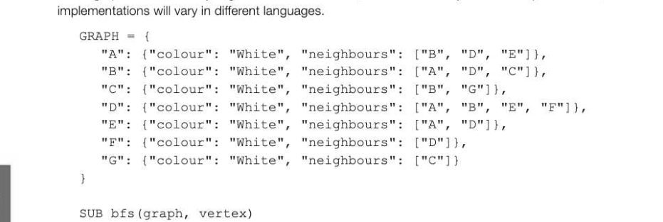

# Chapter 47 — Graph-traversal algorithms
## Objectives

- Be able to trace depth-first and breadth-first algorithms
- Describe typical applications of each

## Graph traversals

There are two ways to traverse a graph so that every node is visited. Each of them uses a supporting data structure to keep track of which nodes have been visited, and which node to visit next.

- A depth-first traversal uses a stack, which is implemented automatically during execution of a recursive routine to hold local variables, parameters and return addresses each time a subroutine is called (see Chapter 39). Alternatively, a non-recursive routine could be written and the stack maintained as part of the routine.
- Abreadth-first traversal uses a queue.

## Depth-first traversal

In this traversal, we go as far down one route as we can before backtracking and taking the next route. The following recursive subroutine dfs is called initially from the main program, which passes it a graph, defined here as an adjacency list (see Chapter 41) and implemented as a dictionary with nodes A, B, C,... as keys, and neighbours of each node as data. Thus if "A" is the current vertex, graph ["A"] will return the list ["B","D","E"] with reference to the algorithm below and the graph overleaf. 8-47 The calling program also passes an empty list of visited nodes and a starting vertex. Check the graph in Step 1 on the next page to verify that it corresponds to the nodes and their neighbours. There are different ways of drawing the graph but logically they should all be equivalent!



visitedbist = [] #an empty list of visited nodes SUB dfs(graph, currentVertex, visited) append currentVertex to list of visited nodes

```
   FOR vertex in graph[currentVertex] #check neighbours of currentVertex
       IF vertex NOT IN visited THEN
          dfs (graph, vertex, visited) #recursive call
#stack will store return address, parameters and local variables
       ENDIF
   ENDFOR
   RETURN visited
```



OUTPUT "Nodes visited in this order: ", traversal

It is easiest to understand how this works by looking at the graphs below. This shows the state of the stack (here it just shows the current node when a recursive call is made), and the contents of the ited list. Each eS] visited node is coloured dark blue. Par Ee © oa Ee © a 1. _ Start the routine with an empty stack and an Visit A, add it to the visited list. Colour it to show it empty list of visited nodes. Lad has been visited. 'Stack 3. Push A onto the stack to keep track of where we 4. ~—_— Push B onto the stack and from B, visit the next have come from and visit A's first neighbour, B. unvisited node, C. Add it to the visited list. Colour Add it to the visited list. Colour it to show it has it to show it has been visited.



unvisited node, G. Add it to the visited list. Colour backtrack. Pop the previous node C off the stack it to show it has been visited. and return to C A L*} Stack 7. AtC, all adjacent nodes have been visited, so 8. Push B back onto the stack to keep track of where backtrack again. Pop B off the stack and return to B. we have come from and visit D. Add it to the



9. Push D onto the stack and visit E. Add it to the 10. From E, A and D have already been visited so pop visited list. Colour it to show it has been visited. D off the stack and return to D.



11. Push D back onto the stack and visit F. Add it 12. AtF there are no unvisited nodes so we pop D, then to the visited list. Colour it to show it has been B, then A, whose neighbours have all been visited. visited. The stack is now empty which means every node has been visited and the algorithm has completed.

## Breadth-first traversal

With a breadth first traversal, starting at A we first visit all the nodes adjacent to A before moving to B and repeating the process for each node at this 'level', before moving to the next level. Instead of a stack, a queue is used to keep track of nodes that we still have to visit. Nodes are coloured pale blue when queued and dark blue when dequeued and added to the list of nodes that have been visited. hee? = he = oom bee dm? boo 1. Append A to the empty queue at the start of the 2. Dequeue A and mark it by colouring it dark blue. routine. This will be the first visited node. Add it to the visited list. g [ae 3 va © Queue 'Queue 3. Queue each of A's adjacent nodes B, D and E in 4. We've now finished with A, so dequeue the first turn, Colour each node pale blue to show it has item in the queue, which is B. Mark it by colouring been queued. it dark blue and add it to the visited list. 'Queue 5. Queue B's remaining neighbour C. Colour it pale 6. B's neighbours are all coloured, so dequeue the blue to show it has been queued. first item in the queue, which is D. Mark it by colouring it dark blue and add it to the visited list. R "A © Aeoe


7. D's adjacent node E has already been queued and 8. Dequeue the first item, E. Mark it by colouring it coloured. Colour it pale Add blue D's adjacent to show it node has been F to the queued. queue. dark blue and add it to the visited list. acoso =o 9. E's neighbours are all coloured, so dequeue the 10. Add C's adjacent node G to the queue and colour next item, C. Mark it by colouring it dark blue and it pale blue to show it has been queued. add it to the visited list. Queue CL 11. C's neighbours are all coloured now, so dequeue F, 12. Finally, dequeue G, mark it by colouring it dark mark it by colouring it dark blue and add it to the blue and add it to the visited list. The queue is now visited list. empty and all the nodes have been visited.

Note that we need to distinguish between a dequeued vertex that is added to the visited list and whose neighbours we are examining, which we colour dark blue, and neighbours of the current vertex, which we put in the queue and colour pale blue to show they have been queued but not visited.

## Pseudocode algorithm for breadth-first traversal

The following algorithm assumes you are starting from a vertex currentVertex. The queue qis a dynamic data structure implemented for example as a list. A second list called vis itedNodes holds the nodes that have been visited. Colours Black, Grey and White are more traditional in this algorithm than Dark Blue, Pale Blue and white so are used here — the diagrams are clearer in colour! The breadth-first traversal is an iterative, rather than a recursive routine. The first node ('A' in this example), is appended to the empty queue as soon as the subroutine is entered. A Python definition of the graph as a dictionary is given below for interest, but is not directly used in the pseudocode, as



```
queue ← [] #an empty queue
visited ← [] #an empty list of visited nodes
enqueue vertex
WHILE queue NOT empty
```


```
       FOR each neighbour of currentNode
          IF colour of neighbour = "White" THEN
              enqueue neighbour
              set colour of neighbour to "Grey"
          ENDIF
       ENDFOR
   ENDWHILE
   RETURN visited
ENDSUB
#main
visited ← bfs(GRAPH, "A")
OUTPUT "List of nodes visited: ", visited
```

## Applications of depth-first search

Applications of the depth-first search include the following:

- In scheduling jobs where a series of tasks is to be performed, and certain tasks must be completed before the next one begins.
- In solving problems such as mazes, which can be represented as a graph

## Finding a way through a maze

A depth-first search can be used to find a way out of a maze. Junctions where there is a choice of route in the maze are represented as nodes on a graph. Q1: (a) Redraw the graph without showing the dead ends. 8-47 (b) State the properties of this graph that makes it a tree. (c) Complete the table below to show how the graph would be represented using an adjacency matrix. Q2: Draw a graph representing the following maze. Show the dead ends on your graph.

## Applications of breadth-first search

Breadth-first searches are used to solve many real-life problems. For example:

- Amajor application of a breadth-first search is to find the shortest path between two points A and
B, and this will be explained in detail in the next chapter. Finding the shortest path is important in, for example, GPS navigation systems and computer networks. Facebook. Each user profile is regarded as a node or vertex in the graph, and two nodes are connected if they are each other's friends. This example is considered in more depth in Chapter 72, Big Data. Web crawlers. A web crawler can analyse all the sites you can reach by following links randomly on a particular website.


---

## Exercises

1. (a) Name the supporting data structure which is commonly used when traversing a graph (i) depth-first (1) (ii) breadth-first (] (b) Show the order in which vertices in the following graph are visited, starting at A, using (i) depth-first traversal [3] (ii) breadth-first traversal (3) (c) (i) | Explain why the graph above is not a tree. Which edges would need to be removed for it to be a tree? [2] (ii) | Show, by traversing the tree below using a pre-order traversal and writing the nodes in the order that they are visited, that a pre-order tree traversal is equivalent to a depth-first graph traversal. [2]
