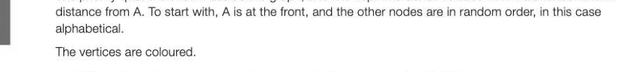
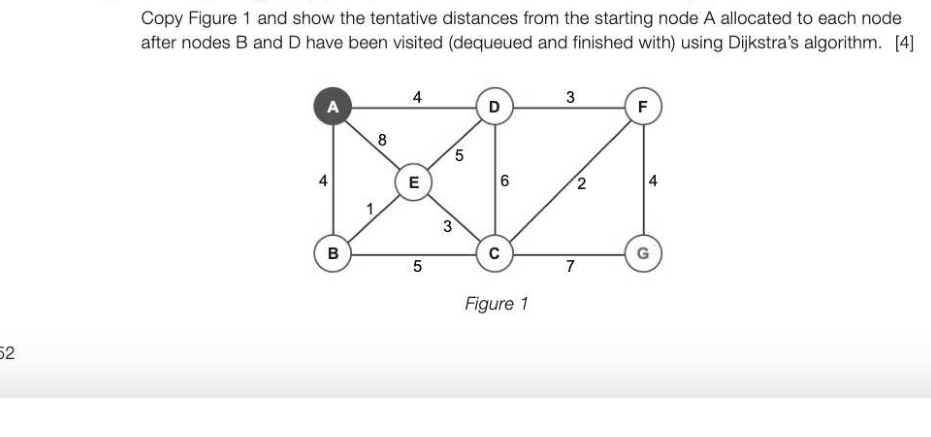

# Chapter 48 — Optimisation algorithms
## Objectives

« Understand and be able to trace Dijkstra's shortest path algorithm

- Be aware of applications of shortest path algorithm

## Optimisation problems

We increasingly rely on computers to find the optimum solution to a range of different problems. For example: scheduling aeroplanes and staff so that air crews always have the correct minimum rest time between flights

- finding the best move in a chess problem
- timetabling classes in schools and colleges
© finding the shortest path between two points — for building circuit boards, route planning, communications networks and many other applications Finding the shortest path from A to B has numerous applications in everyday life and in computer-related problems. For example, if you visit a site like Google Maps to get directions from your current location to a particular destination, you probably want to know the shortest route. The software that finds it for you will use representations of street maps or roads as graphs, with estimated driving times or distances as edge weights.

## Dijkstra's shortest path algorithm

Dijkstra (pronounced dike-stra) lived from 1930 to 2002. He was a Dutch computer scientist who received the Turing award in 1972 for fundamental contributions to developing programming languages. He wrote a paper in 1968 which was published under the heading "GO TO Statement Considered Harmful" and was an advocate of structured programming. Dijkstra's algorithm is designed to find the shortest path between one particular start node and every other node in a weighted graph. The algorithm is similar to a breadth first search, but uses a priority queue rather than a FIFO queue. The weights could represent, for example, distances or time taken to travel between towns, or the cost of travel between airports.

## The algorithm

The algorithm works as follows: Assign a temporary distance value to every node, starting with zero for the initial node and infinity for every other node Add all the vertices to a priority queue, sorted by current distance. (This puts the initial node at the front, the rest in random order.) WHILE the queue is not empty remove the vertex u from the front of the queue

```
       FOR each unvisited neighbour w of the current vertex u
          newDistance ← distanceAtU + distanceFromUtowW
          IF newDistance < distanceAtW THEN
              distanceAtW ← newDistance
              change position of w in priority queue to reflect new
                                                                distance to w
          ENDIF
       ENDFOR
ENDWHILE
```

## Example

In the figure below, A is the start node. A temporary distance value has been assigned to every node, starting with zero for the start node and infinity for every other node. The priority queue is shown beside the graph, and it is kept in order of vertices with the shortest known



- White vertices have not been visited and their distances remain at infinity.
- Pale blue vertices have been partially explored. A tentative distance to them has been found but all possible paths to them have not yet been explored, so this distance cannot be guaranteed to be the shortest one and they remain in the queue.
- Dark blue vertices have been removed from the queue and their minimum distance from A has been found. These vertices are described as having being visited.
Start at A, remove it from the front of the queue and shade it dark blue to show it has been visited (B=2[6=~[D=»[E==] Priority queue ] Node A has two neighbours B and D. Shade each of these pale blue to show they have been partially explored, and calculate new distance values for nodes B and D by taking the distance value at A (i.e. Zero) and adding it to the edge weight between A and B, A and D. Since all these values are less than infinity, update the distances at B and D. Distance at D is less than distance at B, so move D to the front of the priority queue.

[D=3]B=7|C=a|E=| ] Remove D from the front of the queue. Shade it dark blue to show it has been visited. Shade D's neighbours C and E pale blue to show they have been partially explored. Now calculate new values for the unvisited neighbours of D, namely B, C and E. The distance between D and B is 2, and this is added to the edge weight between D and A. 3 + 2 = 5 so the distance value at B is changed to the new lowest value, 5. The current tentative distance © at C is replaced with 3 + 4 = 7, at Eis replaced with 3 + 7 = 10. The order of nodes in the priority queue does not need to be changed since B, the node with the smallest current distance from A, is already at the front. [B=5|C=7/E=10| il | Remove B from the priority queue. Shade B dark blue to show it has been visited. At B, the values at C and E are calculated as 5 + 3 = 8 and 5 + 6 = 11 respectively, but these are both 8-48 greater than the tentative values already there, so these values are not changed. Remove C from the queue and shade it dark blue to show it has been visited. The distance to E via C will be calculated as 7 + 1 = 8. This is less than current tentative distance to E (10) so will replace it. {e=s] [| T JT 4 Remove E from the queue. It has no unvisited neighbours, so there are no new distances to calculate. Shade E dark blue.

The queue is empty, all the nodes have now been visited so the algorithm ends. We have found the shortest distance from A to every other node, and the shortest distance from A is marked in blue at each node. Q1: Copy the graph below and use the method above to trace the shortest path from A to all other nodes. Write the shortest distance at each node. Q2: Use a similar method to trace the shortest path from A to all other nodes. Write the shortest distance at each node. What is the shortest distance from A to G?


---

## Exercises

1. (a) What is the purpose of Dijkstra's shortest path algorithm? (2) (b) Describe briefly two applications of the algorithm. [4] (c) The weighted graph (Figure 1) shows distances between each of the graph's vertices.



*Figure 1*

2. The following graph shows distances between five cities. Dijkstra's shortest path algorithm is used to find the shortest distance between Liverpool and each of the other cities. The algorithm is given below. Assign a temporary distance value to every node, starting with zero for the initial node and infinity for every other node Add all the vertices to a priority queue, sorted by current distance. (This puts the initial node at the front, the rest, which all start with temporary distances of infinity, in random order.) WHILE the queue is not empty remove the vertex u from the front of the queue FOR each unvisited neighbour w of the current vertex u

```
   newDistance ← distanceAtU + distanceFromUtoW
   IF newDistance < distanceAtW THEN
       distanceAtW ← newDistance
       change position of w in priority queue to reflect new
                                                         distance to w
   ENDIF
ENDFOR
```

ENDWHILE The following table represents the distances after the first statement in the algorithm is executed. i) « ca ca ca (a) Complete the following table after one iteration of the WHILE loop in the above algorithm. [3] (b) Complete the table after the second iteration of the WHILE loop. [2]
