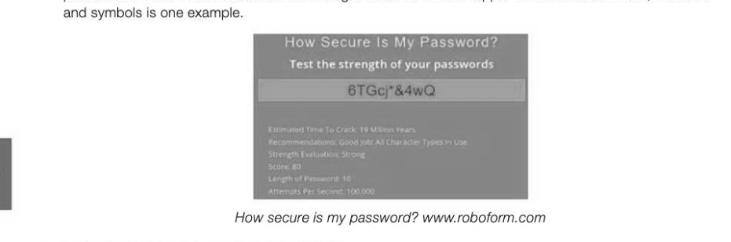
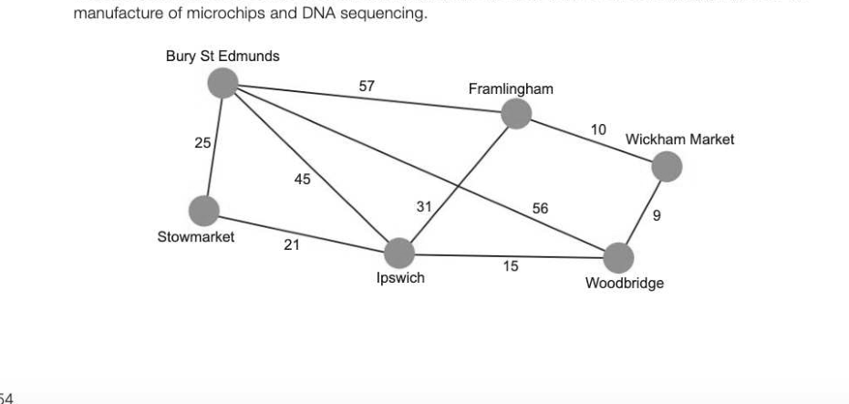
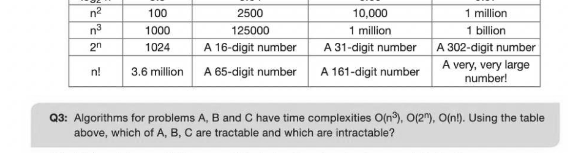
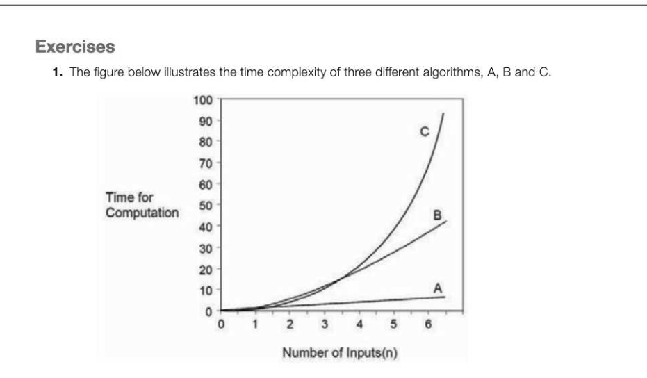
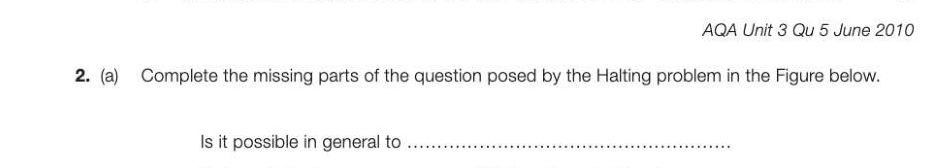

# Chapter 49 — Limits of computation
## Objectives

° Be aware that algorithmic complexity and hardware impose limits on what can be computed Know that algorithms may be classified as being either tractable or intractable Be aware that some problems cannot be solved algorithmically Describe the Halting problem, and understand its significance for computation Does every computational problem have a solution? In this chapter we will look at the limits of computation. Some problems may be theoretically soluble by computer but if they take millions of years to solve, they are in a practical sense, insoluble. Cracking a password of 10 or more characters consisting of a random mix of upper and lowercase letters, numbers.

## The travelling salesman problem

This is a very well-known optimisation problem. It poses the question "Given a list of towns and the distances between each pair of towns, what is the shortest possible route that the salesman can use to visit each town exactly once and return to the starting point?" This is different from finding the shortest path from A to B. This problem has many applications in fields such as planning, logistics, the

To solve the problem, we could look first at a brute-force method, testing out every combination of routes. With just five cities, the number of possible routes is: 4! = 4x 3x 2x1 = 24. A computer could calculate the best route in a fraction of a second. The problem is computationally difficult because it will take a long time for a fast computer to find the optimal solution for even a relatively small number of cities, and using the brute force algorithm, the problem rapidly becomes impossible to solve within a reasonable time as the number of cities increases. Another approach is needed, and later in this chapter we will discuss heuristic solutions to problems such as this one.

## Tractable and intractable problems

Computer scientists are interested in the efficiency of algorithms, and whether or not it is possible, for example, to find an algorithm that will solve a problem in a "reasonable amount of time" using only a "reasonable amount of memory". Some problems in fact cannot be solved at all, however much time and memory is available. This chapter looks at how we can categorise algorithms. A problem that has a polynomial-time solution or better is called a tractable problem. A polynomial- time solution is one of time complexity O(n'). So for example, problems which have solutions with time complexities of O(n), O(n log n) and O(n") are all tractable. An intractable problem is one that does not have a polynomial-time solution. Problems of time complexity O(2") and O(n!) are examples of intractable problems. In other words, although these problems have a theoretical solution, it is very hard to solve such a problem for a value of n of any size greater than something very small. Note that "intractable" does not mean "insoluble". An example of a tractable problem is: "Find the shortest path between two vertices in a given weighted graph." We saw in the last chapter that this is relatively easy to solve efficiently. However, if we wanted to find the Jongest path between two vertices, this is a problem which can only be solved by exhaustive search — in other words, trying every option.

## Comparing time complexities

The table below shows what a huge difference there is in algorithms with different orders of time complexity for different values of n. n 10 50 100 1000 logs n 3.3 5.64 6.65 9.97

Intractable problems, which have no efficient algorithms to solve them, are in fact quite common; so how can solutions to these problems be found?

## Heuristic methods

Not all intractable problems are equally hard, and not all instances of a given intractable problem are equally hard. Brute-force algorithms are not the only option. It may be quite simple to get an approximate answer, or an answer that is good enough for a particular purpose. One approach is to find a solution which has a high probability of being correct. Another approach is to solve a simpler or restricted version of the problem, if that is possible. This may give useful insights into possible solutions. An approach to problem solving which employs an algorithm or methodology not guaranteed to be optimal or perfect, but is sufficient for the purpose, is called a heuristic approach. An adequate solution may be achieved by trading optimality, completeness, accuracy or precision for speed. Returning to the Travelling Salesman Problem (TSP), a large number of heuristic solutions have been developed, the best of which (developed in 2006) can compute a solution within two or three percent of an optimal tour for as many as 85,000 "cities" or nodes. In fields other than computer science, individuals and organisations frequently use heuristic methods in reaching decisions, and researchers have found that ignoring part of the information at hand can actually lead to more accurate decisions. Examples of a heuristic approach include using a rule of thumb, making an educated guess or an intuitive judgement, or simply using common sense. Many virus scanners use heuristic rules for detecting viruses and other forms of malware. The heuristic algorithm looks for code and behaviour patterns indicative of a class or family of viruses.

## Computable and non-computable problems

There are some problems which cannot be solved algorithmically. In fact, the number of things which can be computed is tiny compared with the number of things we would like to be able to compute! In the 1920s, a mathematician named David Hilbert proposed that any problem, defined properly, could be solved by writing an appropriate algorithm — i.e. that every problem was computable. In 1936 Turing was able to prove him wrong. Some problems are simply non-computable.

The fact that some problems have no solution is of significance to computer scientists. One definition of Computer Science is "the study of problems that are and that are not computable", or the study of the existence and the nonexistence of algorithms.

## The Halting problem

The Halting problem is the problem of determining whether for a given input, a program will finish running or continue for ever. The problem can be represented graphically: | NUT! a rears i halt on input i? Alan Turing proved in 1936 that a machine H to solve the Halting problem for all possible programs and their inputs, cannot exist. It is not possible to devise a program H which can show that, given any program and its inputs, it will halt or continue for ever. It is, however, often possible to show that given a specific algorithm, it will halt for any input. What the Halting problem shows is that there are some problems that cannot be solved by computer.

---

## Exercises

(a) The three algorithms have orders of time complexity O(n2), O(n) and O(a"). (i) What is the order of time complexity of algorithm C? (1) (ii) | Which of the algorithms, A, B or C, is the most time efficient? (1) 8-49 (b) The Travelling Salesman problem is intractable. (i) | What is meant by an intractable problem? [2] (ii) What approach might a programmer take if asked to 'solve' an intractable problem? [2]

that can tell, given any program and its inputs and without

(b) What is the significance of the Halting problem? (1) AQA Unit 3 Qu 11 June 2012

## Section 9

## Regular languages

In this section: Chapter 50 Mealy machines 260 Chapter 51 Sets 265 Chapter 52 Regular expressions 269 Chapter 53 The Turing machine 273 Chapter 54 Backus-Naur form 278 Chapter 55 Reverse Polish notation 283
