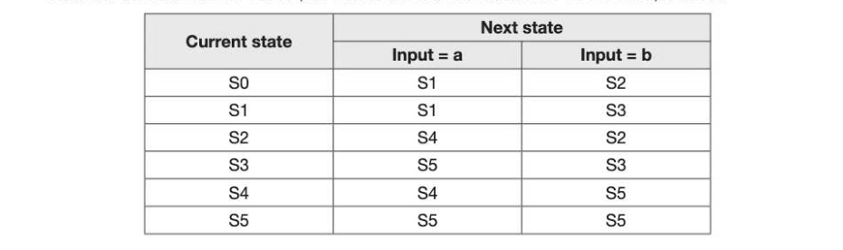
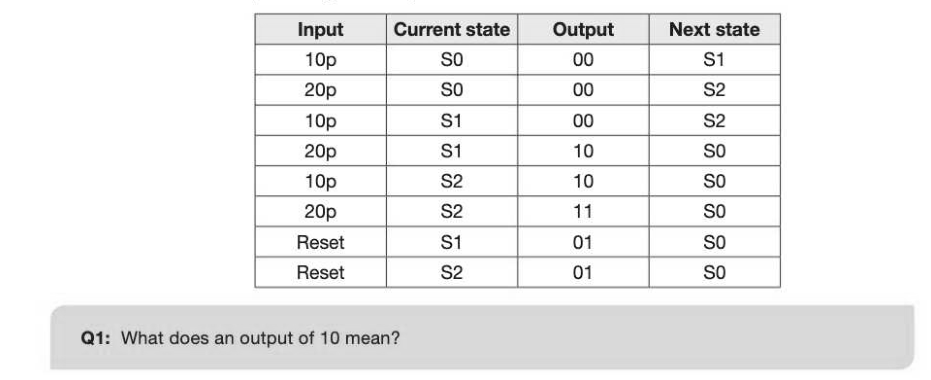
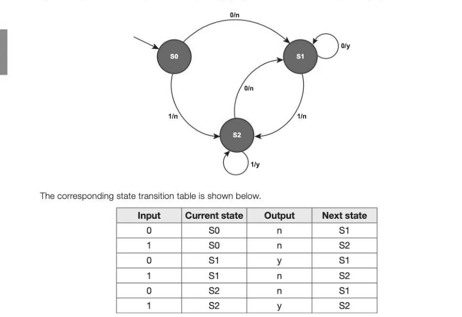
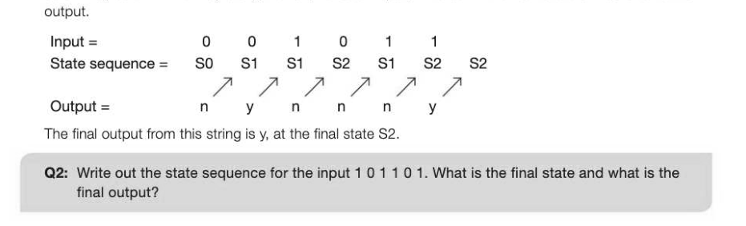
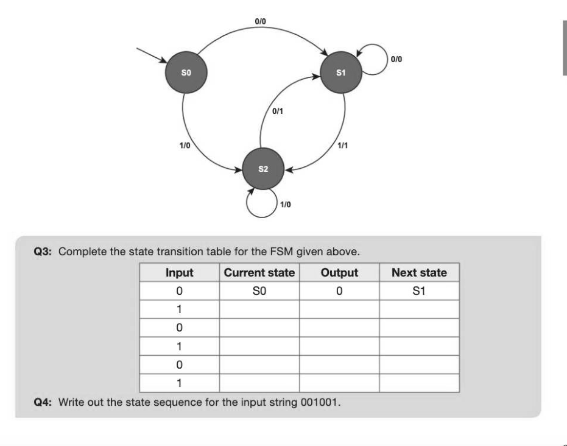
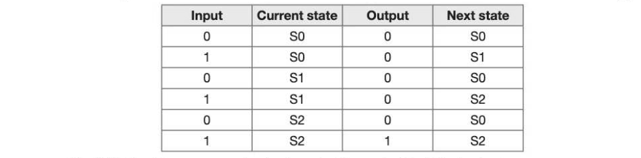

# Chapter 50 — Mealy machines
## Objectives

- Be able to draw and interpret simple state transition diagrams for FSMs with no output and with output
- Be able to draw and interpret simple state transition tables for FSMs with no output and with output

## Finite state machines

A finite state machine (FSM) which does not have output is sometimes referred to as a finite state automaton. (These were covered in Chapter 12 and you should refer back to this chapter for more detail.) An FSM is an abstract representation or model of computation used in designing computer systems and logic circuits, and one which can also be used to check the syntax of programming languages. This chapter gives a brief revision of the concepts previously covered in Chapter 12 before moving on to a specific type of FSMs with output, known as Mealy machines.

## State transition diagrams

State transition diagrams use circles to represent the states that a system may be in, and arrows to represent the transitions between states. One of the states is a start state, shown with an arrow pointing to it, and one or more of the states is an accept state, shown as a double circle. The finite state automaton produces a Yes or No answer to the question: does the input sequence move from the start state to an accept state by any of the possible paths?

## Example 1

The finite state diagram below accepts certain combinations of the letters a and b, and rejects others. Which of the following combinations of letters are accepted? baabb aaabb aaaa abba abb baa Answer: aaabb, abb, baa. These are the only three combinations that end at an accept state, S3 or S4.

## State transition tables

A state transition table is an alternative way of representing an FSM, showing in tabular form the current state and the next state for each input. Here is the state transition table for the example above.

## Mealy machines

A Mealy machine is a type of FSM with an output, named after its inventor George Mealy. A Mealy machine has outputs that are determined both by its current state and the current input. For each state and input, no more than one transition is possible.

## Example 2

The controller for a vending machine is implemented as a Mealy machine as shown in the finite state diagram below. The initial state is shown with an arrow, and each transition shows both the input and the output. A packet of crisps will be dispensed when the customer has inserted three 10p coins or a 10p coin and a 20p coin. If two 20p coins are inserted, the machine will give 10p change. For example, 10p/00 means that 10p has been input and the controller does not dispense the packet of crisps and does not give change. 20p/11 means that 20p has been inserted and the machine dispenses the crisps and gives change. A Reset button gives change if the customer presses it when they have entered less than 30p.

The transition table representing this Mealy machine is as follows:

## Example 3

The FSM below represents a Mealy machine which accepts any number of inputs of 0 or 1. If the last two symbols input are 00 or 11, the final output is y (yes), otherwise the final output is n (no).

You can show the output for any input string. Suppose you input the string0 0101 1.

Write these inputs down and underneath them, complete the state sequence and the output rows, column by column. Working along the row, for each input, write down the next state arrived at and the

## Applications of Mealy machines

Mealy machines can provide a simple model for cipher machines. Given a string of letters (a sequence of inputs), a Mealy machine can be designed to give a ciphered string (a sequence of outputs). They can also be used to represent traffic lights, timers, vending machines, and basic electronic circuits.

## Example 4

This example shows a Mealy machine that represents an exclusive OR of the two most recent values input.

---

## Exercises

1. A Mealy machine is to be designed so that its final output is a 1 when at least three ones have been entered in sequence. (a) With the aid of the state transition table below, draw the finite state diagram representing the Mealy machine. (3]

(b) Write the state sequence showing the output for each of the following input sequences: (i) 110111 (2) (i) 101101 (2) 2. The following Mealy machine accepts as input a string of binary digits. The output is the remainder, given in decimal, when the string of binary digits is divided by 5. Thus for example an input string of binary digits 10 will give an output of 2, and an input string of 1011 will output 1. (a) What are the outputs A, B, C and D? [4] (cb) (i) | The binary string 1010011 is input. List the state sequence. [2] (ii) | What is the output from the string? (1)
