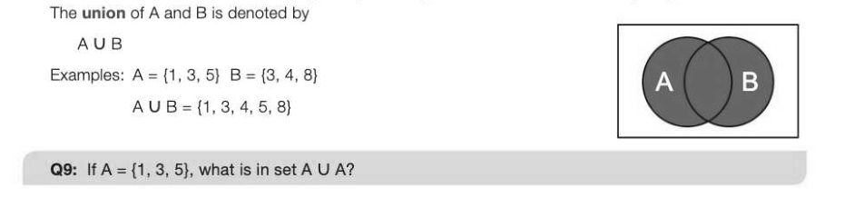
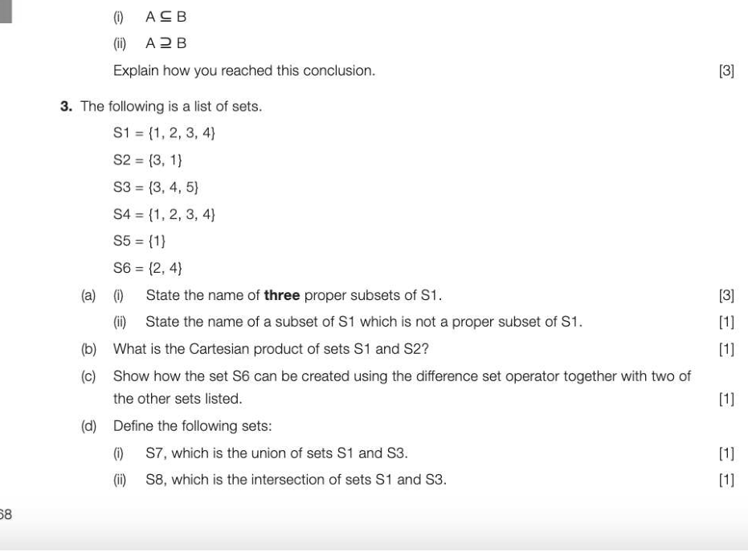

# Chapter 51 — Sets
## Objectives

Be familiar with the concept of a set and the notations used for specifying a set and set comprehension e Be familiar with the compact representation of a set e Be familiar with the concept of finite and infinite sets, countably infinite sets, cardinality of a finite set, Cartesian product of sets e Be familiar with the meaning of the terms subset, proper subset, countable set

- Be familiar with set operations: membership, union, intersection, difference

## Definition of a set

A set is an unordered collection of values or symbols in which each value or symbol occurs at most once. A set may be defined in one of three ways, and the notation used for each of these is explained below.

## Defining a set by listing each member

The list of members is enclosed in curly brackets: e.g. A = {2, 4, 6, 8}

## Common sets

There are some sets that are used so often that they have special names and notational conventions to identify them. These include:

- The empty set {} or , which has no elements.
- The (infinite) set of natural numbers, including zero, referred to as N in mathematics. Nor N = (0, 1, 2,3, ...}
A natural number is a whole number that is used in counting. For example, five gold rings, four calling birds, three French hens. (This is sometimes defined as {1, 2, 3,...} without including zero.) Note that the ellipsis indicates that the set continues in the obvious way, and can be used to indicate an infinite set. e The set of all integers whether positive, negative or zero: Zor Z={...,-2,-1,0, 1,2,...}

- The set of all rational numbers Q or Q, i.e. any value that can be expressed as a ratio, or fraction. This includes all integer values since each can simply be expressed as 7/1 or 1076/1, to use the examples above.
© The set R or R of real numbers is defined as 'the set of all possible real world quantities'. This includes, for example, -10, -6.456, 0 4, 6.0, /2 and TT. It does not include 'imaginary' numbers such as y-1, or infinity (ee).

## Finite and infinite sets

A finite set is one whose elements can be counted off by natural numbers up to a particular number. For example, 10 is the fourth and final element of the set A = {1, 4, 6, 10}. Another example of a finite set is the set of all odd numbers from 1 to 99, which may be specified as: Again, the ellipsis (...) indicates that the list continues in the obvious way. The cardinality of a finite set is the number of elements in the set. An infinite set may be countable or uncountable. For example, N (the set of natural numbers) and R (the set of real numbers) are examples of infinite sets, because they cannot be counted off against the set of natural numbers up to a certain number. N is a countably infinite set because you can count the elements off against the set of natural numbers; 0, 1, 2, 3. and so on. This is in contrast to the set IR which is not countable; you cannot list all the numbers in the set or say which is the next number. A countable set is a set which can be counted off against a subset of the natural numbers, i.e. all of the natural numbers up to a fixed limit. A countably infinite set is one which can be counted off against the natural numbers but without ever stopping.

## Defining a set by set comprehension

A set may be defined by set comprehension, using the notation shown in the example below: B= {n?|neNan<5}

- The vertical bar | means "such that"
- The ← symbol indicates membership, so x ← N is read as "x belongs to N"
- ~Ameans "and"
Another way of writing the set B, therefore, is B= {0, 1, 4, 9, 16}

## Defining a set using the compact representation

Aset may be defined using the compact representation, as in the following example: A= {On} In this notation, A is the set containing all strings with an equal number of Os and 1s. Another way of writing this set is A = {01, 0011, 000111, 00001111,...}

## Cartesian product of two sets

The Cartesian product of two sets A and B, written A x B and spoken "A cross B", is the set of all ordered pairs (a, b) where a is a member of A and b is a member of B. Example: The set A is defined as A = {1, 3, 5} and the set B as B = {12, 25, 40}. The definition of set C, which is defined as A x B is written: C= {(1, 12), (1, 25), (1, 40), (3, 12), (8, 25), (3, 40), (6, 12), (5, 25), (5, 40)}

## Subsets

|f every member of set A is also a member of set B, then A is a subset of B, written ASB An equivalent statement is "B is a superset of A" or "B contains A", written B2A \f Ais a subset of, but not equal to B, then A is called a proper subset of B. AcB e.g. (0, 1,2} CN

## Set membership

If Ais a set and x is one of the elements of A, then x is a member of A, denoted by x ← A.

## Set operations

There are several operations which can be used to construct new sets from given sets.

## Union

Two sets A and B can be "added together', resulting in the set that contains everything in either A or B.

## Intersection

The intersection of two sets contains all the members that both sets have in common. Thus the intersection of the two sets A= (1, 2, 3, 4, 5} and B = {1, 3, 5, 7, 9} is the set {1, 3, 5} This is written as AN B = {1, 3, 5}

## Difference

The difference of two sets is denoted by A \ B (or alternatively A — B) and is defined by A\B= {x: x e Aand x • B} A If A= {1, 2, 3, 4} and B = {1, 3, 5}, then A\ B "Subtracting" a member that is not in set A has no effect.

---

## Exercises

1. Give an equivalent definition of the set A x = x2} which shows the values in the set. (1)

## 2. (a) What is the meaning of

() ASB (i) A2B? Give an example of each. (4) (b) Given that A x « N} and B x e N}, which of the following is true?

