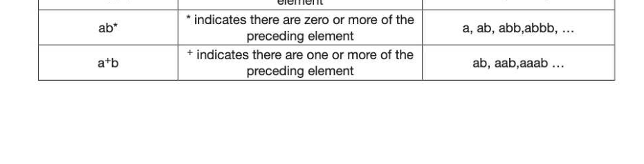

# Chapter 52 — Regular expressions
## Objectives

Understand that a regular expression is a way of describing a set Understand that regular expressions allow particular types of languages to be described in convenient shorthand notation Be able to form and use simple regular expressions for string manipulation and matching Be able to describe the relationship between regular expressions and finite state machines Be able to write a regular expression to recognise the same language as a given FSM and vice versa

## What is a regular expression?

Regular expressions are a tool that enables programmers and computers to work with text patterns. They are used, for example, to match patterns in text files (for example when searching for a particular word in a word processing program) by compilers to recognise the correct form of a variable name or the syntax of a statement by programmers to validate user input (for example to check that a postcode or an email address is in the correct format) Many programming languages including Python and Java support regular expressions. A regular expression, often called a pattern, is an expression used to specify a set of strings that satisfy given conditions. The most common symbols used in regular expressions are described below. | A vertical bar separates alternatives 2? A question mark indicates that there are zero or one of the preceding element

- — Anasterisk indicates that there are zero or more of the preceding element
+ Asuperscript plus sign indicates that there is one or more of the preceding element Regular expression Meaning Matching strings (Edward)|(Eddie)(Ea) | Boolean OR; a vertical bar separates Edward, Eddie, Ed alternatives (Dld)is(clk) Parentheses are used to define the "Disc", "disc", "Disk" and scope and precedence of the operators "disk". ? indicates zero or one of the preceding 7 Dialog(ue)? element Dialog, Dialogue

## Regular language

A language is called regular if it can be represented by a regular expression. A regular language can also be defined as any language that a finite state machine will accept. Any finite language (one containing only a finite number of words) is a regular language, since a regular expression can be created that is the union of every word in the language.

## Example 1

A regular language consists of all words beginning and ending in a, with zero or more instances of b in between, e.g. aa, aba, abba, abbba. Write a regular expression that describes this language, and draw the corresponding finite state machine (FSM). Answer: R = ab'*a. Note that the FSM is drawn with an outgoing transition from every state for every possible input symbol.

## Example 2

Describe the set of strings found by 0*1*0 and draw the FSM. Answer: It would find all strings with one or more zeros followed by one or more ones followed by one Zero. e.g. 010, 0010, 00010, 0010, 00110 ) 1

Finding a regular expression to express an automaton The set of strings accepted by a language can be expressed either in graphical form as a finite state diagram, or as a regular expression. Given the regular expression, it is usually not too difficult to draw the FSM, as we have seen. The examples below give practice in writing the regular expression corresponding to a given FSM.

## Example 1

Consider the FSM shown below, which has four states. This allows an empty string and strings of the form ab, aabb and all combinations of these such as abab, aabb, aababb. The corresponding regular expression is (a(ab)*b)*. Q4: Write the regular expression which represents the finite state machine shown below. Q5: Write the regular expression which represents the finite state machine shown below.

---

## Exercises

1. Regular expressions can be used to search for strings. For example, de (£|g) *h* matches any string that starts with de and is followed by zero or more instances of either f or g followed by one or more instances of h. Write regular expressions that will match: (a) any string that starts with a letter a, ends with a letter c and has one or more occurrences of the letter b in the middle of it, ie the expression should match the strings abc, abbc, abbbc and so on. (1) (b) any string that starts with either a 0 or a 1, followed by zero or more occurrences of the digit 1, ie the expression should match the strings 0, 1, 01, 11, 011 and so on. (1) AQA Unit 3 Qu 12 June 2012 2. Regular expressions can be used to search for strings. (a) For each of the following regular expressions, describe the set of strings that they would find. () atb (1) (i) a?b [1] (i) (ab) * (1) (b) Write regular expressions that match: (i) either Clare or Claire. 1) (i) any non-empty string that:

- — starts with 10 has zero or more occurrences of any combination of 0 or 1 in the middle © ends with 01 Example strings that the expression should match are 1001, 100010101, 101111010101001. (2] AQA Unit 3 Qu 9 June 2011
3. (a) Which of the following strings will be accepted by the finite state automaton shown below? 11001 01000 101111 000110 (3) (b) Write a regular expression to describe the language that the FSA will accept. [3] 4. Draw a four-state FSM that represents the regular expression b*ab'*a. [3]
